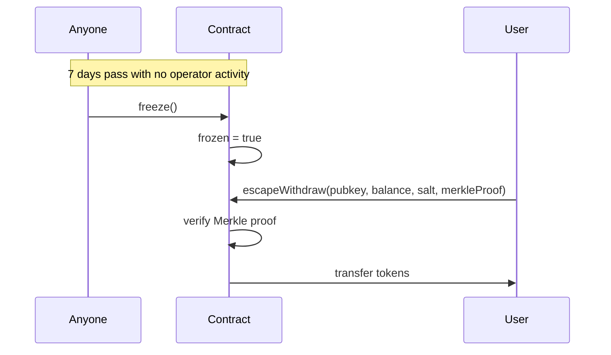

# DIY Validium: Protocol Specification

## Executive Summary

Institutions want blockchain guarantees — immutability, settlement finality, auditability — without blockchain transparency. This protocol keeps account data in the operator's database and posts only Merkle roots and ZK validity proofs on-chain.

Four operations cover the institutional lifecycle:

| Operation | What It Does | Business Use |
|-----------|-------------|-------------|
| **Transfer** | Private payment between accounts | Institutional settlements, private stablecoin transfers |
| **Bridge** | Deposit ERC20 (gated) + withdrawal (proven exit) | On/off ramp between public and private systems |
| **Disclosure** | Prove compliance without revealing data | Regulatory attestations, capital adequacy proofs |
| **Escape Hatch** | Emergency fund recovery when operator disappears or censors | Business continuity, regulatory requirement for fund access |

The disclosure proof demonstrates custom compliance: rules written as readable Rust guest programs, auditable by non-cryptographers.

## Problem Statement

| Use Case | What's Private | What's On-Chain |
|----------|---------------|-----------------|
| **Private Stablecoins** | Holder balances, transfer amounts | Total supply, validity proofs |
| **Tokenized Securities** | Positions, trade details | Settlement finality, compliance attestations |
| **Cross-Institution Settlement** | Bilateral positions, netting details | Net settlement amounts, proof of correct computation |

### Constraints

- **Privacy**: Balances and transfer amounts must remain confidential
- **Regulatory**: System must support selective disclosure to auditors
- **Operational**: Must integrate with existing Ethereum tooling
- **Trust**: Minimize trust assumptions while acknowledging PoC limitations

## Approach

Build a Validium-style system where:
- Full account state lives off-chain (operator database)
- Merkle roots of state are committed on-chain
- Zero-knowledge proofs validate state transitions
- RISC Zero provides the proving system (Rust guest programs, no trusted setup)

| Alternative | Why Not |
|-------------|---------|
| On-chain encrypted state | Gas costs prohibitive, limited computation |
| Full zkRollup | On-chain DA publishes all transaction data; validium keeps data private off-chain |
| Trusted execution (SGX) | Different trust model, hardware dependency |
| ZKSync Prividium | Same validium pattern; DIY Validium demonstrates the building blocks from scratch using RISC Zero |

### Relationship to Prividium

DIY Validium and Prividium (ZKSync) are the same architecture: account-based validiums with off-chain state, on-chain roots, and ZK validity proofs. This PoC demonstrates how to build the pattern from scratch using RISC Zero, with compliance rules expressed as Rust guest programs:

```rust
// In the disclosure guest program — readable by any Rust engineer:
assert!(balance >= threshold, "Balance below threshold");
let disclosure_key_hash =
    sha256(&[&pubkey[..], &auditor_pubkey[..], b"disclosure_v1"].concat());
```

Purpose-built guest programs are easier to audit than a full zkEVM. An auditor reviewing a 40-line Rust function is a fundamentally different (and better) experience than auditing a zkEVM opcode table.

## Protocol Design

### Participants

| Role | Description |
|------|-------------|
| **Operator** | Maintains off-chain state, generates proofs, submits to chain |
| **User** | Owns accounts, initiates transfers, generates proofs locally |
| **Verifier Contract** | On-chain contract that verifies proofs and tracks state |
| **Auditor** | Receives disclosure proofs, verifies compliance |

### Data Structures

**Account (Off-chain):**
```
Account { pubkey: [u8; 32], balance: u64, salt: [u8; 32] }
```

**Account Commitment (Merkle Leaf):**
```
commitment = SHA256(pubkey || balance_le || salt)   // 72 bytes input
```

**Merkle Tree:** Binary, SHA-256, depth 20 (~1M accounts).
```
internal_node = SHA256(left_child || right_child)
```

### On-Chain State

```solidity
// TransferVerifier
bytes32 public stateRoot;

// ValidiumBridge (extends with ERC20 + escape hatch + forced withdrawals)
IERC20 public token;
bytes32 public allowlistRoot;
uint256 public lastProofTimestamp;  // tracks operator liveness
bool public frozen;                 // escape hatch activated
mapping(uint256 => bool) public claimed;  // escape withdrawal tracking
mapping(bytes32 => address) public escapeAddress;  // pubkey → depositor for front-running protection
uint256 public forcedRequestCount;  // forced withdrawal request counter
mapping(uint256 => ForcedRequest) public forcedRequests;  // pending forced withdrawals
```

> **No nullifiers needed:** In an account model with sequential state updates, the contract's `require(oldRoot == stateRoot)` check prevents replay — each operation changes the root, making stale proofs instantly invalid. Nullifiers are essential in UTXO models (Zcash, Tornado Cash) where independent notes can be spent, but are redundant here. This matches Prividium (ZKSync), which also uses sequential root checks without nullifiers.

**Token Conservation Invariant:** The bridge contract's ERC20 balance must always equal the sum of all private account balances. This is maintained by construction: deposits increase both the bridge balance and one private balance; withdrawals decrease both. The invariant is not enforced by an on-chain check — it follows from the proof structure (withdrawal amounts are public in the journal and verified by the bridge).

---

## Operation 1: Transfer

Private payment between two accounts. Both sender and recipient balances change; the old Merkle root transitions to a new root via dual-leaf update.

### Flow

```
Sender         Operator              RISC Zero          Contract
  │               │                      │                  │
  │ request ─────▶│                      │                  │
  │               │ provide state ──────▶│                  │
  │               │                      │ prove ──────────▶│
  │               │                      │                  │ verify + update root
  │               │ update off-chain DB  │                  │
```

### Guest Program: Transfer Proof

**Public Inputs (Journal):** `old_root` (32) + `new_root` (32) = 64 bytes

**Private Inputs:** sender_sk, sender_balance, sender_salt, sender_path, sender_indices, amount, recipient_pubkey, recipient_balance, recipient_salt, recipient_path, recipient_indices, new_sender_salt, new_recipient_salt

**Guest Program:**
```rust
// Derive sender identity
let sender_pubkey = sha256(&sender_sk);

// Business logic
assert_ne!(sender_pubkey, recipient_pubkey, "Self-transfer not allowed");
assert!(amount > 0, "Transfer amount must be positive");
assert!(sender_balance >= amount, "Insufficient balance");
assert!(recipient_balance <= u64::MAX - amount, "Recipient overflow");

// Verify both accounts exist in old tree
let sender_old_leaf = account_commitment(&sender_pubkey, sender_balance, &sender_salt);
let old_root = compute_root(sender_old_leaf, &sender_path, &sender_indices);
verify_membership(recipient_old_leaf, &recipient_path, &recipient_indices, old_root);

// State transition: compute new root with updated balances
let new_root = compute_new_root(sender_new_leaf, recipient_new_leaf, ...);

commit(old_root, new_root);
```

**Dual-Leaf Root Recomputation:** When two leaves change simultaneously, the algorithm finds the divergence depth (shallowest level where sender/recipient indices differ), recomputes each branch independently below it, joins them at divergence, and hashes upward using shared siblings.

### Contract: TransferVerifier

```solidity
function executeTransfer(bytes seal, bytes32 oldRoot, bytes32 newRoot) {
    require(oldRoot == stateRoot, "Stale state");
    verifier.verify(seal, IMAGE_ID, sha256(abi.encodePacked(oldRoot, newRoot)));
    stateRoot = newRoot;
}
```

---

## Operation 2: Bridge (Deposit + Withdrawal)

### Deposit Flow

Deposits are gated by an allowlist membership proof: only pubkeys in the allowlist Merkle tree can deposit ERC20 tokens into the private system.

The allowlist is a separate Merkle tree (same SHA-256 binary structure) whose leaves are SHA-256 hashes of authorized public keys. The operator maintains this tree off-chain and sets the `allowlistRoot` on the bridge contract. To authorize a new depositor, the operator adds their pubkey hash as a leaf, rebuilds the tree, and updates the on-chain root. The membership proof proves "my pubkey hash is a leaf in this tree" without revealing which leaf.

```
User                    Contract                 Operator
  │ approve(amount) ───▶│                        │
  │ deposit(amt, pk,    │                        │
  │   membershipSeal) ─▶│ verify membership      │
  │                     │ transferFrom ──▶       │
  │                     │ emit Deposit ─────────▶│
  │                     │                        │ credit off-chain balance
```

### Guest Program: Withdrawal Proof

Single-leaf state transition: balance decreases, funds exit to L1.

**Public Inputs (Journal):** `old_root` (32) + `new_root` (32) + `amount` (8, big-endian) + `recipient` (20) = 92 bytes

**Guest Program:**
```rust
let pubkey = sha256(&secret_key);
let old_leaf = account_commitment(&pubkey, balance, &salt);
let old_root = compute_root(old_leaf, &path, &indices);

// Business logic
assert!(amount > 0, "Withdrawal amount must be positive");
assert!(balance >= amount, "Insufficient balance");

let new_leaf = account_commitment(&pubkey, balance - amount, &new_salt);
let new_root = compute_root(new_leaf, &path, &indices);

commit(old_root, new_root, amount, recipient);
```

### Contract: ValidiumBridge

```solidity
function deposit(uint256 amount, bytes32 pubkey, bytes calldata membershipSeal) external {
    require(amount > 0);
    verifier.verify(membershipSeal, MEMBERSHIP_IMAGE_ID, sha256(abi.encodePacked(allowlistRoot)));
    token.transferFrom(msg.sender, address(this), amount);
    emit Deposit(msg.sender, pubkey, amount);
}

function withdraw(bytes seal, bytes32 oldRoot, bytes32 newRoot,
                  uint64 amount, address recipient) external {
    require(oldRoot == stateRoot && amount > 0);
    verifier.verify(seal, WITHDRAWAL_IMAGE_ID, sha256(journal));
    stateRoot = newRoot;
    token.transfer(recipient, amount);  // CEI: state updates before external call
}
```

---

## Operation 3: Disclosure

The disclosure guest program proves that an account satisfies a compliance predicate (balance >= threshold) without revealing the actual balance, identity, or tree position. The proof is bound to a specific auditor via a disclosure key.

Institutions write compliance rules as readable Rust guest programs — not opaque zkEVM bytecode or platform-specific DSLs.

### Flow

```
User                    Auditor                  Contract (optional)
  │◀─── request ────────│                        │
  │ generate proof      │                        │
  │──── proof ─────────▶│                        │
  │                     │ verify (off-chain) ───▶│
  │                     │◀── verified ───────────│
```

### Guest Program: Disclosure Proof

**Public Inputs (Journal):** `merkle_root` (32) + `threshold_be` (8) + `disclosure_key_hash` (32) = 72 bytes

**Guest Program:**
```rust
// Derive identity and verify account exists
let pubkey = sha256(&secret_key);
let leaf = account_commitment(&pubkey, balance, &salt);
let merkle_root = compute_root(leaf, &path, &indices);

// === Business logic (readable by any Rust engineer) ===
assert!(balance >= threshold, "Balance below threshold");
let disclosure_key_hash =
    sha256(&[&pubkey[..], &auditor_pubkey[..], b"disclosure_v1"].concat());

commit(merkle_root, threshold, disclosure_key_hash);
```

**Disclosure Key Derivation:** `SHA256(pubkey || auditor_pubkey || "disclosure_v1")`

Three properties:
1. **Auditor binding** — proof is only meaningful to the intended auditor
2. **Account binding** — different accounts produce different keys
3. **Domain separation** — `"disclosure_v1"` prevents collisions with other protocol hashes

**Institutional applications:**
- Capital adequacy: "Prove reserves >= $50M" without revealing $53.7M
- Counterparty solvency: "Prove you can cover this $10M trade"
- AML threshold: "Prove no single balance exceeds $10K"

### Contract: DisclosureVerifier

```solidity
function verifyDisclosure(bytes seal, bytes32 root, uint64 threshold,
                          bytes32 disclosureKeyHash) external {
    require(root == stateRoot);
    verifier.verify(seal, IMAGE_ID, sha256(abi.encodePacked(root, threshold, disclosureKeyHash)));
    emit DisclosureVerified(root, threshold, disclosureKeyHash);
}
```

> Read-only contract: no root updates. Disclosure proofs are attestations, not state transitions.

**Proof Freshness:** A disclosure proof is bound to a specific Merkle root. If the operator updates state (via transfer or withdrawal) between proof generation and auditor verification, the on-chain `stateRoot` will have moved and the `DisclosureVerifier` will reject the proof with "Root mismatch". In practice, the auditor should verify the proof promptly, or the user must regenerate the proof against the current root. Off-chain verification (without the contract) avoids this issue since the auditor can accept any recent root.

---

## Operation 4: Escape Hatch

If the operator disappears, users can recover their funds directly from the bridge contract — no ZK proof required. This is the standard "escape hatch" pattern used by StarkEx, ZKSync, and other validiums: sacrifice privacy for fund recovery in an emergency.

### Problem

The centralized operator is a single point of failure. If the operator goes offline permanently, no new proofs can be submitted, and normal withdrawals require a valid proof. Without an escape mechanism, funds are locked in the bridge contract forever.

### Design: Freeze-Then-Claim

The escape hatch uses a two-phase approach:

1. **Freeze**: After `ESCAPE_TIMEOUT` (7 days) of operator inactivity, anyone can freeze the bridge. Freezing is irreversible — it permanently disables deposits, withdrawals, and transfers.
2. **Claim**: Once frozen, users prove their balance against the last committed state root using an on-chain Merkle proof (no ZK proof needed — the operator is gone, so there's no one to hide from). The user reveals their `pubkey`, `balance`, `salt`, and Merkle proof on-chain.

### Root Synchronization: `postTransferBatch`

The bridge contract maintains its own `stateRoot`. Normal withdrawals update this root, but off-chain transfers (via `TransferVerifier`) do not. The `postTransferBatch` function mirrors a transfer proof on the bridge to keep its root current:

```solidity
function postTransferBatch(bytes calldata seal, bytes32 oldRoot, bytes32 newRoot) external {
    require(oldRoot == stateRoot);
    verifier.verify(seal, TRANSFER_IMAGE_ID, sha256(abi.encodePacked(oldRoot, newRoot)));
    stateRoot = newRoot;
    lastProofTimestamp = block.timestamp;
}
```

Each successful `postTransferBatch` or `withdraw` resets the liveness timer, preventing premature freezing while the operator is active.

> **Note:** In production, TransferVerifier and ValidiumBridge would share a single state root to avoid this synchronization requirement. The PoC keeps them separate for modularity.

### Flow



### What Users Must Save

To use the escape hatch, users must retain:

| Data | Size | Notes |
|------|------|-------|
| `pubkey` | 32 bytes | Account public key |
| `balance` | 8 bytes (uint64) | Current balance |
| `salt` | 32 bytes | Current salt |
| `leafIndex` | uint256 | Position in Merkle tree |
| Merkle proof | depth × 32 bytes | Sibling path to root; operator provides updated proof after each batch |

**The salt changes on every state transition** (transfer, withdrawal). Users must save updated account data after each transaction. If they lose their current salt, they cannot construct a valid commitment and cannot escape.

**The Merkle proof also changes whenever the tree is updated** — even from other users' transactions — because sibling hashes shift. After each batch, the operator distributes each user's updated sibling path (~640 bytes for a depth-20 tree, not the full tree). If the operator disappears and the user's proof is stale, they cannot construct a valid path to the committed root. This is the core problem that DA layers solve — see [Layered DA Extensions](#layered-da-extensions-future-work) for how blob checkpoints and encrypted blobs progressively reduce this dependency.

### Contract Interface

```solidity
function freeze() external;
// Requires: !frozen, block.timestamp > lastProofTimestamp + ESCAPE_TIMEOUT

function escapeWithdraw(
    uint256 leafIndex,
    bytes32 pubkey,
    uint64 balance,
    bytes32 salt,
    bytes32[] calldata merkleProof
) external;
// Requires: frozen, !claimed[leafIndex], balance > 0
// Verifies: SHA256(pubkey || balance_le || salt) is in the Merkle tree at leafIndex
// Requires: msg.sender == escapeAddress[pubkey]
// Sends: balance tokens to msg.sender
```

### Front-Running Protection

Without address binding, `escapeWithdraw` sends tokens to `msg.sender`. An attacker monitoring the mempool could copy a legitimate escape transaction's calldata and front-run it, stealing the user's funds.

**Fix: deposit-time address binding.** The contract stores `escapeAddress[pubkey] = msg.sender` during `deposit()`. During `escapeWithdraw()`, it verifies `msg.sender == escapeAddress[pubkey]`. This matches StarkEx's escape hatch pattern.

This works because:
1. **Every account enters via deposit** — the mapping is always populated before escape is needed.
2. **Pubkeys are immutable during transfers** — only balance and salt change, so the mapping remains valid across all state transitions.
3. **Pubkey claiming is exclusive** — once an address deposits to a pubkey, no other address can deposit to the same pubkey (`PubkeyAlreadyClaimed` revert). The same address can deposit again (e.g., topping up).

```solidity
// In deposit():
if (escapeAddress[pubkey] != address(0) && escapeAddress[pubkey] != msg.sender)
    revert PubkeyAlreadyClaimed();
escapeAddress[pubkey] = msg.sender;

// In escapeWithdraw():
if (msg.sender != escapeAddress[pubkey]) revert NotEscapeAddress();
```

### Forced Withdrawal (Anti-Censorship)

The escape hatch above handles operator **disappearance** — but not operator **censorship**, where the operator is alive but refuses to process a specific user's withdrawal. A censoring operator can keep resetting the escape timeout by posting any valid proof.

Forced withdrawals solve this with a request queue pattern (similar to StarkEx):

```
Censorship resistance spectrum:

Normal withdraw     →  Forced withdrawal    →  Escape hatch
(operator submits)     (user submits proof,    (no proof needed,
                        operator must process   system frozen,
                        or system freezes)      Merkle proof only)
```

#### How It Works

1. **User submits** `requestForcedWithdrawal(seal, oldRoot, newRoot, amount, recipient)` — same arguments as `withdraw()`, with a valid ZK withdrawal proof. The contract verifies the proof but does **not** update `stateRoot` or transfer tokens. It stores the request with a deadline (`block.timestamp + FORCED_WITHDRAWAL_DEADLINE`, default 1 day).

2. **Operator must act** within the deadline:
   - **Process it**: call `processForcedWithdrawal(requestId)` — applies the state transition (`stateRoot = newRoot`), transfers tokens, deletes the request.
   - **Ignore it**: after the deadline expires, anyone can call `freezeOnExpiredRequest(requestId)` to freeze the bridge. Once frozen, the escape hatch enables fund recovery.

3. **Key requirement**: The user must have a valid ZK withdrawal proof (Merkle path + secret key + prover access). If they don't, the escape hatch (no ZK needed) remains the ultimate fallback.

#### Contract Interface

```solidity
function requestForcedWithdrawal(
    bytes calldata seal, bytes32 oldRoot, bytes32 newRoot,
    uint64 amount, address recipient
) external;
// Requires: !frozen, oldRoot == stateRoot, amount > 0
// Verifies: ZK withdrawal proof
// Stores: request with deadline = block.timestamp + FORCED_WITHDRAWAL_DEADLINE

function processForcedWithdrawal(uint256 requestId) external;
// Requires: !frozen, request exists, stateRoot == request.oldRoot
// Applies: stateRoot = newRoot, transfers tokens, deletes request

function freezeOnExpiredRequest(uint256 requestId) external;
// Requires: !frozen, request exists, block.timestamp > request.deadline
// Freezes the bridge (same effect as freeze())
```

#### Stale Request Handling

A forced request is verified against `stateRoot` at submission time. If the operator posts other proofs (transfers, withdrawals) that change `stateRoot` before processing, the forced request's `oldRoot` no longer matches — `processForcedWithdrawal` will revert with `StaleState`. However, the deadline still ticks. The operator cannot dodge a forced request by churning state: either they process the user's withdrawal (in the current or a re-derived state), or the deadline expires and the bridge freezes.

> **PoC limitation:** In production, the operator should re-derive the forced withdrawal against the new state root and process it. The PoC demonstrates the anti-censorship mechanism without handling concurrent state changes — if state moves, the request becomes unprocessable but still triggers a freeze on expiry, and the user recovers via the escape hatch.

### Privacy Trade-off

During escape withdrawal, the user reveals their `pubkey`, `balance`, and `salt` on-chain. This is an acceptable trade-off: the operator is gone, the system is permanently frozen, and the alternative is losing funds entirely. This matches the privacy model of StarkEx and ZKSync escape hatches.

### Layered DA Extensions (Future Work)

The current escape hatch is "Layer 0" — pure on-chain Merkle verification. Users must independently save their account data. Future layers would progressively reduce this burden:

- **Layer 1 (Blob Checkpoints)**: Operator periodically posts full Merkle tree snapshots to EIP-4844 blobs. Users can reconstruct their proof from blob data even if the operator disappears. Blobs are public, so this trades some privacy for easier recovery.
- **Layer 1+ (Encrypted Blobs)**: Blob data is encrypted to a DA committee or threshold key. Only authorized parties can reconstruct the tree, preserving privacy until escape is actually needed.

---

## Why Rust Guest Programs Matter

The guest programs above are standard Rust — no DSL, no manual constraint wiring, no bit decomposition. An institutional auditor reviewing the 5-line disclosure check (`assert!(balance >= threshold)`) is reviewing the actual verification logic, not a circuit abstraction layer.

Compare: Circom requires ~80 lines of manual signal routing and SHA-256 constraint wiring for the same logic. Noir is more readable but still a ZK-specific DSL with a smaller ecosystem. RISC Zero lets institutions write compliance rules in a language their engineers already know.

---

## Privacy Guarantees

| Operation | What's Public | What's Private | Who Learns What |
|-----------|--------------|----------------|-----------------|
| **Deposit** | Amount, depositor address | Account position in tree | Public observers see deposit |
| **Transfer** | Merkle roots | Amount, sender, recipient, balances | Only operator sees details |
| **Disclosure** | Threshold, disclosure_key_hash | Actual balance, pubkey, tree position | Auditor learns: balance >= threshold. Nothing more. |
| **Withdrawal** | Amount, recipient address | Prior balance, account history | Public observers see withdrawal |
| **Escape** | Leaf index, pubkey, balance, salt | Other accounts, history | Balance revealed on-chain (privacy sacrifice for fund recovery) |

**Critical caveats:**
- Deposits and withdrawals are public — privacy exists only between them
- Operator sees everything — primary privacy concern in production
- Escape hatch (Layer 0) — if operator disappears, users can recover funds after 7-day timeout by revealing balance on-chain (Operation 4)
- Timing analysis can link deposits to withdrawals with few participants

## Operator Trust Model

**Trusted (not enforced):**
- Credits private balances correctly on deposit
- Maintains Merkle tree accurately
- Maps pubkeys to real identities
- Controls data availability

**Liveness risk:** If the operator goes offline, no new proofs can be submitted and no withdrawals can be processed. The escape hatch (Operation 4) mitigates this: after 7 days of inactivity, anyone can freeze the bridge, and users can recover funds by revealing their balance on-chain via Merkle proof. Users must save their current account data (pubkey, balance, salt, leaf index, Merkle proof) after every transaction to use the escape hatch. Production would add DA layers (blob checkpoints, encrypted blobs) to reduce this burden.

**Enforced by ZK + on-chain verification:**
- Cannot forge a transfer or withdrawal without the sender's secret key
- Cannot double-spend (sequential root check prevents replay)
- Cannot steal funds via withdrawal (proofs verified on-chain)
- Cannot update state root without a valid proof
- Cannot fake a disclosure proof (bound to real account state + specific auditor)

## Limitations & Shortcuts (PoC Scope)

- **Centralized operator** — Production: DA committee or on-chain calldata
- **Hash-based disclosure keys** — Production: threshold decryption or verifiable encryption (Penumbra, Aztec)
- **Simple key derivation** (`pubkey = SHA256(sk)`) — Production: EC key derivation (ed25519)
- **In-memory storage** — Production: persistent database
- **IMAGE_IDs as constructor params** — Contracts accept IMAGE_IDs as immutable constructor parameters. The E2E test passes real IMAGE_IDs (from compiled guest ELFs) and real encoded seals via `risc0-ethereum-contracts`. The deploy script defaults to `bytes32(0)` for local/testnet use. Full on-chain verification requires swapping `MockRiscZeroVerifier` for `RiscZeroGroth16Verifier`, which needs Groth16 proof compression (Bonsai or x86 only — ARM Macs cannot produce Groth16 proofs natively).
- **No batching** — One proof per operation; production would batch
- **Single ERC20** — Production: add `asset_id` to commitment scheme
- **No access control on contract functions** — Any address can submit a valid proof. Production: restrict `executeTransfer` / `withdraw` to an operator address or multisig to prevent front-running and ordering manipulation.
- **Forced withdrawal stale state** — If the operator changes `stateRoot` after a forced request is submitted, `processForcedWithdrawal` reverts. The deadline still ticks toward a freeze. In production, the operator would re-derive the withdrawal proof against the new state root.
- **Dev mode for tests** — Rust tests use `RISC0_DEV_MODE` (fake proofs)

## Future Work

- **Viewing keys with real crypto** — Replace hash-based disclosure keys with threshold decryption (Penumbra) or verifiable encryption (Aztec)
- **Data availability layers** — Layer 1: EIP-4844 blob checkpoints (operator posts periodic Merkle snapshots). Layer 1+: encrypted blobs (DA committee or threshold key preserves privacy until escape)
- **Multi-asset** — Add `asset_id` to commitment: `SHA256(pubkey || asset_id || balance_le || salt)`
- **Transaction batching** — N transfers per proof
- **Range proofs** — Prove "amount in [min, max]" for AML compliance
- **ERC-3643 compliance hooks** — ZK proofs of claim validity (KYC status without revealing claims)
- **Proven minting / supply audit** — Currently the operator is trusted to credit deposits correctly. A "supply proof" guest program could periodically prove that the sum of all private balances equals the bridge's ERC20 balance, providing on-chain verification of the conservation invariant.
- **Cross-validium transfers** — Moving funds between validiums currently requires a public withdraw-then-deposit cycle, which links the two operations on-chain. Private cross-validium transfers would need a shared proof relay or atomic bridge protocol.

## Terminology

- **Commitment** — Hash that hides a value but can be verified later
- **Merkle Root** — Single hash representing entire tree state
- **Journal** — Public outputs from a RISC Zero proof
- **Seal** — The proof bytes that can be verified on-chain
- **Validium** — L2 where data is off-chain but validity is proven
- **Disclosure Key** — Hash binding an account to a specific auditor
- **Escape Hatch** — Emergency withdrawal mechanism when operator is unresponsive or censoring; users reveal balance on-chain to recover funds
- **Forced Withdrawal** — User-initiated on-chain withdrawal request with a deadline; operator must process it or the system freezes (anti-censorship)
- **Freeze** — Irreversible state transition that disables normal operations and enables escape withdrawals; triggered by operator inactivity timeout or an expired forced withdrawal request
- **Prividium Pattern** — Privacy by default, transparency by choice

## References

- [RISC Zero Documentation](https://dev.risczero.com/)
- [Zcash Protocol Specification](https://zips.z.cash/protocol/protocol.pdf)
- [Validium on ethereum.org](https://ethereum.org/en/developers/docs/scaling/validium/)
- [Penumbra — Viewing Keys](https://protocol.penumbra.zone/)
- [Aztec — Note Discovery](https://docs.aztec.network/)
