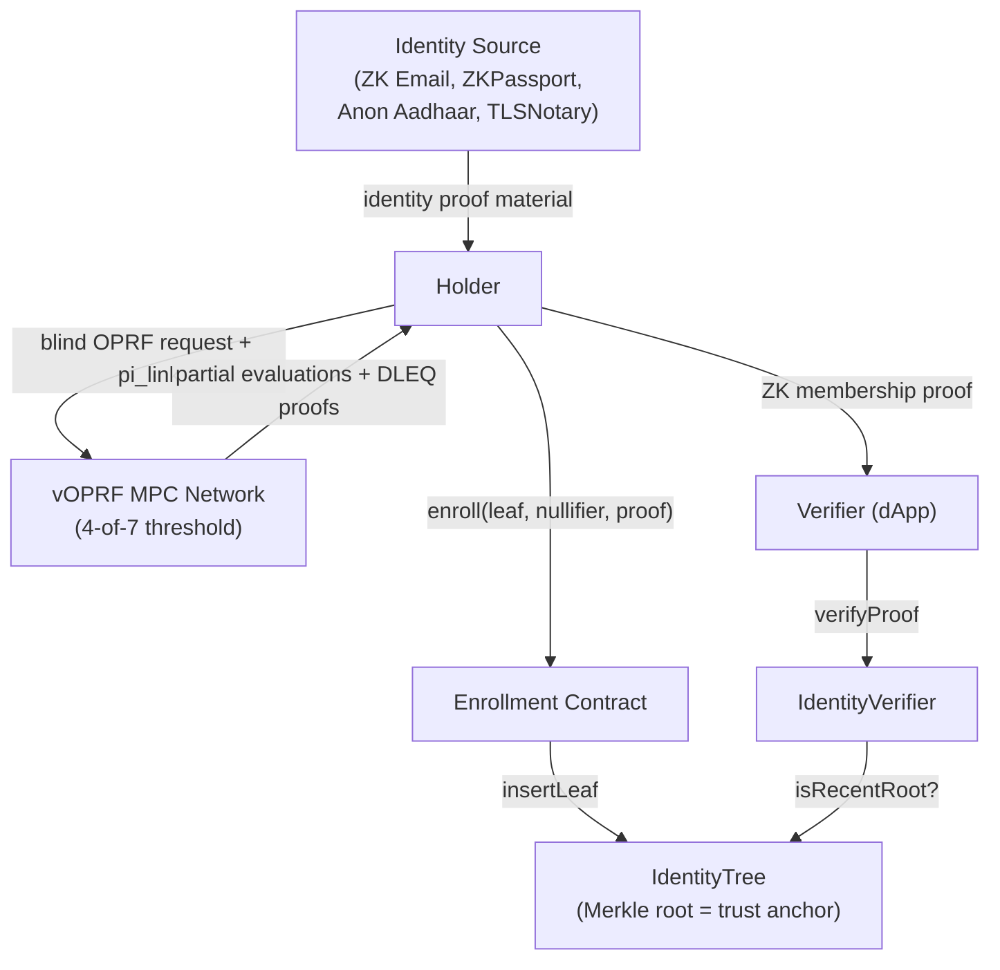
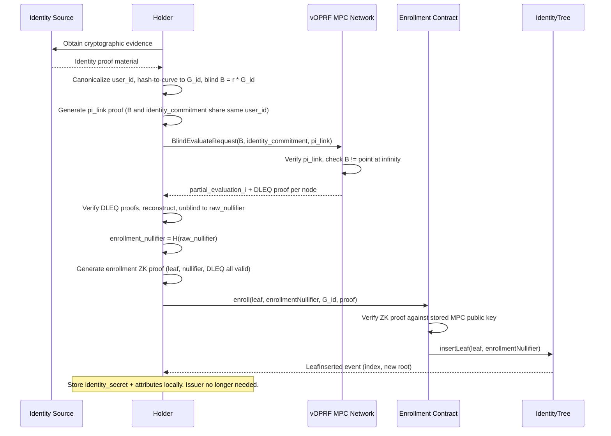
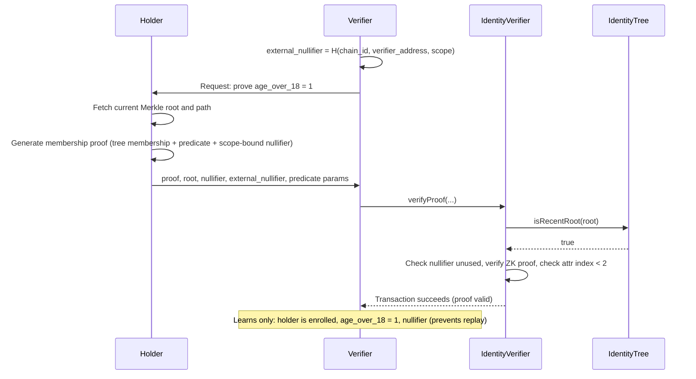
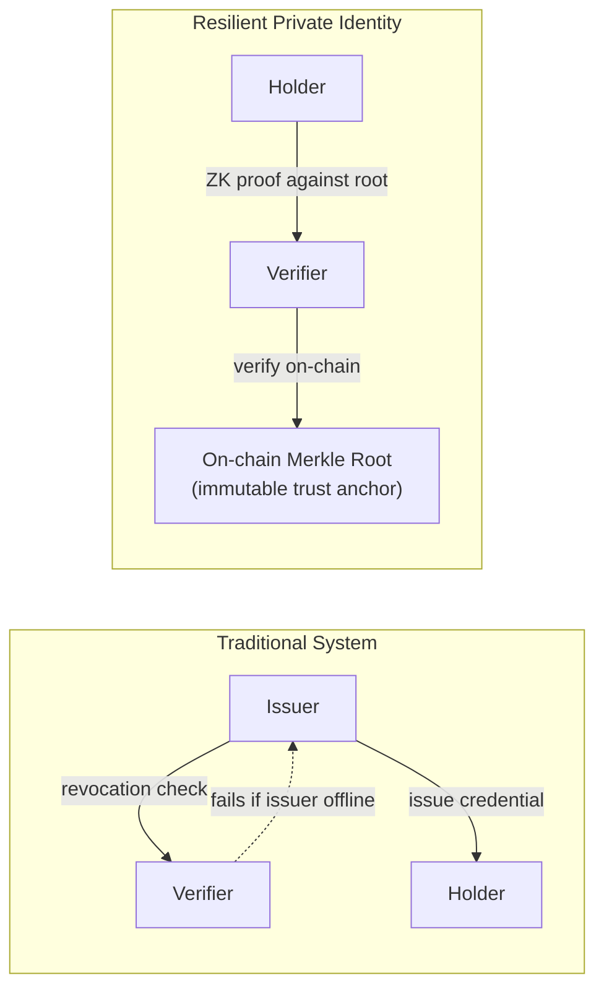

# Resilient Private Identity: Protocol Specification

## Problem Statement

Credential systems today depend on a live, cooperative issuer. If the issuer becomes adversarial, goes offline, or is destroyed, holders lose the ability to prove identity attributes even when the underlying credentials were legitimately issued. Holders need an identity layer that lets them continue generating and verifying proofs without issuer participation, so that a failing or uncooperative issuer cannot revoke their ability to use legitimately obtained credentials.

This protocol anchors enrollment to a verifiable oblivious pseudorandom function (vOPRF) that binds one real-world identity to one on-chain leaf, providing cryptographic sybil resistance. An on-chain Merkle root serves as the sole trust anchor.

## Use Case Overview

Institutions need to verify counterparty attributes (age, nationality) without learning identity. Current systems depend on a live issuer, creating a single point of failure. This protocol anchors enrollment to an on-chain Merkle tree. After enrollment, holders generate ZK proofs against the tree root with no issuer involvement.

### Components

| Component | Role | Operator |
|-----------|------|----------|
| **Identity Source** | Cryptographic proof of real-world identity (ZK Email, ZKPassport, Anon Aadhaar, TLSNotary) | Holder, using evidence from Web2 providers |
| **vOPRF MPC Network** | Deterministic per-identity tag for sybil resistance | Threshold network of independent operators (4-of-7) |
| **IdentityTree** | Stores one leaf per enrolled identity; the sole trust anchor | Ethereum smart contract |
| **Enrollment Contract** | Gates tree insertion behind a ZK proof of valid OPRF enrollment | Ethereum smart contract |
| **IdentityVerifier** | Checks ZK membership proofs, enforces nullifier uniqueness | Ethereum smart contract |
| **Holder** | Enrolls once, then proves attributes at will | End user |
| **Verifier** | Requests and validates attribute proofs | Any dApp or institution |

### Holder Actions

1. **Prove identity**: obtain cryptographic evidence from an identity source (DKIM signature, passport NFC, etc.)
2. **Enroll**: interact with the MPC network for a sybil-resistant tag, submit one on-chain transaction to insert a leaf
3. **Prove attributes**: generate a ZK proof ("I am in the tree and `age_over_18 = 1`"), submit to a verifier
4. **Rotate verifiers freely**: each verifier gets a scope-bound nullifier preventing replay, but verifiers cannot link proofs across scopes

### System Architecture



### Enrollment Flow



### Verification Flow



### Issuer Independence



After enrollment, the on-chain Merkle root is the sole trust anchor. The issuer can go offline, revoke all credentials, or become adversarial. Existing holders continue generating and verifying proofs. New enrollees can still enroll via the vOPRF network.

### Constraints

| Category | Requirement |
|----------|-------------|
| **Privacy** | Holder identity, credential contents, and issuer-holder relationships hidden from public observers. Proof validity and scope-bound nullifiers are public. |
| **Regulatory** | Selective disclosure grants auditors scoped read access. Append-only audit trail records verification events. |
| **Operational** | On-chain proof verification in a single transaction. No issuer online requirement after enrollment. Proof generation practical on consumer hardware. |
| **Trust** | Verifiers are honest-but-curious. vOPRF MPC network is honest above its threshold (t-of-n). Verifiers cannot extract holder identity or credential contents beyond the boolean result. |
| **Sybil resistance** | Each real-world identity maps to exactly one on-chain leaf via the vOPRF enrollment nullifier. |

## Approach

### Strategy

Holders enroll by proving real-world identity ownership (ZK Email, TLSNotary, Anon Aadhaar, ZKPassport) and obtaining a deterministic vOPRF evaluation from an MPC network. The OPRF output produces an enrollment nullifier that prevents duplicate enrollment and a leaf commitment inserted into an on-chain Merkle tree. After enrollment, holders generate ZK membership proofs against the Merkle root without any issuer involvement. Scope-bound nullifiers prevent replay. Selective disclosure supports predicate queries over committed attributes.

### Why This Approach

| Alternative | Trade-off | Why Not |
|-------------|-----------|---------|
| Traditional issuer-managed credentials | Issuer must be online for revocation checks and re-issuance | Single point of failure; the exact problem we solve |
| Semaphore (identity commitment only) | No sybil resistance at the identity layer | Cannot bind one real-world person to one leaf |
| World ID (biometric OPRF) | Strong sybil resistance via iris scan | Requires specialized hardware; not institution-compatible |
| PLUME (ECDSA nullifiers) | Reuses existing keys | No attribute predicates; limited to key-holder proofs |
| OpenAC | Attribute credentials with ZK | Assumes cooperative issuer for credential issuance |
| zk-creds (Rosenberg et al., 2023) | General-purpose zkSNARK credentials; issuer-less issuance via bulletin board/blockchain; supports existing identity documents without modification | Merkle-tree issuance list is structurally similar to our approach; does not address sybil resistance (duplicate enrollment prevention requires external mechanism) |
| zk-promises (Shih et al., 2025) | Stateful anonymous credentials with Turing-complete callbacks; supports asynchronous reputation, moderation, and blocking of anonymous users | Designed for interactive platform moderation (downvotes, bans, reputation decay), not institutional identity attestation; requires clients to periodically scan for callbacks, adding liveness assumptions; proving cost higher than simple membership proofs due to stateful transition circuits |

The vOPRF approach provides sybil resistance without biometric hardware, works with existing Web2 identity proofs, and survives issuer destruction because the on-chain Merkle root is the sole trust anchor.

**Relationship to zk-creds.** zk-creds shares the Merkle-tree-as-issuance-list paradigm and the goal of removing trusted credential issuers. Our protocol can be understood as a zk-creds-style construction augmented with a vOPRF sybil gate: where zk-creds assumes the issuance list manager prevents duplicate enrollment (or tolerates it), our protocol enforces one-person-one-leaf cryptographically via the threshold vOPRF enrollment nullifier. zk-creds additionally introduces blind Groth16 for proof rerandomization and reuse, enabling unlinkable multi-show credentials without re-proving. Our protocol achieves multi-show unlinkability instead via scope-bound nullifiers with fresh proofs per verifier. The trade-off is proving cost: zk-creds ShowCred runs in ~150ms (Groth16) vs. our UltraHonk membership proof, which avoids per-circuit trusted setup but has higher verification cost on-chain.

**Relationship to zk-promises.** zk-promises extends the anonymous credential model to support stateful, Turing-complete callbacks, enabling reputation systems, moderation, and account suspension for anonymous users. This addresses a gap our protocol does not: post-enrollment state mutation by third parties (e.g., a regulator docking reputation or suspending an identity). Our protocol's on-chain nullifier tracking is append-only and holder-driven; integrating asynchronous issuer/regulator actions (revocation, attribute updates) without breaking unlinkability is an open problem. zk-promises' callback scanning model (~4ms server verification, <1s client auth) is a potential direction for institutional compliance hooks that require post-issuance state updates while preserving holder privacy.

### Tools & Primitives

| Tool | Purpose |
|------|---------|
| **Noir v1.0.0-beta.3** | ZK circuit language for enrollment, membership, and link proofs |
| **UltraHonk (Barretenberg v0.82.0)** | Proving system. Universal SRS (Aztec Ignition ceremony, 2^20 points). No per-circuit trusted setup. |
| **Poseidon** | ZK-friendly hash for commitments, nullifiers, Merkle tree nodes. BN254 scalar field. |
| **BN254 (alt_bn128)** | Elliptic curve. Ethereum precompiles EIP-196/EIP-197. ~100-110 bits classical security. |
| **@zk-kit/imt v2.1.0** | Incremental Merkle tree (Solidity). Depth 20, capacity 2^20. |
| **vOPRF (RFC 9497 extended)** | Threshold OPRF for sybil-resistant enrollment nullifier derivation. |
| **hashToCurve (RFC 9380)** | Fouque-Tibouchi SVDW (Shallue-van de Woerter) mapping for BN254 G1. Field element derived via `Poseidon(DOMAIN_H2C, user_id_hash)`. |

## Protocol Design

### Participants & Roles

| Role | Responsibility |
|------|----------------|
| **Enrollee/Holder** | Proves real-world identity ownership. Enrolls via vOPRF. Generates ZK membership proofs. Stores `identity_secret` and attributes locally. |
| **vOPRF MPC Network** | Threshold network (t=4, n=7) that evaluates blinded identity points. Verifies identity-blinding link proofs before responding. Stateless per request. |
| **Verifier** | Checks ZK proofs on-chain or off-chain. Enforces access policy. Cannot extract holder identity. |
| **Governance Multisig** | 4-of-7 multisig. Controls `IdentityTree` authorization and MPC key rotation (with timelock). |
| **Guardian** | Can veto pending MPC key rotations during the timelock window. Set at deployment, not upgradeable. |
| **Auditor** | Receives scoped access to specific credential attributes or proof metadata via selective disclosure. |

### Flows

#### Enrollment

Precondition: MPC network is available. Enrollee has a Web2 identity with cryptographic evidence created within the last 90 days.

Note: ZK Email requires the identity provider's DKIM public keys to have been published in DNS at some prior point. TLSNotary requires the provider's web service to have been accessible when the session was recorded. These sources work when the issuer became adversarial after the enrollee obtained their credential, but not when the issuer retroactively deletes all cryptographic evidence.

"Proving identity ownership" in step 1 means generating a source-specific cryptographic proof (e.g., a ZK proof over a DKIM-signed email for ZK Email, an NFC signature proof for ZKPassport, or a TLS session transcript proof for TLSNotary). See the Identity Source Canonicalization table for supported sources and the per-source proof format.

1. Enrollee proves Web2 identity ownership via a supported source. Derives canonical `user_id` per the Identity Source Canonicalization table. Computes `user_id_hash = SHA-256(canonical_user_id) mod r`. Generates random `salt` from F_r. Computes `identity_commitment = H(DOMAIN_LINK, user_id_hash, salt)`.
2. Enrollee computes `G_id` via SVDW hash-to-curve from `user_id_hash` (see `G_id` in Symbols table). Picks random `r` from F_r \ {0}. Computes `blinded_request = r * G_id`.
3. Enrollee generates `pi_link` proving `blinded_request` and `identity_commitment` derive from the same `user_id` (see Circuit: Identity-Blinding Link Proof).
4. Enrollee sends `BlindEvaluateRequest { blinded_request, identity_commitment, pi_link, session_nonce }` to the vOPRF MPC network. Enrollment transactions SHOULD be submitted via a private mempool (e.g., Flashbots Protect) to prevent front-running.
5. Each MPC node `i` verifies `pi_link`, checks `blinded_request` is not the point at infinity, then responds with `partial_evaluation_i = s_i * blinded_request` and a per-node DLEQ proof.
6. Enrollee verifies per-node DLEQ proofs, discards invalid responses. MUST abort if fewer than `t` valid responses remain. Reconstructs `aggregated_response` via Lagrange interpolation, unblinds: `raw_nullifier = r^{-1} * aggregated_response`.
7. Enrollee computes `enrollment_nullifier = H(DOMAIN_ENROLLMENT_NULL, raw_nullifier.x, raw_nullifier.y)`.
8. Enrollee generates `identity_secret` uniformly at random from F_r.
9. Enrollee computes `attr_hash = H(DOMAIN_ATTR, 1, attr[0], attr[1], attr[2], attr[3])` and `leaf = H(DOMAIN_LEAF, identity_secret, attr_hash)`.
10. Enrollee generates `pi_enrollment` (see Circuit: vOPRF Enrollment). The raw OPRF coordinates and `G_id` are used in the proof; the DLEQ is verified inside the circuit.
11. Enrollee calls `Enrollment.enroll(leaf, enrollmentNullifier, G_id.x, G_id.y, enrollmentProof)`.
12. Holder stores `identity_secret`, `attr[0..3]`, and `leafIndex` locally. The `leafIndex` MUST be read from the `LeafInserted` event emitted by the holder's own enrollment transaction, not predicted from `nextIndex`.

Holders MUST update their Merkle path before generating proofs. Recommended method: watch `LeafInserted` events and recompute the tree locally (privacy-preserving). Alternative: query a full node for the current path given the leaf index (leaks the leaf index to the node operator; see Known Limitations).

#### Verification

1. Verifier computes `external_nullifier = H(DOMAIN_EXTERNAL_NULLIFIER, chain_id, verifier_address, application_scope)`. The verifier MUST compute this value from its own address, the chain ID, and its registered application scope.
2. Holder generates a membership proof (see Circuit: Membership and Selective Disclosure).
3. Holder submits `(proof, root, nullifier, external_nullifier, version, predicate_type, predicate_attr_index, predicate_value, predicate_result)` to the verifier.
4. Verifier calls `IdentityVerifier.verifyProof(...)`. The contract checks root freshness, nullifier uniqueness, attribute index restriction, and proof validity. If the call does not revert, the proof is valid.
5. Verifier MUST independently compute the expected `external_nullifier` from its own address, chain ID, and application scope, and MUST reject submissions where the submitted value does not match.

If verification reverts due to root eviction, the holder MUST regenerate the Merkle proof against a current root and produce a new ZK proof. The nullifier will be the same (since `identity_secret` and `external_nullifier` are unchanged) and will still be unused.

#### Acceptance Criteria: Issuer Destruction

This section defines acceptance criteria for the issuer-independence property, not a protocol flow.

1. The issuer goes offline or becomes adversarial.
2. Existing holders demonstrate uninterrupted proof generation and verification against the on-chain root. No issuer endpoint is contacted.
3. A new enrollee demonstrates successful enrollment via vOPRF, proving the system operates without the original issuer.

### Data Structures

#### Symbols

| Symbol | Definition |
|--------|------------|
| `H(d, ...)` | `Poseidon(d, ...)` over the BN254 scalar field, where `d` is a domain separation tag |
| `identity_secret` | Private scalar in F_r (BN254 scalar field), generated uniformly at random by the holder |
| `user_id` | Canonical identity string derived from a Web2 identity proof source |
| `attr[0..3]` | Ordered attribute vector of 4 field elements for version 1 |
| `version` | Attribute schema version. PoC: `version = 1` |
| `attr_hash` | `H(DOMAIN_ATTR, version, attr[0], attr[1], attr[2], attr[3])` |
| `leaf` | `H(DOMAIN_LEAF, identity_secret, attr_hash)` |
| `external_nullifier` | `H(DOMAIN_EXTERNAL_NULLIFIER, chain_id, verifier_address, application_scope)` |
| `nullifier` | `H(DOMAIN_NULLIFIER, identity_secret, external_nullifier)` |
| `enrollment_nullifier` | `H(DOMAIN_ENROLLMENT_NULL, raw_nullifier.x, raw_nullifier.y)`, where `raw_nullifier` is the unblinded vOPRF output |
| `identity_commitment` | `H(DOMAIN_LINK, user_id_hash, salt)` |
| `user_id_hash` | `SHA-256(canonical_user_id) mod r`, where `r` is the BN254 scalar field order |
| `G_id` | SVDW hash-to-curve from `user_id_hash`: `t = H(DOMAIN_H2C, user_id_hash)`, then Fouque-Tibouchi SVDW map over BN254 Fq with y-canonicalization to even parity |
| `application_scope` | `bytes32`: `keccak256(abi.encodePacked(application_name))`. MUST be stable across sessions for the same application. |
| `verifier_address` | Ethereum address of the entity requesting verification, zero-extended to 256 bits and interpreted as a BN254 scalar |
| `chain_id` | EIP-155 chain identifier, interpreted as a BN254 scalar |

#### Domain Separation Tags

All Poseidon invocations except Merkle node hashing MUST include a domain separation tag as the first argument. Merkle node hashing omits the tag to match the on-chain LeanIMT implementation (`PoseidonT3.hash([left, right])`).

| Tag | Value | Usage | Poseidon t |
|-----|-------|-------|------------|
| *(none)* | — | Merkle tree internal nodes | 3 (2 children, no tag) |
| `DOMAIN_LEAF` | 1 | Leaf commitment | 4 (tag + secret + attr_hash) |
| `DOMAIN_NULLIFIER` | 2 | Presentation nullifier | 4 (tag + secret + ext_null) |
| `DOMAIN_ENROLLMENT_NULL` | 3 | vOPRF enrollment nullifier | 4 (tag + x + y) |
| `DOMAIN_ATTR` | 4 | Attribute hash | 7 (tag + version + 4 attrs) |
| `DOMAIN_EXTERNAL_NULLIFIER` | 5 | External nullifier derivation | 5 (tag + chain_id + addr + scope) |
| `DOMAIN_NAME` | 6 | Name hash derivation | 3 (tag + name_digest) |
| `DOMAIN_LINK` | 7 | Identity-blinding link proof | 4 (tag + user_id_hash + salt) |
| `DOMAIN_H2C` | 8 | SVDW hash-to-curve field derivation | 3 (tag + user_id_hash) |

The Poseidon `t` column specifies the state width for each invocation: `t = input_count + 1` (capacity element). The domain tag is counted as an input where present. Each `t` value requires its own Poseidon parameterization (round constants, MDS matrix).

#### Attribute Encoding (version = 1)

| Index | Name | Type | Encoding | Queryable |
|-------|------|------|----------|-----------|
| 0 | `age_over_18` | boolean | 0 or 1 | Yes |
| 1 | `nationality` | country | ISO 3166-1 numeric code (e.g., 840 for US) | Yes |
| 2 | `name_hash` | hash | `H(DOMAIN_NAME, SHA256(NFC(UTF-8 full name)) mod r)` | No |
| 3 | `enrollment_timestamp` | timestamp | `floor(unix_seconds / 86400)` (day granularity) | No |

Implementations MUST zero-pad the attribute vector to exactly 4 elements for version 1. Attribute indices 2 and 3 MUST NOT be targeted by predicates. Implementations MUST reject proof requests where `predicate_attr_index >= 2`. The name hash exists solely for holder-side credential binding and is never disclosed or queried. The enrollment timestamp is non-queryable to limit timing correlation attacks.

Future versions MAY define additional attributes. Attribute indices MUST maintain stable semantics across versions (append-only; existing indices MUST NOT be redefined). Verifiers MUST support all versions present in the tree during transition periods.

#### Identity Source Canonicalization

The `user_id` is derived from a Web2 identity proof source. Each source type defines a canonical encoding to ensure the same real-world person always produces the same `user_id`.

| Source | Canonical `user_id` encoding |
|--------|------------------------------|
| ZK Email | `"email:" \|\| lowercase(NFC(local_part)) \|\| "@" \|\| lowercase(domain)`. Strip Gmail dots from local part. |
| TLSNotary | `"tls:" \|\| lowercase(NFC(provider_canonical_id))`. The provider's canonical user identifier extracted from the TLS session. |
| Anon Aadhaar | `"aadhaar:" \|\| aadhaar_number_string` |
| ZKPassport | `"passport:" \|\| uppercase(issuing_country_alpha3) \|\| ":" \|\| passport_number_string` |

All `user_id` values MUST be encoded as UTF-8, normalized to NFC form (Unicode Normalization Form C), and prefixed with the source type. Implementations MUST reject `user_id` values that are not in canonical form.

Cross-source sybil resistance: The PoC restricts enrollment to a single identity source type per deployment (configured at deployment time). See [README.md Future Work](./README.md#future-work-multi-source-identity-integration) for the production path via tiered canonical identity derivation and recursive per-source `pi_link` circuits.

#### Verifiable Credential Format

**Holder Credential** (private, never presented directly):

```json
{
  "@context": [
    "https://www.w3.org/ns/credentials/v2",
    "https://example.org/ns/resilient-identity/v1"
  ],
  "type": ["VerifiableCredential", "ResilientIdentity"],
  "issuer": "did:pkh:eip155:1:<enrollment_contract_address>",
  "validFrom": "2026-03-31T00:00:00Z",
  "credentialSubject": {
    "ageOver18": true,
    "nationality": "840",
    "nameHash": "0x...",
    "enrollmentDay": 20178
  },
  "credentialStatus": {
    "id": "urn:ric:<chain_id>:<contract_address>",
    "type": "MerkleTreeInclusion",
    "chainId": 1,
    "contractAddress": "0x..."
  }
}
```

**Verifiable Presentation** (what verifiers see):

```json
{
  "@context": [
    "https://www.w3.org/ns/credentials/v2",
    "https://example.org/ns/resilient-identity/v1"
  ],
  "type": ["VerifiablePresentation"],
  "verifiableCredential": [{
    "@context": [
      "https://www.w3.org/ns/credentials/v2",
      "https://example.org/ns/resilient-identity/v1"
    ],
    "type": ["VerifiableCredential", "ResilientIdentity"],
    "issuer": "did:pkh:eip155:1:<enrollment_contract_address>",
    "validFrom": "2026-03-31T00:00:00Z",
    "credentialSubject": {
      "ageOver18": true
    },
    "credentialStatus": {
      "id": "urn:ric:1:<identity_tree_address>",
      "type": "MerkleTreeInclusion"
    }
  }],
  "proof": {
    "type": "ZKMerkleInclusionProof",
    "created": "2026-04-04T12:00Z",
    "proofPurpose": "authentication",
    "verificationMethod": "did:pkh:eip155:1:<identity_tree_contract_address>",
    "chainId": 1,
    "merkleRoot": "0x...",
    "nullifier": "0x...",
    "externalNullifier": "0x...",
    "version": 1,
    "predicateType": 1,
    "predicateAttrIndex": 0,
    "predicateValue": 0,
    "predicateResult": 1,
    "proofValue": "0x..."
  }
}
```

The `https://example.org/ns/resilient-identity/v1` context defines the custom types `ResilientIdentity`, `MerkleTreeInclusion`, and `ZKMerkleInclusionProof` with their associated properties. Implementations MUST publish this context at a stable URL before production deployment.

The `credentialSubject` in the presentation is an unverified human-readable hint. Verifiers MUST rely solely on the ZK proof's public inputs and the on-chain verification result. The `proofValue` field contains the hex-encoded UltraHonk proof bytes as output by the Noir prover. The `created` timestamp is truncated to minute granularity to limit timing correlation. The `ZKMerkleInclusionProof` type is a custom proof type outside the W3C Data Integrity suite; standard VC processors require the custom JSON-LD context to resolve it.

### On-Chain State

All contracts inherit a `Pausable` modifier controlled by the governance multisig. When paused, state-mutating functions MUST revert.

#### IdentityTree.sol

Incremental Merkle tree (depth 20, Poseidon t=3 without domain tag) with a universal vOPRF sybil gate.

**State:**
- `leaves: bytes32[]` (appended on insertion)
- `currentRoot: bytes32`
- `nextIndex: uint256`
- `recentRoots: bytes32[1000]` (circular buffer of last 1000 roots, all initialized to the empty-tree root at deployment)
- `rootIndex: uint256` (current position in circular buffer)
- `insertedLeaves: mapping(bytes32 => bool)` (leaf uniqueness enforcement)
- `usedEnrollmentNullifiers: mapping(bytes32 => bool)` (vOPRF sybil gate, shared across all callers)
- `authorized: mapping(address => bool)` (managed via governance)
- `governance: address` (multisig, set at deployment)

**Functions:**
- `insertLeaf(bytes32 leaf, bytes32 enrollmentNullifier) external onlyAuthorized whenNotPaused`: MUST revert if `insertedLeaves[leaf]` is true. MUST revert if `usedEnrollmentNullifiers[enrollmentNullifier]` is true. MUST revert if `nextIndex >= 2^20`. Appends leaf, sets `insertedLeaves[leaf] = true`, sets `usedEnrollmentNullifiers[enrollmentNullifier] = true`, updates Merkle root via path recomputation, pushes root: `recentRoots[rootIndex % 1000] = newRoot; rootIndex = rootIndex + 1`.
- `isRecentRoot(bytes32 root) view returns (bool)`: Returns true if root is in `recentRoots`. MUST return false for `bytes32(0)`.
- `addAuthorized(address addr) external onlyGovernance`: Sets `authorized[addr] = true`.
- `removeAuthorized(address addr) external onlyGovernance`: Sets `authorized[addr] = false`.

**Events:**
- `LeafInserted(uint256 indexed index, bytes32 leaf, bytes32 enrollmentNullifier, bytes32 newRoot)`

#### Enrollment.sol

Handles all enrollment via vOPRF. The vOPRF enrollment nullifier is the universal sybil gate: every real-world identity maps to exactly one enrollment nullifier, preventing duplicate enrollment regardless of when enrollment occurs.

**State:**
- `mpcPublicKey: (uint256 x, uint256 y)` (aggregated vOPRF network key)
- `previousMPCKey: (uint256 x, uint256 y)` (previous key, valid during grace period)
- `keyGraceExpiry: uint256` (block number after which previousMPCKey is no longer accepted)
- `pendingKey: (uint256 x, uint256 y)` (proposed key, pending timelock)
- `pendingKeyActivation: uint256` (block number when pendingKey can be finalized)
- `guardian: address` (can veto pending key rotations, set at deployment)

**Governance:** 4-of-7 multisig with 48-hour timelock on MPC key rotation. A separate `guardian` address can veto pending key rotations during the timelock window. The multisig and guardian addresses are set at deployment and are not upgradeable.

**Functions:**
- `enroll(bytes32 leaf, bytes32 enrollmentNullifier, uint256 G_id_x, uint256 G_id_y, bytes calldata enrollmentProof) external whenNotPaused`: Reads `mpcPublicKey` from contract storage. Constructs the public input vector `[leaf, enrollmentNullifier, mpcPublicKey.x, mpcPublicKey.y, G_id_x, G_id_y]` and verifies the Noir enrollment proof against the enrollment circuit's verification key. If verification fails AND `block.number <= keyGraceExpiry`, retries with `previousMPCKey`. MUST revert if all verifications fail. Calls `IdentityTree.insertLeaf(leaf, enrollmentNullifier)`.
- `proposeMPCPublicKey(uint256 x, uint256 y) external onlyMultisig`: MUST verify the point is on BN254 G1: `y^2 == x^3 + 3 mod p`. MUST verify the point is not (0, 0). Sets `pendingKey = (x, y)` and `pendingKeyActivation = block.number + TIMELOCK_BLOCKS`.
- `finalizeMPCPublicKey() external onlyMultisig`: MUST revert if `block.number < pendingKeyActivation` or `pendingKey == (0, 0)`. Sets `previousMPCKey = mpcPublicKey`, `mpcPublicKey = pendingKey`, `keyGraceExpiry = block.number + GRACE_BLOCKS`, clears `pendingKey`.
- `vetoPendingKey() external onlyGuardian`: Clears `pendingKey` and `pendingKeyActivation`. Callable only while a proposal is pending.

**Constants:** `TIMELOCK_BLOCKS = 14400` (~48 hours at 12s blocks). `GRACE_BLOCKS = 14400` (~48 hours grace for old key acceptance).

**Events:**
- `MPCKeyRotationProposed(uint256 x, uint256 y, uint256 activationBlock)`
- `MPCKeyRotationFinalized(uint256 x, uint256 y, uint256 graceExpiry)`
- `MPCKeyRotationVetoed()`

#### IdentityVerifier.sol

Verifies membership and selective disclosure proofs.

**State:**
- `usedNullifiers: mapping(bytes32 => bool)`

**Functions:**
- `verifyProof(bytes calldata proof, bytes32 root, bytes32 nullifier, bytes32 externalNullifier, uint256 version, uint256 predicateType, uint256 predicateAttrIndex, uint256 predicateValue, uint256 predicateResult) external whenNotPaused`: Constructs the public input vector `[root, nullifier, externalNullifier, version, predicateType, predicateAttrIndex, predicateValue, predicateResult]` and verifies the Noir proof against the membership circuit's verification key. MUST revert if `!IdentityTree.isRecentRoot(root)`. MUST revert if `usedNullifiers[nullifier]` is true. MUST revert if `predicateAttrIndex >= 2` (only indices 0-1 are queryable for version 1). MUST revert if proof verification fails. On success, sets `usedNullifiers[nullifier] = true`.

This function MUST revert on ANY failure condition. It does not return a value. The only observable outcome of a non-reverting call is that the nullifier has been consumed and the proof is valid.

**Events:**
- `ProofVerified(bytes32 indexed nullifier, bytes32 root, bytes32 externalNullifier, uint256 version)`

## Cryptographic Details

### Primitives

| Primitive | Specification | Parameters |
|-----------|---------------|------------|
| Hash | Poseidon | Noir v1.0.0-beta.3 stdlib `std::hash::poseidon`. BN254 scalar field. t-values per Domain Separation Tags table. Round constants from Noir's deterministic generation for each t. Implementations MUST use the exact Noir version specified. |
| Merkle tree | Incremental Merkle tree, depth 20 | Poseidon without domain tag for internal nodes: `Poseidon(left, right)` with t=3, matching LeanIMT on-chain. Solidity: `@zk-kit/imt@2.1.0`. Zero value: `bytes32(0)`. Capacity: 2^20 = 1,048,576 leaves. |
| Proving system | Noir v1.0.0-beta.3, UltraHonk backend | Barretenberg v0.82.0. Universal SRS (Aztec Ignition ceremony, 2^20 points). No per-circuit trusted setup. SRS integrity depends on at least one honest ceremony participant. Verifier contracts generated via `bb write_vk && bb write_solidity_verifier`. WARNING: UltraHonk has no known third-party audit as of this writing. |
| Curve | BN254 (alt_bn128) | Ethereum precompiles EIP-196 (addition, scalar multiplication), EIP-197 (optimal ate pairing check). ~100-110 bits of classical security post Kim-Barbulescu tower NFS improvements. |
| Nullifier | `H(DOMAIN_TAG, secret, scope)` | Deterministic, collision-resistant under Poseidon's security assumptions. |
| vOPRF | Based on RFC 9497 modeVOPRF (0x01) | Extended with threshold secret sharing per Jarecki et al. The threshold extension is non-standard; RFC 9497 defines only single-server modes. MPC key via Shamir t-of-n secret sharing with verifiable key generation. |
| hashToCurve | RFC 9380, Fouque-Tibouchi SVDW for BN254 G1 | Field element derived via `t = H(DOMAIN_H2C, user_id_hash)` (Poseidon). Three candidate x-coordinates computed via SVDW algebraic map with hardcoded constants `sqrt(-3)` and `C1 = (sqrt(-3) - 1) / 2` over BN254 Fq. First candidate where `x^3 + 3` is a quadratic residue is selected. Y-coordinate canonicalized to even parity (LSB = 0). Cofactor: 1. No isogeny map (direct mapping to BN254 G1). Implementations MUST use the exact SVDW constants specified. |

#### Chaum-Pedersen DLEQ Verification

The enrollment circuit verifies a Chaum-Pedersen DLEQ proof to confirm that `raw_nullifier` was produced by the MPC network's key applied to the enrollee's identity point `G_id`.

**Statement:** Given generator `G`, public key `PK`, base point `G_id`, and evaluation `Q`, prove that `log_G(PK) == log_{G_id}(Q)`, i.e., `PK = s * G` and `Q = s * G_id` for the same scalar `s`.

**Proof structure:** A Chaum-Pedersen proof `pi = (c, z)` consists of two BN254 scalars.

**Verification algorithm (in-circuit):**

```
Input: G (BN254 generator, hardcoded), PK (mpc_public_key), G_id, Q (raw_nullifier), pi = (c, z)
1. R1 = z * G + c * PK              // EC scalar mul + EC add
2. R2 = z * G_id + c * Q            // EC scalar mul + EC add
3. c' = SHA-256(G || PK || G_id || Q || R1 || R2) mod r   // Fiat-Shamir challenge
4. Assert c == c'
```

Points are serialized as `(x, y)` coordinates in big-endian for the Fiat-Shamir transcript. The SHA-256 hash is computed over the concatenated uncompressed point encodings (32 bytes per coordinate, 6 points = 384 bytes).

**In-circuit arithmetic:** The DLEQ operates on BN254 G1 points. Since the circuit's native field is the BN254 scalar field `F_r` and point coordinates are in the base field `F_p`, EC operations require non-native field arithmetic. Implementations SHOULD use Noir's `std::bignum` library for `F_p` arithmetic with full range checks. The SHA-256 for the Fiat-Shamir challenge uses Noir's `std::hash::sha256`. Estimated constraint cost: ~500K-1M constraints for the full DLEQ verification.

#### vOPRF MPC Protocol

The vOPRF MPC network consists of `n` nodes, of which any `t` must respond correctly for enrollment to succeed. PoC parameters: `t = 4, n = 7`.

**Node discovery:** The Enrollment contract stores the MPC node registry as a list of HTTPS endpoints in off-chain metadata (referenced by a URI stored on-chain). Clients fetch the node list at enrollment time.

**Session protocol (enrollee <-> MPC nodes):**

1. Enrollee generates a random `session_nonce` (32 bytes).
2. Enrollee sends `BlindEvaluateRequest { blinded_request, identity_commitment, pi_link_proof, session_nonce }` to all `n` nodes via HTTPS POST.
3. Each node `i` verifies `pi_link_proof`, checks that `blinded_request` is not the point at infinity, and responds with `BlindEvaluateResponse { partial_evaluation_i, dleq_proof_i, node_index_i, session_nonce }`.
4. Enrollee collects responses. For each response, verifies the per-node DLEQ proof: `DLEQ(G, PK_i, blinded_request, partial_evaluation_i)` where `PK_i` is node `i`'s public key share.
5. Enrollee discards responses with invalid DLEQ proofs. If fewer than `t` valid responses remain, enrollment MUST abort.
6. Enrollee selects any `t` valid responses and reconstructs:

```
aggregated_response = sum_{i in S} lambda_i * partial_evaluation_i
```

where `S` is the selected set of `t` node indices and `lambda_i` are Lagrange coefficients:

```
lambda_i = product_{j in S, j != i} (j / (j - i))    // arithmetic in F_r
```

7. Enrollee unblinds: `raw_nullifier = r^{-1} * aggregated_response`, where `r^{-1}` is the multiplicative inverse of blinding factor `r` in `F_r`. The enrollee MUST verify `r != 0` before computing the inverse.

**Error handling:** MPC nodes MUST be stateless with respect to individual requests. Nodes MUST support idempotent resubmission of the same `(blinded_request, session_nonce)` pair. Nodes MUST rate-limit requests per `identity_commitment` to prevent DoS.

**Per-node DLEQ proof:** Each node's DLEQ proof `(c_i, z_i)` proves `log_G(PK_i) == log_{blinded_request}(partial_evaluation_i)`. Verification follows the same algorithm as the Chaum-Pedersen section with the appropriate base points.

### Circuit Constraints

#### Membership and Selective Disclosure

**Statement:** "I am in the tree and attribute[i] satisfies predicate P."

| Constraint | |
|------------|--|
| `version == 1` | version validation (PoC) |
| `attr_hash == H(DOMAIN_ATTR, version, attr[0], attr[1], attr[2], attr[3])` | attribute vector integrity |
| `leaf == H(DOMAIN_LEAF, identity_secret, attr_hash)` | leaf derivation |
| `MerkleProof(leaf, path, leaf_index, root) == true` | tree membership |
| `nullifier == H(DOMAIN_NULLIFIER, identity_secret, external_nullifier)` | nullifier derivation |
| `predicate_type in {0, 1}` | valid predicate type |
| `predicate_attr_index < 2` | only queryable attributes (indices 0-1) |
| For type 0: `predicate_result == (attr[predicate_attr_index] == predicate_value)` | equality predicate |
| For type 1: `predicate_result == (attr[predicate_attr_index] == 1)` AND `predicate_value == 0` | boolean predicate |
| `predicate_result in {0, 1}` | boolean result |

**Public inputs:** `root`, `nullifier`, `external_nullifier`, `version`, `predicate_type`, `predicate_attr_index`, `predicate_value`, `predicate_result`

**Private inputs:** `identity_secret`, `attr[0..3]`, `proof_length` (u32), `leaf_index_bits` ([u1; 20], bit decomposition LSB-first), `merkle_path` ([Field; 20])

The `proof_length` parameter specifies the actual depth of the LeanIMT Merkle proof (which may be less than the maximum depth of 20). Siblings beyond `proof_length` are zero-padded. The `leaf_index_bits` array encodes the leaf position as a bit decomposition where bit `i` indicates whether the leaf is the right child at level `i`.

Note: `attr_hash`, `leaf`, and `version`-dependent computations are derived intermediate values inside the circuit, not independent private inputs.

**Predicate types (PoC):**

| Type ID | Name | Semantics |
|---------|------|-----------|
| 0 | equality | `attr[i] == predicate_value`. The `predicate_value` is a public input supplied by the verifier. |
| 1 | boolean | `attr[i] == 1`. The `predicate_value` MUST be constrained to 0 (unused). |

Range proofs and compound predicates are deferred to a future version.

#### vOPRF Enrollment

**Statement:** "My enrollment nullifier and leaf derive from a valid OPRF output verified against G_id and the MPC public key."

| Constraint | |
|------------|--|
| `DLEQ_verify(G, mpc_public_key, G_id, raw_nullifier, chaum_pedersen_c, chaum_pedersen_z) == true` | in-circuit Chaum-Pedersen DLEQ verification |
| `enrollment_nullifier == H(DOMAIN_ENROLLMENT_NULL, raw_nullifier_x, raw_nullifier_y)` | nullifier derivation |
| `attr_hash == H(DOMAIN_ATTR, version, attr[0], attr[1], attr[2], attr[3])` | attribute integrity |
| `leaf == H(DOMAIN_LEAF, identity_secret, attr_hash)` | leaf derivation |
| `version == 1` | version validation (PoC) |

**Public inputs:** `leaf`, `enrollment_nullifier`, `mpc_public_key_x`, `mpc_public_key_y`, `G_id_x`, `G_id_y`

**Private inputs:** `identity_secret`, `version`, `attr[0..3]`, `raw_nullifier_x`, `raw_nullifier_y`, `chaum_pedersen_c`, `chaum_pedersen_z`

The `G_id` point is a public input that binds the DLEQ proof to a specific identity. The MPC network only produces OPRF responses for `G_id` values that passed `pi_link` verification. This binding relies on the MPC honest-threshold assumption: under the assumption that fewer than `t` MPC nodes are compromised, a valid OPRF response for a given `G_id` can only be obtained by an enrollee who proved ownership of the corresponding `user_id` via `pi_link`.

The `mpc_public_key` is a public input so the contract can verify it matches the on-chain stored key. The contract MUST read `mpcPublicKey` from its own storage and supply it as part of the public input vector, never accepting the key from calldata.

Note: `attr_hash` is a derived intermediate value computed inside the circuit from `version` and `attr[0..3]`. It is NOT an independent private input.

#### Identity-Blinding Link Proof (pi_link)

**Statement:** "My blinded OPRF request and my identity commitment derive from the same user_id."

| Constraint | |
|------------|--|
| `identity_commitment == H(DOMAIN_LINK, user_id_hash, salt)` | commitment well-formedness |
| `t = H(DOMAIN_H2C, user_id_hash)` | SVDW field element derivation |
| `t != 0` | non-degenerate SVDW input |
| `w * (4 + t²) == sqrt(-3) * t` | SVDW division witness verification |
| `inv_w2 * w² == 1` | SVDW inverse witness verification |
| `x1 = C1 - t * w`, `x2 = -1 - x1`, `x3 = 1 + inv_w2` | SVDW candidate x-coordinates |
| `G_id.x == x_{svdw_index}` | selected candidate matches `G_id` |
| For `svdw_index > 0`: `w0² == -(x1³ + 3)` | non-QR proof for candidate 0 |
| For `svdw_index > 1`: `w1² == -(x2³ + 3)` | non-QR proof for candidate 1 |
| `G_id.y` has even parity (LSB = 0) | y-canonicalization |
| `G_id` is on BN254 (`y² == x³ + 3`) | curve membership |
| `blinded_request == r * G_id` | blinding correctness |
| `blinded_request` is on BN254 | curve membership |
| `r != 0` | non-trivial blinding |

**Public inputs:** `identity_commitment`, `blinded_request_x`, `blinded_request_y`, `G_id_x`, `G_id_y`

**Private inputs:** `user_id_hash`, `salt`, `r`, `svdw_index` (u8, which SVDW candidate: 0, 1, or 2), `svdw_w` (division witness), `svdw_inv_w2` (inverse witness for w²), `non_qr_witness_0`, `non_qr_witness_1` (non-QR proofs for earlier candidates)

This proof is verified by the vOPRF MPC network before responding to blinded requests. It ensures the enrollee cannot submit arbitrary blinded points unrelated to their proven identity.

**In-circuit hash-to-curve:** The SVDW (Fouque-Tibouchi) map-to-curve is computed entirely inside the circuit using witness-based verification. Instead of computing square roots in-circuit (which is expensive), the prover supplies precomputed witnesses (`svdw_w`, `svdw_inv_w2`, `non_qr_witness_*`) and the circuit verifies algebraic relations. The `sqrt(-3)` and `C1` constants are hardcoded to prevent root-choice attacks. Y-canonicalization to even parity prevents y-negation attacks where `(x, -y)` would produce a different OPRF output. The non-QR witnesses enforce canonical candidate selection: if `svdw_index = k`, the prover must prove that candidates 0 through k-1 have non-residue right-hand sides, exploiting the BN254 Fq property that `-1` is a non-quadratic residue (since `q ≡ 3 mod 4`).

## Security Model

### Threat Model

The adversary is a single issuer who cooperated during initial credential issuance but has since become adversarial. The adversary can refuse new issuance, mass-revoke credentials, publish false revocation lists, attempt de-anonymization, or forge credentials for non-holders. Verifiers are honest-but-curious. The vOPRF MPC network is honest above its threshold (t-of-n nodes).

**Out of scope:** Verifier collusion with issuer, 51% attacks on Ethereum, compromise of the BN254 discrete-log assumption, unsoundness of the UltraHonk proving system, compromise of t or more MPC nodes, front-running by adversaries with MPC infrastructure access.

### Guarantees

| Property | Guarantee |
|----------|-----------|
| Membership soundness | Only holders who completed vOPRF enrollment can produce valid membership proofs. |
| Nullifier uniqueness | A holder cannot present twice in the same application context without detection. |
| Sybil resistance | The vOPRF enrollment nullifier is deterministic per canonical `user_id`. Duplicate enrollment is rejected on-chain via the `usedEnrollmentNullifiers` mapping. Each real-world identity maps to exactly one leaf, modulo the MPC honest-threshold assumption and `user_id` canonicalization correctness. |
| Domain separation | All Poseidon invocations use unique domain tags (values 1-8) with specified arities, preventing cross-context collisions. Merkle tree nodes use untagged Poseidon t=3, distinct from all tagged invocations. |
| Root freshness | Proofs are valid against any of the last 1000 stored roots. |
| Selective disclosure | Verifiers learn the predicate result and the public predicate parameters (type, index, value). Attribute indices 2 and 3 are non-queryable. The attribute vector itself remains hidden behind `identity_secret`. Note: predicate parameters are public inputs (see "Predicate parameter leakage" in Limitations). |
| Issuer independence | No protocol operation after enrollment requires issuer participation. |
| OPRF privacy | The raw OPRF coordinates never appear in calldata or in any on-chain data. The Chaum-Pedersen verification is performed inside the ZK circuit against `G_id`. Only the hashed enrollment nullifier is revealed on-chain. The MPC network can compute OPRF outputs given its key shares (see "MPC collusion" in Limitations). |
| DLEQ binding | The enrollment circuit verifies DLEQ against a specific `G_id` public input, cryptographically binding the enrollment nullifier to a specific identity point. Combined with MPC pi_link verification, this chains real-world identity -> G_id -> OPRF output -> enrollment nullifier. |
| Attribute integrity | The enrollment circuit derives `attr_hash` from the attribute vector inside the circuit. There is no independent `attr_hash` input that could be manipulated. Note: attribute values are self-declared (see Limitations). |

### Limitations & Shortcuts (PoC Scope)

| Limitation | Scope | Mitigation |
|------------|-------|------------|
| Key loss is permanent | PoC | No revocation mechanism. If a holder loses `identity_secret`, the leaf remains in the tree and the enrollment nullifier remains consumed. Shamir secret sharing of `identity_secret` across trusted devices is recommended. Production: revocation bitmap checked in-circuit alongside Merkle membership, with governance-gated enrollment nullifier clearing. |
| Self-declared attributes | Design | Enrollees self-declare their attribute vector. The protocol does not validate attribute truthfulness on-chain. Identity proof sources (Anon Aadhaar, ZKPassport) can provide verifiable attributes, but the binding between the identity proof and the committed attributes is not enforced on-chain. See [README.md Future Work](./README.md#future-work-multi-source-identity-integration) for the production path via recursive per-source `pi_link` circuits with in-circuit attribute extraction. |
| Predicate parameter leakage | Design | `predicate_type`, `predicate_attr_index`, `predicate_value`, and `predicate_result` are public inputs visible on-chain. Every verification transaction permanently records the exact attribute query and result. With 2 queryable dimensions (`age_over_18`: 2 values, `nationality`: ~249 values), the anonymity set ceiling is ~498 buckets. Per de Montjoye et al. (2013), approximately 4 independent observations uniquely identify 95% of individuals. Production: universal predicate circuits where all predicate parameters are private inputs. |
| Transaction graph linkability | Design | Without a relayer, the Ethereum transaction graph links enrollment to verification via address reuse or funding-source correlation. Holders SHOULD use separate, unlinkable addresses for enrollment and presentation, or use relayer services and account abstraction. For any deployment claiming privacy, relayer infrastructure MUST be provided. Production: mandatory EIP-4337 paymaster or purpose-built relay protocol. |
| No forward secrecy | Design | `identity_secret` is static and never rotates. Compromise at time T reveals all historical nullifiers, linking every past interaction to the holder (attacker enumerates `external_nullifier` values from public chain data). Production: epoch-based key derivation (`secret_epoch = H(master_secret, epoch)`) with old-epoch key deletion, hardware-backed secret storage (TEE/SE), and a key rotation protocol that re-enrolls under a new leaf. |
| MPC metadata accumulation | Design | Each MPC node sees `(identity_commitment, blinded_request, IP, timestamp)` per enrollment. Even below the collusion threshold, individual operators accumulate a census of enrollees. Timing correlation with on-chain enrollment events can link OPRF requests to specific leaves. Production: Tor/mixnet for MPC communication, data retention policies, blind MPC designs. |
| MPC collusion | Design | If `t` MPC nodes collude, they can reconstruct the OPRF secret key and: (a) compute enrollment nullifiers for arbitrary `user_id` values, enumerating who has enrolled; (b) enroll arbitrary identities (sybil bypass); (c) pre-register enrollment nullifiers to permanently block specific individuals (censorship). The MPC threshold MUST be set high enough that collusion is infeasible. Proactive secret sharing (periodic key resharing) limits the window of compromise. |
| MPC key rotation sybil gap | Design | When the MPC key rotates from K1 to K2, the vOPRF output changes for the same `user_id`. A person who enrolled under K1 could theoretically obtain a different enrollment nullifier under K2. During the grace period, the contract accepts proofs against both keys, but `usedEnrollmentNullifiers` prevents the same nullifier from being reused. The cross-key sybil gap exists if nullifiers differ across keys. Production: nullifier epoch binding, including a key epoch identifier in the enrollment nullifier derivation so the contract can check both old and new nullifiers during migration. |
| Off-chain coordination | PoC | MPC network communication is specified at the protocol level but transport security (TLS certificate pinning, node authentication) is left to implementation. Integrate with authenticated RPC or libp2p for production. |
| Single-chain | PoC | L2 deployment for lower gas. Cross-chain root bridging. |
| Root buffer size K=1000 | Design | 1000 rapid leaf insertions evict the oldest root, invalidating in-flight proofs. Deliberate tradeoff. Griefing cost: 1000 valid vOPRF enrollments. On L2, rate-limiting per block is recommended to increase the effective time window. Holders SHOULD submit proofs promptly and refresh Merkle paths regularly. |
| Holder address linkability | Design | If the same Ethereum address submits enrollment and verification transactions, ZK privacy guarantees are defeated by on-chain address correlation. Holders SHOULD use separate, unlinkable addresses or relayer services. |
| BN254 security margin | Design | BN254 provides approximately 100-110 bits of classical security (Kim and Barbulescu, 2016), below the 128-bit target. Driven by Ethereum precompile availability. Migration to a stronger curve (e.g., BLS12-381 via EIP-2537) SHOULD be planned for production. |
| UltraHonk unaudited | Tooling | Audit before mainnet deployment. The protocol's soundness depends on UltraHonk's constraint system correctness. |
| Attribute version migration | Design | Old leaves keep their version. `version` is a public input, allowing verifiers to dispatch to version-specific semantics. Attribute indices maintain stable semantics across versions (append-only). Holders with old versions cannot update attributes without a new enrollment (which requires a new enrollment nullifier, currently blocked by the sybil gate). Production: versioned enrollment nullifiers. |
| ZK Email/TLSNotary threat model | Design | Requires identity provider infrastructure to have existed at some prior point. Identity proof evidence MUST be no older than 90 days to limit theft of stale credentials. Does not protect against issuer retroactive deletion of all cryptographic evidence. |
| Merkle path leakage | Design | Holders who query a full node for their Merkle path leak their leaf index to the node operator. Holders SHOULD reconstruct the tree locally from `LeafInserted` events for privacy. |
| Identity proof freshness | Design | First-to-enroll wins: if an attacker obtains a victim's identity proof material within the 90-day window and enrolls before the victim, the victim is permanently locked out. Production: challenge-response binding between the identity proof and the enrollment transaction. |

## Deployment

### Contract Deployment Order

1. Deploy `IdentityTree(address governance)`. The constructor initializes all 1000 `recentRoots` slots to the empty-tree root (untagged Poseidon applied recursively with zero leaves for depth 20). Sets `governance` to the multisig address.
2. Deploy `Enrollment(address identityTree, uint256 mpcPubKeyX, uint256 mpcPubKeyY, address multisig, address guardian)`. The constructor validates the MPC public key is on BN254 G1.
3. Deploy `IdentityVerifier(address identityTree)`.
4. Call `IdentityTree.addAuthorized(address(Enrollment))` from the governance multisig.

### Circuit Deployment

Three UltraHonk verifier contracts are generated and deployed:
1. **MembershipVerifier**: For the Membership and Selective Disclosure circuit. Used by `IdentityVerifier.verifyProof()`.
2. **EnrollmentVerifier**: For the vOPRF Enrollment circuit. Used by `Enrollment.enroll()`.
3. **LinkVerifier**: For the Identity-Blinding Link Proof circuit. Used off-chain by MPC nodes. Not deployed on-chain.

Verification keys are embedded in the generated Solidity contracts and are immutable. The `Enrollment` and `IdentityVerifier` contracts store the address of their respective verifier contracts, set at deployment.

### Protocol Constants

| Constant | Value | Source |
|----------|-------|--------|
| Tree depth | 20 | Cryptographic Primitives |
| Tree capacity | 2^20 = 1,048,576 | Cryptographic Primitives |
| Root buffer K | 1000 | IdentityTree.sol |
| Domain tags | 1-8 (merkle nodes untagged) | Domain Separation Tags |
| Attribute count (v1) | 4 | Attribute Encoding |
| Queryable attributes (v1) | Indices 0-1 | Attribute Encoding |
| MPC threshold | t=4 of n=7 | vOPRF MPC Protocol |
| Multisig threshold | 4-of-7 | Enrollment.sol |
| Timelock | 14400 blocks (~48h) | Enrollment.sol |
| Grace period | 14400 blocks (~48h) | Enrollment.sol |
| Identity proof max age | 90 days | Enrollment flow |
| hashToCurve | Fouque-Tibouchi SVDW, Poseidon field derivation | Cryptographic Primitives |
| Noir version | v1.0.0-beta.3 | Cryptographic Primitives |
| Barretenberg version | v0.82.0 | Cryptographic Primitives |
| @zk-kit/imt version | v2.1.0 | Cryptographic Primitives |

## Terminology

| Term | Definition |
|------|------------|
| **vOPRF** | Verifiable Oblivious Pseudorandom Function. A protocol where a server evaluates a PRF on a client's blinded input without learning the input. The client can verify the output is correct. |
| **DLEQ** | Discrete Logarithm Equality proof. A Chaum-Pedersen proof that the same scalar relates two pairs of elliptic curve points. |
| **Enrollment nullifier** | A deterministic hash of the vOPRF output. One per real-world identity. Prevents duplicate enrollment. |
| **Presentation nullifier** | A deterministic hash of `identity_secret` and `external_nullifier`. Prevents replay within a given application scope. |
| **External nullifier** | A deterministic hash of `chain_id`, `verifier_address`, and `application_scope`. Defines the replay-prevention scope. |
| **Leaf** | A Poseidon commitment to `identity_secret` and `attr_hash`. The holder's entry in the Merkle tree. |
| **pi_link** | The identity-blinding link proof. Binds a blinded OPRF request to an identity commitment without revealing the underlying `user_id`. |
| **MPC** | Multi-Party Computation. In this protocol, the threshold vOPRF network where `t` of `n` nodes must cooperate to produce an OPRF evaluation. |
| **hashToCurve** | Fouque-Tibouchi SVDW mapping from a field element to a BN254 G1 point, based on RFC 9380 principles. Field element derived via Poseidon. Used to derive `G_id` from `user_id_hash`. Computed in-circuit in the link proof with witness-based verification. |

## References

### Normative

- [BCP 14 / RFC 2119: Key words for use in RFCs](https://www.rfc-editor.org/rfc/rfc2119)
- [RFC 8174: Ambiguity of Uppercase vs Lowercase in RFC 2119 Key Words](https://www.rfc-editor.org/rfc/rfc8174)
- [RFC 9380: Hashing to Elliptic Curves](https://www.rfc-editor.org/rfc/rfc9380)
- [RFC 9497: Oblivious Pseudorandom Functions Using Prime-Order Groups](https://www.rfc-editor.org/rfc/rfc9497)
- [EIP-196: Precompiled contracts for addition and scalar multiplication on the elliptic curve alt_bn128](https://eips.ethereum.org/EIPS/eip-196)
- [EIP-197: Precompiled contracts for optimal ate pairing check on the elliptic curve alt_bn128](https://eips.ethereum.org/EIPS/eip-197)
- [Poseidon Hash Function (Grassi et al., 2019)](https://eprint.iacr.org/2019/458)
- [Noir Language v1.0.0-beta.3](https://noir-lang.org/)
- [Barretenberg v0.82.0](https://github.com/AztecProtocol/barretenberg)
- [@zk-kit/imt v2.1.0](https://github.com/privacy-scaling-explorations/zk-kit)
- [Jarecki et al.: Threshold OPRF (2018)](https://eprint.iacr.org/2017/363)
- [Shamir, A.: How to Share a Secret (1979)](https://dl.acm.org/doi/10.1145/359168.359176)
- [W3C Verifiable Credentials Data Model v2.0](https://www.w3.org/TR/vc-data-model-2.0/)

### Informative

- [Kim, T. and Barbulescu, R.: Extended Tower Number Field Sieve (2016)](https://doi.org/10.1007/978-3-662-53018-4_20)
- [EIP-2537: Precompile for BLS12-381 curve operations](https://eips.ethereum.org/EIPS/eip-2537)
- [de Montjoye et al.: Unique in the Crowd (2013)](https://doi.org/10.1038/srep01376)
- [Semaphore Protocol](https://semaphore.pse.dev/)
- [Anon Aadhaar](https://github.com/anon-aadhaar/anon-aadhaar)
- [ZKPassport](https://zkpassport.id/)
- [ZK Email (PSE)](https://zk.email/)
- [TLSNotary (PSE)](https://tlsnotary.org/)
- [vOPRF Web2 Nullifiers (PSE)](https://pse.dev/blog/web2-nullifiers-using-voprf)
- [OpenAC (Ying Tong Lai, Liam Eagen, Vikas Rushi et al., 2026)](https://eprint.iacr.org/2026/251)
- [zk-creds: Flexible Anonymous Credentials from zkSNARKs and Existing Identity Infrastructure (Rosenberg et al., 2023)](https://eprint.iacr.org/2022/878)
- [zk-promises: Anonymous Moderation, Reputation, and Blocking from Anonymous Credentials with Callbacks (Shih et al., 2025)](https://eprint.iacr.org/2024/1260)
- [World ID](https://worldcoin.org/world-id)
- [PLUME: ECDSA Nullifiers (Aayush Gupta, ERC-7524)](https://aayushg.com/thesis.pdf)
- [EF IPTF Map](https://github.com/ethereum/iptf-map)
