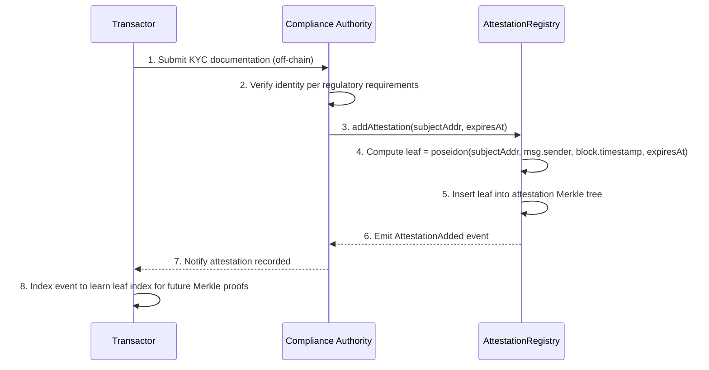
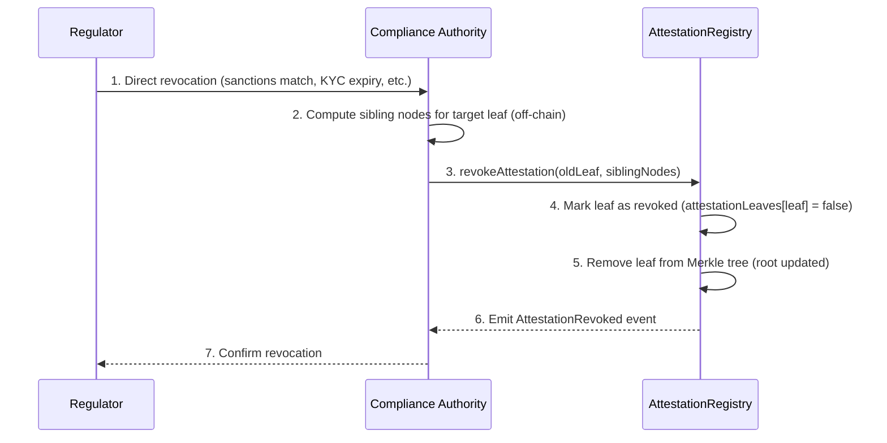
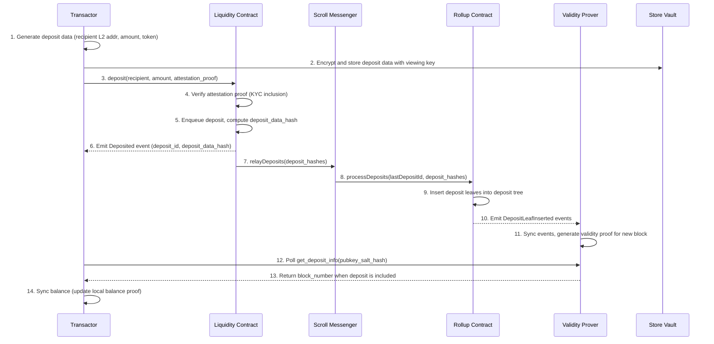
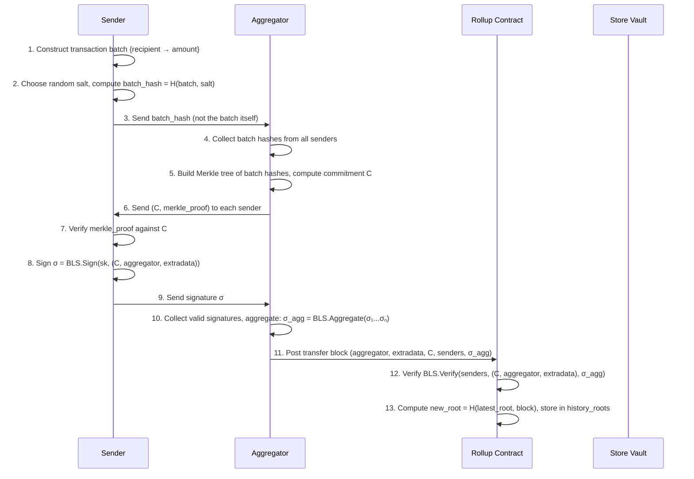
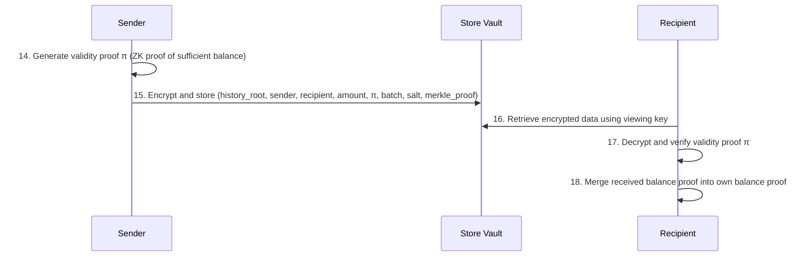
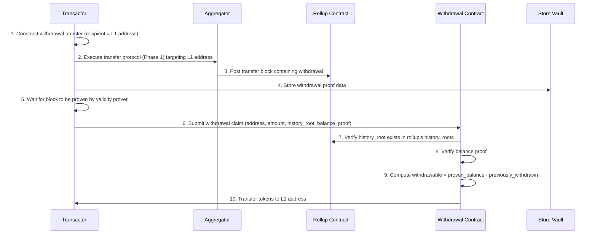

# Plasma Private Payments: Protocol Specification

## Executive Summary

This protocol enables institutional stablecoin payments with transaction-level privacy using a stateless ZK-rollup architecture based on [Intmax2](https://eprint.iacr.org/2025/021). Unlike shielded-pool approaches that publish encrypted commitments and nullifiers on L1, this design achieves privacy *architecturally*: transaction details are never posted on-chain. Only block commitments and aggregated BLS signatures are recorded by the rollup contract. Users maintain their own balance proofs client-side using recursive zero-knowledge proofs, and transaction data is exchanged directly between sender and recipient off-chain. Compliance is enforced through attestation-gated entry: only KYC-verified participants can deposit into the system, verified via zero-knowledge proofs against an on-chain attestation registry. A dual-key architecture (spending key for transfers, viewing key for audits) enables selective regulatory disclosure without compromising spending authority.

## Problem Statement

Institutional payment flows on public blockchains expose sensitive operational data:

- **Treasury operations**: Visible cash positions and movement patterns
- **Supplier relationships**: Payment destinations reveal business relationships
- **Settlement patterns**: Timing and frequency expose trading strategies
- **Competitive intelligence**: Aggregated on-chain data enables competitor analysis

Institutions require payment privacy equivalent to traditional banking while operating on public infrastructure.

### Constraints

| Category | Requirement |
|----------|-------------|
| **Privacy** | Transaction amounts, counterparties, and patterns hidden from public observers. Transaction *existence* may be visible (block commitments are public), but contents are not. |
| **Regulatory** | Only KYC-verified participants. Viewing keys enable selective disclosure for AML/CFT monitoring. |
| **Operational** | Near real-time settlement. High throughput (hundreds of transaction batches per second theoretically). Compatible with existing ERC-20 stablecoins and native ETH. |
| **Trust** | Aggregators cannot steal funds, link transactions, or censor selectively (permissionless aggregation). No centralized sequencer. |
| **Scalability** | On-chain data usage scales with the number of *senders* per block, not the number of transactions. Each sender can batch unlimited recipients into a single block entry. |

## Approach

### Strategy

The protocol implements a **stateless ZK-rollup with attestation-gated entry** using four core mechanisms:

1. **Attestation-Gated Entry**: Deposits require a ZK proof of inclusion in an on-chain KYC attestation tree, preventing unauthorized actor participation.
2. **Stateless ZK-Rollup**: Transaction details stay entirely off-chain. The rollup contract stores only block commitments (Merkle roots of transaction batch hashes) and aggregated BLS signatures of the senders. Aggregators are stateless and permissionless.
3. **Client-Side Balance Proofs**: Each user maintains a recursive ZK proof of their balance, constructed from received transaction data and on-chain block history. This shifts computation from L1/aggregator to the client.
4. **Dual-Key Architecture**: Separate spending keys (BLS, for signing block commitments and authorizing transfers) and viewing keys (for decrypting transaction data stored in the store vault), supporting institutional key management and regulatory disclosure.

### Why This Approach

| Alternative | Trade-off | Why Not |
|------------|-----------|---------|
| Shielded pool (Railgun-style, UTXO on L1) | Proven privacy with mature tooling, but every commitment and nullifier is posted on-chain | Higher gas per transaction;  scalability limited by L1 data |
| Traditional ZK-rollup (e.g., zkSync, Starknet) | Full transaction data posted to L1 for data availability | Data availability bottleneck limits throughput; all tx data public on L1 |
| Optimistic rollup | Simpler verification, but relies on fraud proofs and challenge periods | Slower finality (7-day challenge window); less privacy (full tx data on L1) |
| FHE-based payments | Flexible computation on encrypted data | Higher computational cost; less mature tooling; verification overhead |
| Intmax2 stateless ZK-rollup | Minimal on-chain data; permissionless aggregation; client-side proof generation | Requires client-side proof generation; newer, less battle-tested |

The Intmax2 architecture uniquely satisfies the constraints: near-zero on-chain data per transaction provides privacy and scalability, permissionless aggregation eliminates sequencer trust, and client-side balance proofs enable selective disclosure. The trade-off is shifted computation to clients, which is acceptable for institutional users with adequate hardware.

### Tools & Primitives

| Tool | Purpose |
|------|---------|
| **BLS Signatures** | Aggregatable signatures for block commitment signing; enables compact on-chain representation of sender consent |
| **Plonky2** | Recursive ZK proof system for balance proofs and validity proofs; enables efficient proof composition |
| **Poseidon Hash** | ZK-friendly hash function for Merkle trees, transaction batch hashing, and attestation leaves |
| **Sparse Merkle Trees** | Authenticated dictionary scheme for transaction batch commitments (binding property ensures security) |
| **Solidity** | On-chain contracts: Rollup, Liquidity, Withdrawal, BlockBuilderRegistry, AttestationRegistry |

## Protocol Design

### Participants & Roles

| Role | Description | Keys Held |
|------|-------------|-----------|
| **Transactor** | Institutional user performing deposits, transfers, and withdrawals | BLS keypair (L2 spending), ETH keypair (L1), Viewing key |
| **Aggregator (Block Builder)** | Collects transaction batch hashes, constructs Merkle trees, aggregates BLS signatures, posts transfer blocks to rollup contract | L1 signing key, optional BLS key |
| **Validity Prover** | Observes on-chain events, generates validity proofs for posted blocks via recursive ZK circuits | None (stateless service) |
| **Store Vault Server** | Stores encrypted transaction data (deposits, transfers, withdrawals) for clients to retrieve and decrypt with their viewing key | None (untrusted storage) |
| **Compliance Authority (Attester)** | Issues KYC attestations to verified participants, stored in on-chain attestation tree | Attestation signing key (ETH account) |
| **Regulator** | Observer granted viewing keys by transactors for audit purposes | Granted viewing keys |

### Key Derivation

```
spending_key  = random(Zq)                    // BLS secret key
spending_pubkey = g1^spending_key ∈ G1         // BLS public key = L2 address
viewing_key   = random()                       // Separate key for decrypting stored data
```

- **L2 address**: The BLS public key uniquely identifies the user on the rollup.
- **Spending authority**: The BLS secret key signs block commitments during the transfer protocol and is used to generate balance proofs. Only the spending key holder can authorize transfers or withdrawals.
- **Viewing key**: Decrypts deposit, transfer, and withdrawal data stored in the store vault server. Grants read-only audit access without spending authority. Institutions should manage viewing key distribution carefully, potentially using threshold schemes for regulator access in production.

**Security note**: Compromise of the spending key allows unauthorized transfers. Compromise of the viewing key reveals full transaction history but does not enable theft.

### Data Structures

#### Transaction Batch

A transaction batch is a mapping from recipients to amounts, representing all payments a sender wants to make in a single block:

```
TransactionBatch = { recipient → amount }

where:
  recipient ∈ K = K1 ⨿ K2    // L1 address or L2 address
  amount    ∈ V+              // Positive value (supports multi-token)
```

A sender can include an arbitrary number of recipients in a single batch. The batch is hashed with a random salt before being sent to the aggregator, hiding the contents:

```
batch_hash = H(transaction_batch, salt)
```

#### Transfer Block

A transfer block is the on-chain record of a set of transactions, containing only commitments and signatures:

```
TransferBlock {
    aggregator:   address     // L1 address of the aggregator
    extradata:    bytes       // Replay/timing protection (e.g., deadline)
    commitment:   bytes32     // Merkle root of all transaction batch hashes
    senders:      address[]   // L2 addresses (BLS public keys) of senders
    signature:    bytes       // Aggregated BLS signature over (commitment, aggregator, extradata)
}
```

**On-chain size**: `|senders| × 96 + 132` bytes (uncompressed). With ID-based sender compression: `|senders| × ~4 + 132` bytes.

#### Deposit Block

A deposit block records a single deposit from L1 to L2:

```
DepositBlock {
    recipient:    address     // L2 address (BLS public key) of the recipient
    amount:       uint256     // Deposited value
    token_index:  uint32      // Index of the deposited token type
}
```

#### Balance Proof

A balance proof is the client-side data structure that enables a user to prove their balance. It is a collection of entries, each linking a block commitment to a sender's transaction:

```
BalanceProof = Dict(
    (commitment, sender) → ((merkle_proof, salt), transaction_batch)
)
```

A balance proof is **valid** if every entry's Merkle proof verifies against the corresponding block commitment. Users update their balance proof by:
1. Adding their own sent transactions (with the Merkle proof received from the aggregator)
2. Merging balance proofs received from senders (after verifying validity)

#### Validity Proof

A validity proof is a recursive ZK proof attesting that a sender had sufficient balance for a transaction:

```
ValidityProof {
    history_root:   bytes32   // History root of the rollup block containing the transaction
    sender:         address   // L2 address of the sender
    recipient:      address   // L2 or L1 address of the recipient
    amount:         uint256   // Transaction amount
    proof:          bytes     // ZK proof (Plonky2)
}
```

The recipient only learns the specific transaction details and gains zero knowledge about the sender's balance or other transactions.

### Attestation-Gated Entry

Before a transactor can deposit funds, they must be attested by an authorized compliance authority. The attestation mechanism ensures that only KYC-verified entities can enter the system.

#### Attestation Registry Contract

The attestation registry maintains a Merkle tree of KYC attestation leaves:

```solidity
contract AttestationRegistry {
    // Merkle tree of attestation leaves
    MerkleTree internal _tree;

    // Mapping of attestation leaf hash to existence status
    mapping(bytes32 => bool) public attestationLeaves;

    // Authorized attesters (compliance authorities)
    mapping(address => bool) public authorizedAttesters;

    event AttestationAdded(bytes32 indexed leaf, bytes32 indexed subjectAddr,
                           address indexed attester, uint64 issuedAt, uint64 expiresAt);
    event AttestationRevoked(bytes32 indexed leaf, address indexed revokedBy);
}
```

#### Attestation Leaf

```
AttestationLeaf {
    subject_addr:     address   // L2 address (BLS public key hash) of attested party
    attester:         address   // Compliance authority L1 address
    issued_at:        uint64    // Timestamp of attestation issuance
    expires_at:       uint64    // Expiration timestamp (0 = no expiry)
}

leaf_hash = poseidon(subject_addr, attester, issued_at, expires_at)
```

#### Attestation Issuance (KYC Onboarding)



**Prerequisites**: The Compliance Authority must be registered as an authorized attester by the contract owner via `addAttester(address)`.

#### Attestation Revocation

When a participant's KYC expires, they become sanctioned, or a regulator directs removal:



After revocation, the participant can no longer produce valid Merkle inclusion proofs against the updated attestation root, preventing new deposits. Notes already in the rollup remain spendable; the protocol does not freeze in-flight funds.

#### Deposit Attestation Proof

The Liquidity contract MUST verify a ZK proof of attestation inclusion before accepting any deposit. The proof demonstrates:

1. The depositor's L2 address exists as a leaf in the attestation tree
2. The attestation has not expired (or has no expiry)
3. The proof is valid against the current attestation tree root

This is verified without revealing *which* attestation leaf was used, preserving the depositor's privacy within the set of all attested participants.

### On-Chain State

#### Rollup Contract

The rollup contract is deployed on an L2 (e.g., Scroll) and manages the rollup state:

```
State {
    history_roots:          bytes32[]        // Hash chain of block commitments
    withdrawn:              mapping(address → uint256)  // Total withdrawn per L1 address
    deposit_tree:           MerkleTree       // Tree of processed deposit leaves
    block_count:            uint256          // Number of transfer blocks posted
    last_deposit_id:        uint256          // Last processed deposit ID
}
```

When a new block `B` is added:
- **Deposit or transfer block**: `new_root = H(latest_root, B)`, appended to `history_roots`
- **Withdrawal block**: `withdrawn[addr] += amount` for each withdrawal in the block

The rollup contract verifies:
- Transfer blocks: aggregated BLS signature over `(commitment, aggregator, extradata)` against the sender set
- Deposit processing: only accepts calls from the cross-chain messenger with the liquidity contract as the original sender (`onlyLiquidityContract` modifier)

#### Liquidity Contract

The liquidity contract handles deposits from L1/L2 into the rollup:

```
State {
    deposit_queue:          DepositData[]    // 1-indexed queue of pending deposits
    last_deposit_id:        uint256          // Monotonically increasing deposit counter
    scroll_messenger:       address          // Cross-chain relay contract
    rollup:                 address          // Rollup contract address
    aml_permitter:          address          // Attestation verification contract
}
```

The deposit queue stores `DepositData` hashes. When deposits are relayed to the rollup (via the cross-chain messenger), the rollup processes them by inserting deposit leaves into its deposit tree and emitting `DepositLeafInserted` events.

#### Block Builder Registry

Tracks registered block builders:

```
State {
    builders:               mapping(address → BuilderInfo)
    stake_amount:           uint256          // Required stake
}

BuilderInfo {
    stake:                  uint256
    last_heartbeat:         uint256          // Timestamp of last heartbeat
    url:                    string           // Builder's API endpoint
}
```

Block builders register by staking and periodically sending heartbeats. The registry provides a discovery mechanism for clients to find active builders.

#### Withdrawal Contract

Processes withdrawal claims:

```
State {
    liquidity:              address
    rollup:                 address
    direct_withdrawal_fee:  uint256
    claimable_withdrawal_fee: uint256
}
```

### Flows

#### Deposit

Converts public tokens into a private L2 balance. Requires proof of KYC attestation.



**Steps**:

1. Transactor prepares deposit data: recipient L2 address, deposit amount, token index
2. Transactor encrypts deposit metadata and stores it in the store vault server (retrievable via viewing key)
3. Transactor calls `deposit()` on the Liquidity contract with the deposit amount and a ZK proof of attestation inclusion
4. Liquidity contract verifies the attestation proof against the current attestation tree root
5. Liquidity contract enqueues the deposit and computes a deposit data hash
6. Liquidity contract emits a `Deposited` event with the deposit ID and hash
7. Deposits are relayed from L1/L2 to the rollup via the cross-chain messenger (Scroll Messenger)
8. The messenger calls `processDeposits()` on the rollup contract (authenticated via `onlyLiquidityContract` modifier)
9. Rollup inserts deposit leaves into its deposit Merkle tree
10. Rollup emits `DepositLeafInserted` events
11. The validity prover observes these events, syncs witnesses, and generates a validity proof for the new block state
12. Client polls the validity prover until the deposit is confirmed (appears in a proven block)
13. Validity prover returns the block number containing the deposit
14. Client updates their local balance proof to include the deposit

#### Private Transfer

Transfers value between L2 accounts. The transfer protocol has two phases, following the Intmax2 design.

##### Phase 1: Block Construction



**Key privacy property**: The aggregator receives only salted hashes of transaction batches (step 3). The aggregator cannot determine who is paying whom or how much. The transaction contents are never revealed to the aggregator.

##### Phase 2: Balance Proof Distribution



**Steps**:

14. After the transfer block is posted on-chain, the sender generates a validity proof: a recursive ZK proof attesting that the sender had sufficient balance for the transaction at the given history root
15. The sender encrypts the transaction data (including the validity proof, transaction batch, salt, and Merkle proof from the aggregator) and stores it in the store vault server
16. The recipient retrieves the encrypted data from the store vault using their viewing key
17. The recipient decrypts and verifies the validity proof. The proof reveals only the specific transaction details (sender, recipient, amount) and nothing else about the sender's balance or other transactions
18. The recipient merges the received balance proof into their own, using the `Merge` operation on balance proof dictionaries

**Zero-knowledge property**: The recipient learns only `(history_root, sender, recipient, amount)` for their specific transaction. They gain zero knowledge about the sender's total balance, other transactions in the same block, or any other user's activity.

#### Withdrawal

Converts a private L2 balance back to public L1 tokens. Withdrawal is a two-step process: first a transfer to an L1 address within the rollup, then a claim on L1.



**Steps**:

1. Transactor constructs a transaction batch with the recipient set to an L1 address (indicating withdrawal intent)
2. The transaction goes through the standard transfer protocol (Phase 1: block construction with aggregator)
3. The aggregator posts the transfer block to the rollup contract
4. Transactor stores withdrawal proof data in the store vault
5. Transactor waits for the validity prover to generate a proof for the block containing the withdrawal
6. Transactor submits a withdrawal claim to the Withdrawal contract, providing their L1 address, claimed amount, the history root of the block, and a ZK balance proof
7. The Withdrawal contract verifies that the history root exists in the rollup's list of history roots
8. The contract verifies the balance proof (ZK proof that the L1 address has received at least the claimed amount at the given history root)
9. The contract computes the withdrawable amount by subtracting any previously withdrawn amounts: `withdrawable = proven_balance - withdrawn[address]`
10. The contract transfers the withdrawable amount to the L1 address and updates the withdrawn mapping

**Double-spend prevention**: The `withdrawn` mapping tracks cumulative withdrawals per L1 address. Even if a user submits multiple withdrawal claims using different history roots, the total withdrawn amount is always deducted, preventing double-spending.

## Cryptographic Details

### Primitives

| Primitive | Specification | Usage |
|-----------|---------------|-------|
| **Signature Aggregation** | Modified BLS | Block commitment signing; compact on-chain representation |
| **Hash Function** | Poseidon (BN254 scalar field) | Merkle trees, transaction batch hashing, attestation leaves |
| **Authenticated Dictionary** | Sparse Merkle Tree | Transaction batch commitments (binding property ensures security) |
| **ZK Proof System** | Plonky2 (recursive, FRI-based) | Balance proofs, validity proofs, validity transition proofs |
| **Collision-Resistant Hash** | `H: {0,1}* → {0,1}^n` | Block history chain (`new_root = H(latest_root, block)`) |
| **Encryption** | ECIES / AEAD | Note encryption for store vault (viewing key decryption) |

### BLS Signature Scheme

The protocol uses a modified BLS signature scheme with rogue-key protection:

- **KeyGen**: `sk ← random(Zq)`, `pk ← g1^sk ∈ G1`
- **Sign**: `σ ← H0(m)^sk ∈ G0`
- **Aggregate**: `σ_agg ← Π(σi^ti)` where `ti = H1(pki, {pk1,...,pkn})`
- **Verify**: Check `e(g1, σ_agg) == e(pk_agg, H0(m))` where `pk_agg = Π(pki^ti)`

The rogue-key mitigation factor `ti` prevents an adversary from constructing a public key that cancels out honest signers' contributions.

### Balance Proof Computation

Given a balance proof `π ∈ Π` and the current rollup state `B* ∈ B*`, the balance function `Bal(π, B*)` computes account balances in two steps:

1. **Extract partial transactions**: For each block in `B*`, extract transactions from the balance proof. For deposit blocks, extract the deposit amount credited to the recipient. For transfer blocks, look up the sender's transaction batch in the balance proof and extract each payment. If the balance proof does not contain an entry for a sender in a transfer block, the transaction amount is treated as unknown (`⊥`).

2. **Apply transition function**: Starting from zero balances, apply each partial transaction sequentially. For complete transactions (known amount), transfer the minimum of the stated amount and the sender's current balance from sender to recipient. For incomplete transactions (unknown amount, `⊥`), set the sender's balance to zero (conservative lower bound) and leave other balances unchanged.

This produces a **lower bound** on each account's true balance. The key insight is that unknown transactions can only *reduce* a sender's provable balance, never inflate anyone's balance beyond what can be proven.

### Validity Proof Pipeline

The validity prover service maintains a continuous pipeline to generate proofs for new blocks:

1. **Event observation**: An observer monitors L1/L2 for `Deposited`, `DepositLeafInserted`, and `BlockPosted` events from the rollup and liquidity contracts
2. **Witness construction**: `sync_validity_witness` processes observed events into structured witness data for proof generation
3. **Proof generation**: `generate_validity_proof` dispatches proof tasks to a worker pool (via Redis queue). Each task produces a Plonky2 proof attesting to the validity of a block transition
4. **Proof availability**: Completed proofs are stored and made available to block builders (who wait for validity prover sync before posting new blocks) and to clients (who poll for proof availability to confirm deposits and transfers)

## Security Model

### Threat Model

| Adversary | Capabilities | Mitigations |
|-----------|--------------|-------------|
| **Public Observer** | Sees all on-chain data: block commitments, sender lists (BLS public keys), deposit amounts, withdrawal amounts | Transaction details (recipient, amount per recipient) never posted on-chain; observer sees only Merkle roots and aggregated signatures |
| **Malicious Aggregator** | Can delay block publication, attempt replay attacks, selectively censor senders, or refuse to relay Merkle proofs | Relayer contracts enforce deadlines (extradata field); aggregation is permissionless; Users can switch aggregators or run their own; replay protection via monotonic timestamps |
| **Compromised Recipient** | Receives sender's validity proof for their specific transaction | Zero-knowledge: validity proof reveals only `(sender, recipient, amount)` for that transaction; no information about sender's balance or other transactions |
| **Colluding Aggregator + Recipient** | Aggregator knows sender's BLS public key; recipient knows transaction amount | Aggregator only sees salted hash of transaction batch, not contents; cannot link sender identity to specific payment amounts or recipients |
| **Compromised Viewing Key** | Can decrypt all historical and future transaction data for that key from the store vault server | Cannot spend funds, viewing key grants read-only access; key rotation recommended |
| **Malicious Compliance Authority** | Can issue attestations to unauthorized parties | Requires governance controls (multi-sig, DAO) for attester authorization in production |
| **Malicious Store Vault Operator** | Learns viewing public key (stable identifier) on every request; observes which topics are accessed, request timing, frequency, and data digests queried; can correlate activity patterns across sessions; data is encrypted client-side (BLS encryption) so content is opaque, but metadata is fully visible | Client-side BLS encryption protects data confidentiality; all topics enforce AuthRead so only the key holder can read their own data; no PIR is employed: the server learns **who** is accessing **which** topic and **when**, but not the plaintext content; production should consider PIR or oblivious access patterns to reduce metadata leakage, or operating the service exclusively within your own organization. |
| **Network Observer** | Monitors IP addresses, timing of requests to aggregators and store vault | Out of scope for PoC; production should use Tor/mixnet for client-aggregator communication |

### Security Theorem

The rollup contract's fund safety is formally proven in the Intmax2 paper (Theorem 1, formally verified in Lean):

> **Theorem (Fund Safety)**: The rollup contract is *secure*: winning the attack game (draining the contract balance below zero) is at least as hard as breaking the binding property of the authenticated dictionary scheme or finding a collision of the hash function H.

**Attack game**: A PPT adversary interacts with the rollup contract by submitting an arbitrary sequence of deposit, transfer, and withdrawal requests. The adversary wins if the contract's balance becomes negative (i.e., more funds have been withdrawn than deposited).

**Proof sketch**: The proof proceeds by showing that the balance function `Bal` is monotone in the balance proof argument (Lemma 4), and that the source account's balance is always non-positive (Lemma 3), which together imply that total withdrawals cannot exceed total deposits. The key technical step handles the case where multiple withdrawal proofs share overlapping transaction data; The Merge operation on balance proofs preserves validity, and the binding property of the authenticated dictionary prevents conflicting entries.

### Guarantees

| Property | Description |
|----------|-------------|
| **Confidentiality** | Transaction details (amounts, recipients per sender) never posted on-chain. The rollup stores only block commitments and sender lists. |
| **Unlinkability** | Aggregator receives only salted hashes of transaction batches. Cannot determine who is paying whom or how much within a block. |
| **Double-Spend Prevention** | The balance function computes conservative lower bounds. Withdrawals deduct from proven balances via the `withdrawn` mapping. Formally proven secure (Theorem 1). |
| **Compliance Gating** | Attestation proof required at deposit. Unauthorized parties cannot enter the system. Revocation prevents future deposits but does not freeze in-flight funds. |
| **Selective Disclosure** | Viewing key decrypts deposit, transfer, and withdrawal data from the store vault server. Enables regulatory audit of a specific transactor's full history without compromising spending authority or other users' privacy. |
| **Liveness** | Permissionless aggregation: anyone can become an aggregator. Users can withdraw even if all aggregators disappear (by running their own aggregator or submitting balance proofs directly). |
| **Fund Safety** | Formally verified (Lean theorem prover): the rollup contract balance is always non-negative for any valid execution trace. |
| **Sender Privacy from Aggregator** | The aggregator learns only the set of sender public keys and salted transaction hashes. Transaction contents are hidden. |

### Limitations & Shortcuts (PoC Scope)

| Limitation | Impact | Production Mitigation |
|------------|--------|----------------------|
| **No attestation contract in PoC** | Deposits are not KYC-gated in the current implementation | Deploy AML permitter contract with on-chain attestation tree; integrate proof verification into Liquidity contract |
| **Viewing key shares full transaction history** | Compromised viewing key permanently leaks all historical data for that user | Implement key rotation with historical cutoff; time-bounded viewing keys |
| **Client-side proof generation** | Computationally intensive (Plonky2 recursive proofs); impractical for light clients | Delegated proof generation services; zkSaaS providers |

## Terminology

| Term | Definition |
|------|------------|
| **Transaction Batch** | A mapping from recipients to amounts, representing all payments a sender makes in a single block. Hashed with a random salt before submission to the aggregator. |
| **Transfer Block** | The on-chain record of a set of transactions: contains a Merkle root of transaction batch hashes, the set of sender public keys, and an aggregated BLS signature. |
| **Deposit Block** | An on-chain record of a deposit from L1/L2 into the rollup, specifying the recipient L2 address and amount. |
| **Balance Proof** | A client-side data structure mapping block commitments and senders to their transaction batches with Merkle proofs. Used to prove account balances. |
| **Validity Proof** | A recursive ZK proof (Plonky2) attesting that a sender had sufficient balance for a specific transaction at a given history root. Sent to the recipient as proof of payment. |
| **History Root** | A hash in the rollup's hash chain of block commitments. Each new block extends the chain: `new_root = H(previous_root, block)`. Used as an anchor for balance and withdrawal proofs. |
| **Aggregator (Block Builder)** | An entity that collects transaction batch hashes from senders, builds a Merkle tree, distributes proofs, collects and aggregates BLS signatures, and posts the resulting transfer block to the rollup contract. Stateless and permissionless. |
| **Authenticated Dictionary** | A cryptographic data structure (sparse Merkle tree) that commits to a set of key-value pairs and provides lookup proofs. The binding property ensures that no two different values can be proven for the same key under the same commitment. |
| **Attestation** | A signed statement from a compliance authority that an L2 address belongs to a KYC-verified entity, stored as a leaf in the on-chain attestation Merkle tree. |
| **Store Vault** | An untrusted server that stores encrypted transaction data. Clients encrypt data with recipients' viewing keys before upload. The server cannot read the contents. |
| **Viewing Key** | A cryptographic key that decrypts transaction data stored in the store vault. Grants read-only access to a user's deposit, transfer, and withdrawal history without spending authority. |
| **Spending Key** | The BLS secret key that authorizes transfers and withdrawals. Required to sign block commitments and generate balance proofs. |
| **Scroll Messenger** | The cross-chain messaging contract that relays deposit data from the Liquidity contract to the Rollup contract, ensuring the `onlyLiquidityContract` modifier is satisfied. |

## References

- [Intmax2: A ZK-rollup with Minimal Onchain Data and Computation Costs Featuring Decentralized Aggregators](https://eprint.iacr.org/2025/021): Rybakken, Hioki, Yaksetig, Diaconescu, Silváši, Sutherland. Core protocol design, security proof (Theorem 1, formally verified in Lean).
- [IPTF-MAP: Private Payments Use Case](https://github.com/ethereum/iptf-map/blob/master/use-cases/private-payments.md): Business requirements and institutional constraints.
- [IPTF-MAP: Private Payments Approach](https://github.com/ethereum/iptf-map/blob/master/approaches/approach-private-payments.md): Architecture recommendations and trade-off analysis.
- [Compact Multi-Signatures for Smaller Blockchains](https://doi.org/10.1007/978-3-030-03329-3_15): Boneh, Drijvers, Neven (2018). Modified BLS signature scheme with rogue-key protection.
- [Plonky2](https://github.com/0xPolygonZero/plonky2): Recursive ZK proof system (FRI-based) used for balance and validity proofs.
- [Poseidon Hash Function](https://www.poseidon-hash.info/): ZK-friendly hash for Merkle trees and commitments.
- [Plasma Prime Design Proposal](https://ethresear.ch/t/plasma-prime-design-proposal/4222): Predecessor design incorporating RSA accumulators and UTXO model.
- [Springrollup](https://github.com/adompeldorius/springrollup): Earlier Layer 2 design with on-chain/off-chain state split.
