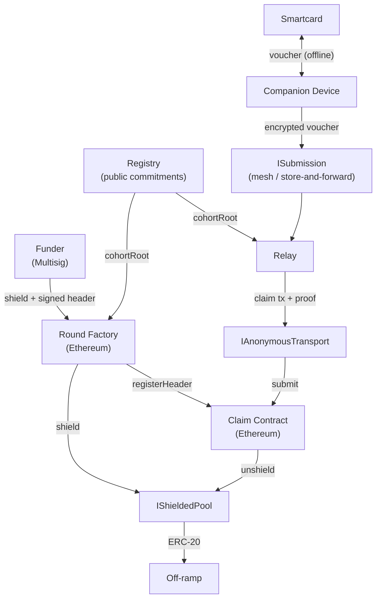
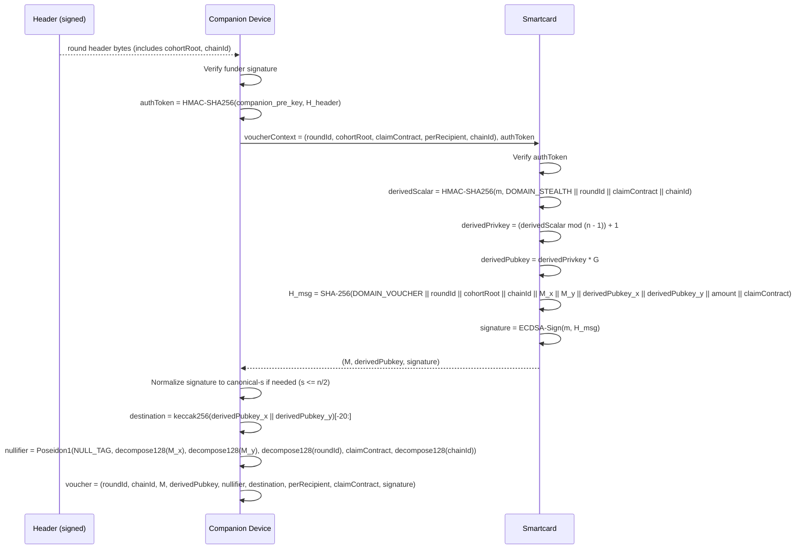
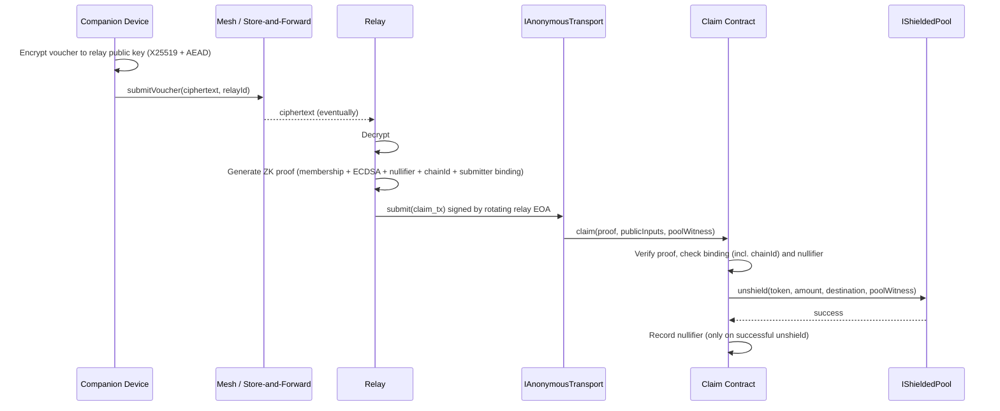

# Resilient Disbursement Rails: Protocol Specification

## Problem Statement

Humanitarian disbursements in adversarial jurisdictions face the eleven-capability adversary set enumerated in [Threat Model](#threat-model). Recipients operate tamper-resistant smartcards with no client-side ZK, intermittent or absent internet, and a high probability of device loss. Off-ramp unlinkability is the dominant cryptographic requirement: every documented prosecution between 2013 and 2026 pivoted on KYC'd off-ramps or subpoena'd exchange records, never on pure on-chain clustering. The protocol prevents off-ramp KYC from linking back to the disbursement event, subject to an explicit organizational separation between the registry operator and the implementing partner.

## Use Case Overview

A funder distributes a fixed per-recipient amount to a cohort of recipients enrolled through a public-key registry. Each recipient holds a tamper-resistant smartcard running a custom applet that signs an offline voucher. A relay lifts the voucher into an on-chain ZK proof and submits the claim through an anonymous transport. Funds settle to a one-time stealth destination derived on-card.

### Components

| Component | Role | Operator |
|-----------|------|----------|
| Smartcard | Custom applet on a JCOP-class secure element, holding a single secp256k1 keypair `(m, M)` generated on-card. Custom `SIGN_VOUCHER` APDU constructs the voucher preimage internally and signs it; derives the per-claim stealth public key on-card via HMAC-SHA256. | Recipient |
| Companion device | Reads smartcard, computes nullifier, encrypts voucher, hands ciphertext to mesh transport. Holds no long-lived recipient secrets. | Recipient |
| Registry | Holds `(cardId, M, status)` per enrolled card; publishes `cohortRoot` on-chain whenever the active set changes. Public-data only, no secret state. | Independent registry operator (distinct legal entity from implementing partner) |
| IShieldedPool | Shielded ERC-20 transfer with sender/recipient unlinkability; k-anonymity within an association set | Existing privacy pool deployment |
| ISubmission | Mesh or store-and-forward delivery of encrypted vouchers from companion to relay | Mesh transport network |
| IAnonymousTransport | Network-layer submission decorrelating origin from Ethereum endpoint | Tor or Nym |
| Round Factory | Atomic shield-and-publish; registers round header with Claim Contract | Ethereum smart contract |
| Claim Contract | Verifies relay ZK proofs, tracks nullifiers, invokes pool unshield | Ethereum smart contract |
| Relay | Decrypts vouchers, generates ECDSA-in-SNARK proofs, submits via IAnonymousTransport. Rotates voucher key ≥ every 24h; rotates submission EOA per round or per day. | Independent relay operators (jurisdictionally diverse) |
| Funder | Multisig that publishes rounds and signs round headers. Holds no beneficiary list. | Funding organization |
| Implementing Partner | Field distribution of smartcards and round headers | Distinct legal entity from registry operator |

### Recipient Actions

1. Receive a signed round header out-of-band (mesh, SMS, USSD, radio, poster QR, agent handoff). Companion device verifies funder signature.
2. Insert smartcard into companion device. Card derives the on-card stealth public key, constructs the voucher preimage internally, and signs it.
3. Companion encrypts the voucher to one or more relays and hands the ciphertext to mesh transport.
4. After settlement, recipient unshields at their off-ramp through the resulting stealth address.

### System Architecture



### Constraints

| Category | Requirement |
|----------|-------------|
| Settlement | Ethereum L1 or a comparable EVM L2 of equivalent finality. Reorg-safety margin set per deployment to at least the deepest observed reorg on the target chain. |
| Privacy | Off-ramp unlinkability up to the stealth destination. Cohort-level anonymity within `cohortRoot`. Forward secrecy of past claim identifiers under card seizure is NOT provided; see [Forward Secrecy](#forward-secrecy). |
| Regulatory | Pool-level k-anonymity within the chosen IShieldedPool association set. Compliance witnesses tolerated as opaque pool inputs. Off-ramp KYC out of scope. |
| Operational | Smartcard-only signing; no on-card ZK. Tolerance for high-latency mesh transport. No real-time recipient internet. Card loss recoverable via re-enrollment. |
| Trust | Funder is multisig. Registry operator and implementing partner MUST be organizationally separated; the funder MAY coincide with either party but not with both. At least one honest reachable relay per claim. Recipient-side relay diversity across rounds. |

## Approach

### Strategy

- Funder publishes a round through a round-factory contract that, in order, verifies funder signature, asserts cohort and `chainId` equality against the Registry, shields `perRecipientAmount * cohortSize` to IShieldedPool, registers the signed header with the Claim Contract, and emits a publication event.
- Smartcard derives a per-claim stealth public key via HMAC-SHA256 over its master secret, constructs the voucher preimage internally (binding round, cohort root, master pubkey, stealth pubkey, amount, claim contract, and `chainId`), and signs it.
- Companion derives the Ethereum stealth address off-card, computes the nullifier, wraps the voucher in IND-CCA2 AEAD to a relay's rotating public key, and hands the ciphertext to mesh transport.
- Relay decrypts, generates a ZK proof of cohort membership, ECDSA validity, nullifier consistency, and `chainId` binding, then submits via IAnonymousTransport.
- Claim Contract verifies the proof, recomputes the stealth address on-chain via keccak256, checks header binding, `chainId`, and nullifier non-consumption, then invokes pool unshield under strict checks-effects-interactions ordering.
- Residual is recoverable by the funder after `closeBlock + 30 days`.

Rationale for this approach is in [Alternatives Considered](#appendix-a-alternatives-considered); cryptographic primitives are listed in [Primitives](#primitives).

## Protocol Design

### Flows

#### Round Publication

```mermaid
sequenceDiagram
    participant F as Funder Multisig
    participant REG as Registry
    participant RF as Round Factory
    participant SP as IShieldedPool
    participant CC as Claim Contract

    F->>REG: cohortRoot, cohortSize
    REG-->>F: root, size, version
    F->>F: Sign header (roundId, cohortVersion, cohortRoot, perRecipient, size, token, closeBlock, claimContract, chainId)
    F->>RF: publishRound(header) via IAnonymousTransport
    RF->>RF: Verify funder multisig signature
    RF->>REG: Read cohortRoot(version), cohortSize(version); assert header equality
    RF->>RF: Assert header.chainId == block.chainid
    RF->>F: Pull perRecipient * size of token (ERC-20 approve)
    RF->>SP: shield(token, perRecipient * size, claimContract.shieldedRecipient)
    RF->>CC: registerHeader(header) [onlyFactory]
    RF-->>RF: emit RoundPublished(header)
```

All pre-shield checks (signature, cohort equality, `chainId`) execute before the shield. A revert in any step reverts the entire factory call.

#### Voucher Construction (Recipient, Offline)



#### Voucher Submission and Settlement



A recipient MAY fan out the encrypted voucher to up to `k < N_relays` relays per voucher. The nullifier ensures only the first on-chain settlement succeeds; duplicate submissions revert at the claim contract and the relay bears the gas cost.

#### Round Close

After `closeBlock`, the claim contract rejects further claims. After a further 30-day timelock, the funder multisig MAY call `funderUnshieldResidual` to recover residual shielded balance. Reorg safety: relays and companion devices treat the round as CLOSED for submission decisions from `closeBlock - 64`. Deployments on chains with deeper reorgs MUST set the margin equal to the deepest observed reorg depth.

### Data Structures

#### Voucher

```
voucher = (
    roundId: bytes32,
    chainId: uint256,
    M: (bytes32, bytes32),                // card master public key (cohort tree leaf source)
    derivedPubkey: (bytes32, bytes32),    // one-time stealth pubkey, derived on-card
    nullifier: bytes32,
    destination: address,                 // = keccak256(derivedPubkey_x || derivedPubkey_y)[-20:]; recomputed on-chain
    amount: uint256,                      // == header.perRecipientAmount
    claimContractAddress: address,
    signature: (bytes32, bytes32)         // (r, s) with s <= n/2 (canonicalized off-card)
)
```

Signed-message preimage (308 bytes), in order:

| Field | Width | Encoding |
|-------|-------|----------|
| `DOMAIN_VOUCHER` | 32 | `SHA256("RDR/voucher/v1")` |
| `roundId` | 32 | `bytes32` as-is |
| `cohortRoot` | 32 | `bytes32` as-is |
| `chainId` | 32 | big-endian `uint256` |
| `M_x` | 32 | big-endian |
| `M_y` | 32 | big-endian |
| `derivedPubkey_x` | 32 | big-endian |
| `derivedPubkey_y` | 32 | big-endian |
| `amount` | 32 | big-endian `uint256` |
| `claimContractAddress` | 20 | as-is |

Total: `32 × 9 + 20 = 308` bytes. The in-circuit verifier MUST reproduce this byte string bit-identically. The destination is NOT in the preimage; it is derived on-chain from public-input `derivedPubkey` limbs, foreclosing companion-side manipulation without requiring on-card or in-circuit keccak256.

#### Round Header

| Field | Type | Notes |
|-------|------|-------|
| `roundId` | `bytes32` | Globally unique |
| `cohortVersion` | `uint64` | Registry counter; bumped on every cohort update |
| `cohortRoot` | `bytes32` | Pinned at publication |
| `perRecipientAmount` | `uint256` | Fixed per claim |
| `cohortSize` | `uint256` | Asserted equal to `Registry.cohortSize(cohortVersion)` |
| `token` | `address` | ERC-20 |
| `closeBlock` | `uint64` | CLAIMING ends |
| `claimContractAddress` | `address` | Pinned in voucher binding |
| `chainId` | `uint256` | Asserted equal to `block.chainid` at publication and at every claim |
| `funderSignature` | `bytes` | ECDSA over `H_header` |

```
H_header = SHA256(DOMAIN_HEADER || encode(roundId, cohortVersion, cohortRoot, perRecipient, cohortSize, token, closeBlock, claimContract, chainId))
DOMAIN_HEADER = SHA256("RDR/header/v1")
```

#### Claim Proof Inputs

Public inputs (each one BN254 Fr element):

| Input | Notes |
|-------|-------|
| `roundId_hi`, `roundId_lo` | 128-bit limbs s.t. `uint256(roundId) = 2^128 · roundId_hi + roundId_lo`. Each limb constrained `< 2^128` in-circuit. |
| `cohortRoot` | `bytes32` reduced to canonical Fr; on-chain asserted `== header.cohortRoot`. |
| `chainId_hi`, `chainId_lo` | 128-bit limbs of `chainId`; each `< 2^128`; on-chain asserted `== block.chainid` AND `== header.chainId`. |
| `derivedPubkey_x_hi`, `derivedPubkey_x_lo` | 128-bit limbs of stealth public key x; each `< 2^128`. Recombined on-chain to compute `destination`. |
| `derivedPubkey_y_hi`, `derivedPubkey_y_lo` | 128-bit limbs of stealth public key y; each `< 2^128`. |
| `amount` | `Fr(uint256(amount))`. |
| `nullifier` | `Fr` directly. |
| `claimContractAddress` | `Fr(uint160(addr))`; constrained `< 2^160`. |
| `relaySubmitter` | `Fr(uint160(addr))`; constrained `< 2^160`; bound on-chain to `msg.sender`. |

Private inputs (witness):

| Input | Notes |
|-------|-------|
| `M_x`, `M_y` | Card master public key; single shared witness wire across all gadgets |
| `signature_r`, `signature_s` | Canonical-s asserted in-circuit |
| `merklePath` | Depth 20 |
| `merklePathDirections` | Bit decomposition |

### Interfaces

#### Registry

Operator-maintained on-chain commitment to cohort membership. Registry holds public commitments only; compromise of the Registry operator does NOT enable voucher forgery, nullifier computation, or destination deanonymization.

State:
- `cohortRoot[version]: bytes32`
- `cohortSize[version]: uint256`
- `currentVersion: uint64`
- `operatorKey: address` (rotation procedure published per deployment)

Functions:
- `currentVersion() -> uint64`
- `cohortRoot(version) -> bytes32` (on-chain readable)
- `cohortSize(version) -> uint256`
- `publishCohort(root, size, operatorSig)`: appends a new `(version, root, size)` tuple under `operatorKey`. Past entries are immutable; in-flight rounds keep verifying against their pinned version.
- `enroll(cardId, M, status="active")`: operator-side, off-chain; effective at next `publishCohort`.
- `revoke(cardId)`: operator-side, off-chain; effective at next `publishCohort`.

Operator off-chain state: per-card `(cardId, M, status)`. Cohort tree built from the M values of currently-active cards.

#### IShieldedPool

External shielded ERC-20 transfer.

Functions:
- `shield(token, amount, shieldedRecipient)`
- `unshield(token, amount, unshieldedRecipient, witness)`

Required properties: sender unlinkability, recipient unlinkability, deterministic recipient addressing without prior interaction, k-anonymity within the active association set.

Integration constraint: contract-as-shielded-recipient with delegated unshield authorization (e.g., Railgun, Privacy Pools, Hinkal in versions verified to support this), permitting a registered "residual-only" authorization scope used by `funderUnshieldResidual`.

#### ISubmission

Mesh or store-and-forward delivery from companion to relay.

Functions:
- `submitVoucher(encryptedVoucher, relayIdentifier) -> deliveryReceipt`

Required properties: end-to-end IND-CCA2 AEAD with ephemeral sender keying; source-fingerprinting resistance via ≥ 2 orthogonal mitigations across physical and network layers; eventual delivery; relay key rotation ≥ every 24h with secure erase.

Relay roster discovery: the set of valid `relayIdentifier` values, current relay public keys, and the active rotation epoch are distributed by the funder out-of-band on the same channels carrying the signed round header. Roster updates are signed by the funder multisig under a domain tag distinct from the round-header tag. Companion devices verify the funder signature on the roster before encrypting any voucher and treat a roster older than 48 hours as stale.

#### IAnonymousTransport

Network-layer submission of signed Ethereum transactions.

Functions:
- `submit(signedTransaction) -> txHash`

Required properties: no single entity simultaneously observes submitter network origin and plaintext transaction.

#### Round Factory

Atomic round publication.

State:
- `funderMultisig: address`
- `claimContract: address`
- `registry: address`

Functions:
- `publishRound(header) external`: in order,
  1. Verify `funderSignature` against the funder multisig.
  2. Read `cohortRoot(cohortVersion)` and `cohortSize(cohortVersion)` from Registry; assert header equality.
  3. Assert `header.chainId == block.chainid`.
  4. Pull `perRecipient * cohortSize` of `token` from funder approval.
  5. `IShieldedPool.shield(token, perRecipient * cohortSize, claimContract.shieldedRecipient)`.
  6. `claimContract.registerHeader(header)` (gated `onlyFactory`).
  7. Emit `RoundPublished`.

All pre-shield checks (1-3) execute before the shield. A revert in any step reverts the entire call.

Events:
- `RoundPublished(roundId, cohortVersion, cohortRoot, perRecipientAmount, cohortSize, token, closeBlock, claimContractAddress, chainId, funderSignature)`

#### Claim Contract

Verifies relay ZK proofs and invokes pool unshield under strict checks-effects-interactions. Round headers are written by `registerHeader` from the factory at publication and are immutable thereafter; `cohortRoot` is read live from Registry at publication only, so subsequent claims use the pinned header to prevent re-targeting.

State:
- `header[roundId]: RoundHeader`
- `nullifierConsumed[nullifier]: bool`
- `nullifiersConsumed[roundId]: uint256`
- `funderMultisig: address`
- `factory: address`
- `shieldedRecipient: bytes32`
- `funderResidualDestination: address`

Functions:
- `registerHeader(header) external onlyFactory`: writes `header[header.roundId] = header`. Reverts on `roundId` collision.
- `claim(proof, publicInputs, poolWitness) external`:
  1. Recombine `roundId`, `derivedPubkey_x`, `derivedPubkey_y`, `chainId` from limbs (range constraints `< 2^128` enforced in-circuit).
  2. `destination = address(uint160(uint256(keccak256(abi.encodePacked(derivedPubkey_x, derivedPubkey_y)))))`.
  3. `block.number < header[roundId].closeBlock`.
  4. Verify ZK proof against pinned verifier with all public inputs.
  5. `publicInputs.cohortRoot == header[roundId].cohortRoot`.
  6. `publicInputs.amount == header[roundId].perRecipientAmount`.
  7. `publicInputs.claimContractAddress == address(this)`.
  8. `chainId == block.chainid && chainId == header[roundId].chainId`.
  9. `publicInputs.relaySubmitter == msg.sender`.
  10. `nullifierConsumed[publicInputs.nullifier] == false`.
  11. `IShieldedPool.unshield(header[roundId].token, header[roundId].perRecipientAmount, destination, poolWitness)` (NOT wrapped in try/catch).
  12. Set `nullifierConsumed[publicInputs.nullifier] = true`; increment `nullifiersConsumed[roundId]`.
- `funderUnshieldResidual(roundId, poolWitness) external onlyFunderMultisig`: callable when `block.number >= header[roundId].closeBlock + 30 days`. Computes `residual = header.perRecipientAmount * (header.cohortSize - nullifiersConsumed[roundId])` and calls `IShieldedPool.unshield(header.token, residual, funderResidualDestination, poolWitness)`. The `poolWitness` is constructed off-chain by the funder via the same path used by relays for per-claim unshield: the pool's contract-as-shielded-recipient integration delegates witness construction to the claim contract's authorized signers; `funderMultisig` is registered with the pool under a residual-only authorization scope at deployment.

Events:
- `Claimed(roundId, nullifier, destination, amount, relaySubmitter)`
- `ResidualRecovered(roundId, residual, destination)`

## Cryptographic Details

### Primitives

| Primitive | Specification | Parameters |
|-----------|---------------|------------|
| Hash (algebraic) | Poseidon1 | BN254 Fr; circomlib parameterization (alpha = 5, R_F = 8); width-2 and width-3 invocations. |
| Hash (cryptographic) | SHA-256 | On-card preimage hash; round-header hash; in-circuit voucher preimage. |
| Hash (Ethereum) | keccak256 | Companion + on-chain claim contract over `derivedPubkey_x \|\| derivedPubkey_y` to derive the destination. NOT computed on-card or in-circuit. |
| MAC | HMAC-SHA256 | On-card stealth scalar derivation. |
| Signature | ECDSA over secp256k1 | Platform-RNG-derived nonces from the secure element TRNG; canonical-s per EIP-2 enforced in-circuit and normalized off-card. |
| Curve (signing) | secp256k1 | SEC 1. |
| Curve (proving) | BN254 (alt_bn128) | EIP-196, EIP-197. |
| Merkle tree | Binary Poseidon1, depth 20 | Empty-leaf sentinel `0`. Distinct domain tags for leaf and internal node. |
| Proving system | secp256k1 ECDSA gadget + in-circuit SHA-256 + Poseidon1 membership | Reference: Noir + Barretenberg UltraHonk. |

### Domain Tags

| Tag | Value | Usage |
|-----|-------|-------|
| `LEAF_DOMAIN_TAG` | `Poseidon1_t2(0, SHA256("RDR/leaf/v1") mod r_BN254)` | Cohort tree leaf hash |
| `NODE_DOMAIN_TAG` | `Poseidon1_t2(0, SHA256("RDR/node/v1") mod r_BN254)` | Cohort tree internal node hash |
| `NULL_DOMAIN_TAG` | `Poseidon1_t2(0, SHA256("RDR/null/v1") mod r_BN254)` | Nullifier hash |
| `DOMAIN_VOUCHER` | `SHA256("RDR/voucher/v1")` | Voucher signed-message preimage |
| `DOMAIN_HEADER` | `SHA256("RDR/header/v1")` | Round-header signed-message preimage |
| `DOMAIN_STEALTH` | `SHA256("RDR/stealth/v1")` | On-card stealth scalar derivation |

### Cohort Tree

Leaf per active card `c`: `L^c = Poseidon1_t3(LEAF_DOMAIN_TAG, decompose128(M^c_x), decompose128(M^c_y))`, where `decompose128(x)` splits a 256-bit value into two 128-bit big-endian Fr elements. Internal node: `node = Poseidon1_t3(NODE_DOMAIN_TAG, left, right)`.

The Registry rebuilds and republishes `cohortRoot` whenever the active set changes (enrollment or revocation). Tree construction is a pure public computation from the per-card `M` table.

### Nullifier

```
nullifier = Poseidon1(
    NULL_DOMAIN_TAG,
    decompose128(M_x), decompose128(M_y),
    decompose128(roundId_as_uint256),
    address_as_field(claimContractAddress),
    decompose128(chainId)
)
```

Companion computes off-card; the circuit re-evaluates so a malicious companion cannot substitute. Deterministic in `(M, roundId, claimContractAddress, chainId)` — prevents double-spend within a round.

### On-Card Stealth Public Key

```
derivedScalar = HMAC-SHA256(m, DOMAIN_STEALTH || roundId || claimContractAddress || chainId)
derivedPrivkey = (derivedScalar mod (n - 1)) + 1     in [1, n-1]; deterministic, no rejection branch
derivedPubkey = derivedPrivkey * G                    on secp256k1
```

The card returns `derivedPubkey` alongside the signature. The destination is `keccak256(derivedPubkey_x || derivedPubkey_y)[-20:]`, derived off-card by the companion and recomputed on-chain by the claim contract. The companion cannot influence the destination because `derivedPubkey` is signed by the smartcard inside the voucher preimage.

### Circuit Relation

The relay-side circuit enforces:

| Constraint | Notes |
|------------|-------|
| `M_x_hi`, `M_x_lo`, `M_y_hi`, `M_y_lo < 2^128` | Range checks on master-pubkey witness limbs |
| `M_x = 2^128 · M_x_hi + M_x_lo` over the secp256k1 base field | Limb consistency for x |
| `M_y = 2^128 · M_y_hi + M_y_lo` over the secp256k1 base field | Limb consistency for y |
| `derivedPubkey_x_hi`, `derivedPubkey_x_lo`, `derivedPubkey_y_hi`, `derivedPubkey_y_lo < 2^128` | Range checks (public-input limbs) |
| `derivedPubkey_x = 2^128 · derivedPubkey_x_hi + derivedPubkey_x_lo` over the secp256k1 base field | Required so SHA-256 preimage agrees with on-chain `keccak256` recombination |
| `derivedPubkey_y = 2^128 · derivedPubkey_y_hi + derivedPubkey_y_lo` over the secp256k1 base field | Limb consistency |
| `roundId_hi < 2^128`, `roundId_lo < 2^128`, `chainId_hi < 2^128`, `chainId_lo < 2^128` | Range checks |
| `chainId = 2^128 · chainId_hi + chainId_lo` | Binds SHA-256 preimage to on-chain `block.chainid` assertion |
| `claimContractAddress < 2^160`, `relaySubmitter < 2^160` | Address-typed public inputs |
| `leaf == Poseidon1_t3(LEAF_DOMAIN_TAG, decompose128(M_x), decompose128(M_y))` | Leaf computation |
| `MerkleVerify(leaf, merklePath, merklePathDirections, cohortRoot)` | Depth-20 Poseidon1 membership |
| `ECDSA-Verify(M, H_msg, r, s)` over secp256k1 | secp256k1 ECDSA gadget |
| `s <= n/2` | Canonical-s; rejects malleable signatures |
| `H_msg == SHA-256(DOMAIN_VOUCHER \|\| roundId \|\| cohortRoot \|\| chainId \|\| M_x \|\| M_y \|\| derivedPubkey_x \|\| derivedPubkey_y \|\| amount \|\| claimContractAddress)` | In-circuit SHA-256 over the pinned 308-byte preimage |
| `nullifier == Poseidon1(NULL_DOMAIN_TAG, decompose128(M_x), decompose128(M_y), decompose128(roundId), claimContractAddress, decompose128(chainId))` | Nullifier re-computation |
| `M`, `derivedPubkey`, `roundId`, `chainId`, `cohortRoot`, `claimContractAddress` shared as single witness or public-input wires across all gadgets | Audit MUST verify wire identity, not equality constraints |
| `publicInputs.relaySubmitter` bound on-chain to `msg.sender` | Closes proof-stealing front-running |

### Forward Secrecy

The protocol does **not** provide forward secrecy of past claim identifiers under card seizure. A seized card exposes the master secret `m`; from `m` an attacker recomputes every past `derivedScalar`, every past `derivedPubkey`, every past destination, and every past nullifier whose `roundId` is known.

Rationale for not pursuing forward secrecy: the dominant attack pivot (per the Problem Statement and the documented prosecution record between 2013 and 2026) is off-ramp KYC linking the stealth destination back to a recipient at fiat conversion. Forward secrecy of past on-chain nullifiers under physical card seizure does not defend against this pivot; it defends against a separate, secondary scenario (post-seizure forensic correlation of past on-chain claims to a specific card) whose practical value is bounded — possession of the card already gives an attacker the recipient's identity and current claim capability. Earlier protocol drafts achieved nullifier forward secrecy via a forward-secure SHA-256 hash chain stored in a non-wear-leveled persistent region of the chip; that design required a custom non-leveled-memory APDU, an NXP vendor letter, a bounded card lifetime, an enrollment-time pubkey precommitment ceremony, and a Faraday-shielded perso-bureau. The complexity-to-benefit ratio against the dominant threat did not justify it for this PoC.

Operational mitigation: revoke promptly on suspected seizure (next `publishCohort` excludes the cardId); standard KYC-grade physical-custody hygiene; deployments needing nullifier forward secrecy MUST adopt a forward-chain extension (see [Alternatives Considered](#appendix-a-alternatives-considered)).

### Smartcard Requirements

| Requirement | Notes |
|-------------|-------|
| ECDSA secp256k1 with platform-RNG-derived nonces | Hardware-accelerated on NXP JCOP-class secure elements. Card returns raw `(r, s)`; canonical-s normalized off-card; in-circuit `s ≤ n/2` enforces canonicality. |
| SHA-256, HMAC-SHA256 | Java Card `MessageDigest.ALG_SHA_256` and `Signature.ALG_HMAC_SHA_256`. |
| secp256k1 base-point multiplication | For `derivedPubkey = derivedPrivkey · G`; reuses platform ECDSA arithmetic. |
| Single master keypair `(m, M)` | Generated on-card during initialization via the standard `GENERATE_KEY` APDU using the on-card TRNG. `m` never leaves the card. `M` is exported once at enrollment via `EXPORT_KEY`. |
| `SIGN_VOUCHER` APDU (custom applet fork) | Single APDU performs (in order): (a) verify `authToken`; (b) `derivedScalar = HMAC-SHA256(m, DOMAIN_STEALTH \|\| roundId \|\| claimContract \|\| chainId)`; (c) `derivedPrivkey = (derivedScalar mod (n-1)) + 1`; `derivedPubkey = derivedPrivkey · G`; (d) construct the 308-byte preimage internally from companion-supplied `(roundId, cohortRoot, claimContract, perRecipientAmount, chainId)` plus on-card-derived `M`, `derivedPubkey`; (e) SHA-256 it; (f) sign the digest with `m`; (g) return `(M, derivedPubkey, signature)`. The card MUST construct the preimage internally and MUST NOT accept a pre-hashed digest, otherwise a malicious companion could substitute `derivedPubkey` and redirect funds. This is the load-bearing reason a forked applet is required. |
| NIST SP 800-88 Clear-level erase on re-provisioning | Single-pass overwrite of `m` under `JCSystem.beginTransaction` when the card is wiped for re-issuance. |

The card does NOT evaluate Poseidon1 or BN254 arithmetic, does NOT compute keccak256, does NOT implement RFC 6979, and does NOT hold per-claim transient state.

The custom applet is a single additional APDU on top of a standard secp256k1 Java Card applet. It does not require non-leveled persistent memory, vendor JC extensions, vendor letters from NXP, or any hash-chain machinery.

## Security Model

### Threat Model

The adversary is assumed to possess all of the following capabilities, exercisable at registration, disbursement, off-ramp, after a round closes, or after a state transition.

| Capability |
|------------|
| Compel implementing partner to disclose beneficiary records |
| Inherit databases via state transition or territorial seizure |
| Subpoena KYC and transaction records from exchanges or banks |
| Cyber-breach NGO or aid infrastructure |
| Freeze accounts at scale |
| De-risk humanitarian rails wholesale |
| Combine on-chain trace with off-ramp KYC to identify individuals |
| Deploy targeted spyware against aid workers, defenders, journalists |
| Seize recipient devices and conduct mobile forensics |
| Weaponize state civil-identity registries |
| Physically observe recipients at distribution points |

Honest-party assumptions:

- Registry operator and implementing partner are organizationally separated (distinct legal entities, jurisdictions, personnel, infrastructure).
- Smartcard tamper-resistance at the AVA_VAN.5 chip platform level. The chip is CC-evaluated; the applet is NOT in any CC TOE.
- At least one honest reachable relay per claim attempt; recipient-side relay diversity across rounds.
- Ethereum censorship resistance at the settlement layer.
- Off-ramp is outside the trust boundary.

Cohort-integrity adversaries (fraudulent enrollment, sybil, double-enrollment) are bounded by the Registry operator's enrollment policy. Soundness requires the active-card set to reflect only legitimately enrolled distinct identities; the protocol provides no cryptographic defense against Registry-operator misbehavior at enrollment time. **Post-enrollment Registry compromise does NOT enable forgery** (the Registry holds only public `M` values).

Out of scope:

- Concurrent denial of all Ethereum-capable transports in the recipient jurisdiction.
- Feature-phone-only recipients with no companion device.
- Privacy of the off-ramp transaction itself.
- Cryptographic prevention of relay-level voucher retention.
- Forward secrecy of past claim identifiers under card seizure (see [Forward Secrecy](#forward-secrecy)).
- Defense against full degradation of AVA_VAN.5 chip-platform tamper-resistance or chip-level invasive analysis.

### Guarantees

| Property | Guarantee |
|----------|-----------|
| Off-ramp unlinkability | Up to the stealth destination, claim events are unlinkable to a specific cohort member beyond membership in `cohortRoot`. K-anonymity at the off-ramp is bounded by the IShieldedPool association-set size. |
| Cohort anonymity | Within `cohortRoot`, a claim is unlinkable to a specific cohort member except through capability paths flagged in Limitations. |
| Soundness under post-enrollment Registry compromise | Registry holds only `(cardId, M)` per active card. Compromise (including database inheritance by a successor regime) does NOT enable voucher forgery, nullifier computation, or destination deanonymization. Registry compromise can deny service or inflate the active set with sybils at enrollment time; cryptographic forgery resistance is preserved. |
| Cross-chain replay resistance | `chainId` is bound into the voucher preimage, the nullifier, the stealth-scalar derivation, and the round header; the claim contract asserts `chainId == block.chainid`. A voucher accepted on chain A cannot be replayed on chain B. |
| Nullifier determinism | Two vouchers from the same card for the same `(roundId, claimContractAddress, chainId)` collide. A relay decrypting two vouchers from the same card sees the same `M` and can link them across rounds; recipient-side relay diversity is the mitigation. |
| No proof-stealing front-running | Proof binds `relaySubmitter` to `msg.sender`; re-submission from a different address fails verification. |
| No witness-griefing nullifier burn | Nullifier write is post-unshield and not revert-suppressed; a pool revert reverts the entire claim transaction. |
| Funder restraint | Funder holds no on-chain beneficiary list. Funder multisig compromise does not expose recipients. |
| Compelled-partner survival | No central beneficiary list at the on-chain layer. Coverage is contingent on the operator-partner separation. |

### Observability

| Party | What it sees during a normal claim |
|-------|-----------------------------------|
| Funder | `cohortRoot`, round-level aggregates, its own on-chain identity |
| Registry operator | Per-card `(cardId, M, status)` plus per-version `cohortRoot`, `cohortSize`. Holds NO `m`. |
| Smartcard | Its own `m`, voucher-context fields, derived `M` and stealth public key |
| Companion device | Voucher-context fields, `M`, `derivedPubkey`, `destination`, Merkle path, signature, nullifier, ciphertext. Does NOT see `m`. |
| Mesh peer | Ciphertext, companion mesh-layer identifiers (subject to physical-layer mitigations) |
| Relay (after decryption) | `M`, `derivedPubkey`, `roundId`, `chainId`, `destination`, `amount`, `claimContractAddress`, `nullifier`, `signature`, Merkle path, claim transaction, its own network origin |
| Anonymous-transport peer | Entry: relay network origin only. Exit: claim transaction only. |
| Screening-set operator (if pool requires it) | Compliance-witness artifacts |
| RPC provider | Without IAnonymousTransport: submitter origin and transaction. With it: one or the other. |
| Ethereum observer | Public inputs of each claim, claim envelope, round header, funder identity |

### Limitations and Side Channels

| Concern | Mitigation / Bound |
|---------|---------------------|
| Cross-round per-relay linkability | Same `M` across all rounds; any relay handling ≥ 2 vouchers from one card can link them. Mitigated by recipient-side relay diversity per round; not cryptographically prevented. |
| Card seizure | Master secret `m` exposed; all past and future destinations and nullifiers recomputable. Mitigation is operational (revocation on suspected seizure). |
| Registry-relay collusion | Registry holds `M` per card; a relay observing one `M` matches it to a `cardId` via collusion. Mitigated by relay-set diversity and Registry oversight; not cryptographically prevented. |
| Claim-time correlation | Relays SHOULD randomize submission delay over ≥ 1 hour and emit Poisson cover traffic. |
| Nullifier-count time-series | Real-time operational indicator; cohort pooling, batched settlement, delayed header publication reduce; not cryptographically eliminated. |
| Companion-device fingerprinting at the mesh layer | ISubmission requires ≥ 2 orthogonal mitigations across physical and network layers. |
| Long-lived submission-EOA funding trails | Relays MUST rotate EOAs per round or per 24 hours. |
| Tor end-to-end confirmation under a global passive adversary | Migration to Nym once Ethereum wallet integration matures. |
| Cellebrite / HIIDE class device-seizure forensics | Track research vs. chosen secure-element; update threat-model documentation per deployment. |
| Supply-chain compromise at applet provisioning | Reproducible builds, multi-party signing of applet-loading keys, perso-bureau personnel vetting. |
| Funder-insider deanonymization via cohort selection or round timing | Organizational separation, audit logging. Cryptographic protection out of scope. |
| Recipient coercion | Out of scope. |
| Companion-device sharing | Each shared companion is equivalent to a relay for claims it handles. |
| Co-location of Registry operator and implementing partner | Conformance-breaking; deployment MUST publish separation attestation. |
| Multi-round program-level fingerprinting | Funder identity, cohort-size evolution, round cadence, token choice. Funders MAY rotate identities per round. |

## Deployment Gate

| # | Item | Artifact | Owner |
|---|------|----------|-------|
| 1 | Round-factory and claim-contract audit | Public audit report | Auditor |
| 2 | ECDSA-in-SNARK relay circuit + verifier audit | Public audit report | Auditor |
| 3 | Field-pilot mesh-to-Ethereum relay software | Pilot results at representative scale | Implementing partner |
| 4 | Smartcard applet audit | Independent security review (Trail of Bits / Cure53 / NCC Group). Scope: `SIGN_VOUCHER` APDU correctness (preimage construction, HMAC stealth derivation, deterministic `(x mod (n-1)) + 1`, on-card SHA-256 over the 308-byte preimage, ECDSA signing, refusal on bad `authToken`); NIST SP 800-88 Clear-level erase on re-provisioning; fault-injection / side-channel testing. | Auditor |
| 5 | Organizational separation attestation | Public attestation between Registry operator and implementing partner | Both |
| 6 | IShieldedPool integration verification | Verification attestation for chosen pool version, including residual-only authorization scope for funder multisig | Funder |
| 7 | Registry operator-side procedures | Cohort-tree construction code, revocation processing, `publishCohort` operator-key rotation, public commitment-table integrity controls | Registry operator |
| 8 | Relay-set roster | `N_relays ≥ 8` pilot, `≥ 16` production; independent operators; jurisdictional diversity | Funder |
| 9 | Relay-economic-recovery model | Chosen model + privacy-consequence analysis | Funder |
| 10 | Supply-chain controls for applet production-load | Reproducible builds, multi-party signing of applet-loading keys, perso-bureau personnel vetting | Implementing partner |
| 11 | Component maturity disclosure | Per chosen component (incl. specific Nym SDK if used) | Funder |

## Terminology

| Term | Definition |
|------|------------|
| AVA_VAN.5 chip platform | CC-evaluated secure-element + Java Card OS at vulnerability-analysis level 5. Reference: NXP JCOP 4 P71 / J3R200. The applet is NOT itself in the CC TOE unless a separate composite evaluation is performed. |
| Cohort | Set of currently-active enrolled cards at a given Registry version; committed by `cohortRoot`. |
| Companion device | Internet- or mesh-capable device that reads the smartcard, computes the nullifier, and submits encrypted vouchers. Holds no long-lived recipient secret. |
| Master keypair `(m, M)` | Single per-card secp256k1 keypair, generated on-card during Keycard initialization. `m` never leaves the card. |
| Nullifier | Unique identifier for a `(card, round, claimContract, chainId)` tuple; deterministic in `(M, roundId, claimContractAddress, chainId)`; prevents double-spend within a round. |
| Poseidon1 | Algebraic permutation hash function over BN254 Fr, optimized for ZK circuits. |
| Registry | Operator-maintained public-commitment store and on-chain `cohortRoot` publisher. Holds no secret material. |
| Relay | Third party that decrypts vouchers, generates a ZK proof, and submits via IAnonymousTransport. |
| Round | Disbursement event delivering a fixed per-recipient amount to each member of a cohort. |
| Stealth destination | One-time Ethereum address `keccak256(derivedPubkey_x \|\| derivedPubkey_y)[-20:]`, with `derivedPubkey` derived on-card. Not enumerable without the card. |
| Voucher | Smartcard-signed authority binding a claim to a round, master pubkey, stealth pubkey, `chainId`, and a nullifier. |

## References

### Normative

- [BCP 14 / RFC 2119](https://www.rfc-editor.org/rfc/rfc2119), [RFC 8174](https://www.rfc-editor.org/rfc/rfc8174)
- [SEC 1: Elliptic Curve Cryptography](https://www.secg.org/sec1-v2.pdf)
- [EIP-2 (canonical-s)](https://eips.ethereum.org/EIPS/eip-2), [EIP-196](https://eips.ethereum.org/EIPS/eip-196), [EIP-197](https://eips.ethereum.org/EIPS/eip-197)
- [NIST SP 800-88 Rev. 1](https://csrc.nist.gov/publications/detail/sp/800-88/rev-1/final)
- [BSI-CC-PP-0084 (AVA_VAN.5)](https://www.bsi.bund.de/dok/CC-PP-0084)

### Informative

- iptf-map: [Use Case](https://github.com/ethereum/iptf-map/blob/master/use-cases/resilient-disbursement-rails.md), [Approach](https://github.com/ethereum/iptf-map/blob/master/approaches/approach-private-payments.md)
- Pools: [Railgun](https://www.railgun.org/), [Privacy Pools](https://privacypools.com/), [Hinkal](https://hinkal.pro/)
- Anonymous transport: [Tor](https://www.torproject.org/), [Nym](https://nymtech.net/)
- Tooling: [Noir](https://noir-lang.org/), [Barretenberg](https://github.com/AztecProtocol/barretenberg)

## Appendix A: Alternatives Considered

| Alternative | Why Not |
|-------------|---------|
| Recipient-generated ZK proofs | Smartcards cannot evaluate Poseidon or in-circuit ECDSA. Pushing proving onto a companion device worsens hardware requirements and does not improve forward secrecy because the companion remains the most exposed surface. |
| Companion-side stealth scalar derivation | Companion compromise (Pegasus, Predator class) would enumerate all stealth public keys. On-card HMAC-SHA256 derivation removes that surface. |
| Direct (non-shielded) ERC-20 disbursement | Off-ramp KYC plus on-chain trace identifies recipients within a year of public-record cases. Does not address the dominant attack pivot. |
| Pre-hashed `H_msg` accepted by a stock smartcard `SIGN` APDU | Allows companion-side substitution of `derivedPubkey`, redirecting funds. The custom `SIGN_VOUCHER` APDU exists exclusively to prevent this. |
| Forward-secure SHA-256 hash chain on-card with per-epoch keypair rotation | Earlier draft. Required non-wear-leveled persistent memory, a vendor letter from NXP, a bounded card lifetime, an enrollment-time pubkey-list precommitment ceremony, and a Faraday-shielded perso-bureau. The protected property (forward secrecy of past nullifiers under card seizure) is a defense-in-depth against a non-dominant attack pivot; the complexity-to-benefit ratio against the dominant threat (off-ramp KYC) did not justify it for this PoC. Deployments needing this property MUST adopt the forward-chain extension as a separate spec addendum. |
| Issuer-side secret hash-chain HSM mirror | Same earlier draft, broken: allowed Registry operator (or successor regime inheriting the database) to forge any voucher and compute any nullifier. |
| Threshold/MPC issuer key shares | Heavy multi-party infrastructure; expanded the compelled-party surface; replaced a clean public-only Registry with a coordination protocol. |
