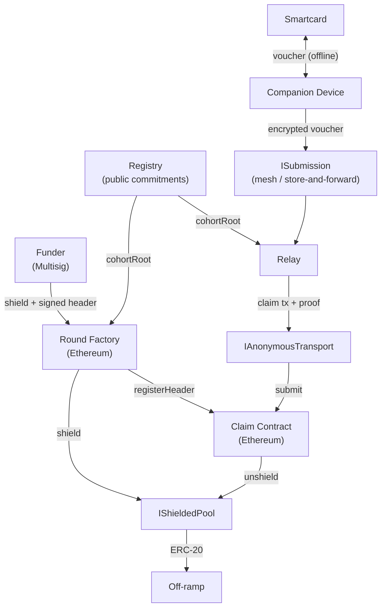
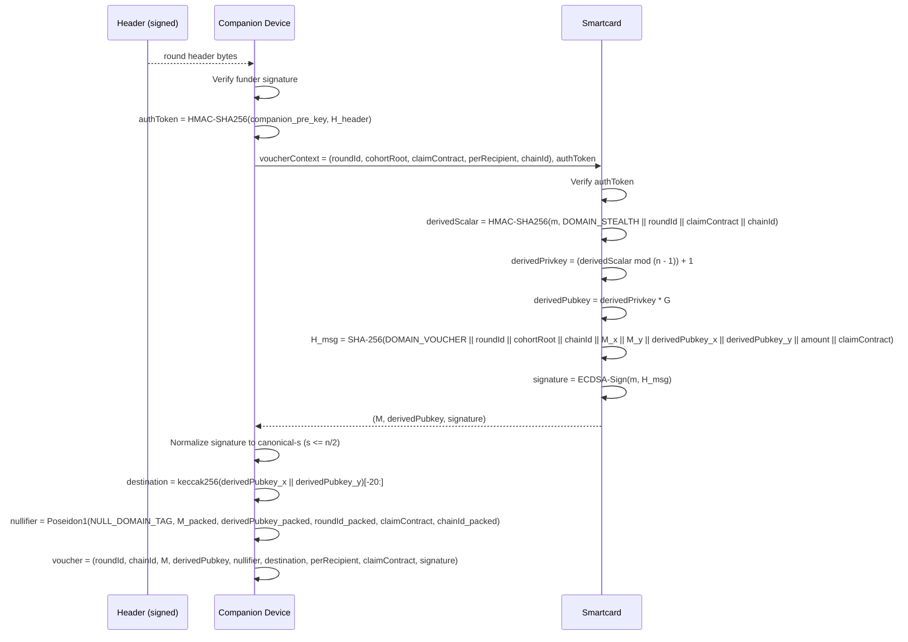

# Resilient Disbursement Rails: Protocol Specification

The keywords MUST, MUST NOT, SHOULD, SHOULD NOT, MAY are interpreted as in BCP 14 (RFC 2119, RFC 8174) when, and only when, they appear in capitals.

## Problem Statement

A funder distributes a fixed per-recipient amount to a cohort of recipients in a jurisdiction whose authorities are hostile to the funder, the implementing partner, or the recipients themselves. The off-ramp is the primary linkage vector: licensed exchanges identify customers and can tie any deposit address to a recipient on demand.

Recipients hold tamper-resistant smartcards. They cannot run zero-knowledge provers on the card, may have intermittent or no internet, and lose devices at meaningful rates.

### Constraints

| Category | Requirement |
|----------|-------------|
| Privacy | Off-ramp unlinkability up to the stealth destination. Cohort-level anonymity within `cohortRoot`. Pool-level k-anonymity bounded by the calling claim contract's pool sub-tree. Cross-funder anonymity and forward secrecy of past claim identifiers under card seizure are out of scope. |
| Regulatory | Pool-level k-anonymity within the chosen IShieldedPool association set. Compliance witnesses tolerated as opaque pool inputs. |
| Operational | Smartcard signing only; no on-card ZK. Tolerance for high-latency mesh transport. No real-time recipient internet. Card loss recoverable via re-enrollment. Settlement on Ethereum L1 or an EVM L2 of comparable finality. The on-chain claim gate is `block.timestamp < closeTime`; deployers SHOULD apply a relay-side close-time buffer consistent with the target chain's observed reorg depth (no on-chain reorg margin is enforced). |
| Trust | Funder is a multisig. Registry operator and implementing partner are organizationally separated (distinct legal entities, jurisdictions, personnel, infrastructure). The funder MAY coincide with either party but not with both. At least one honest reachable relay per claim attempt. Recipient-side relay diversity across rounds. |

### System Overview



## Approach

### Strategy

A round runs in four stages.

1. **Publication.** The funder publishes a round through a round-factory contract. The factory authorizes via `msg.sender == funderMultisig` (the on-chain Multisig contract is the single authority gate), asserts cohort identity and `chainId` against the Registry, deposits one per-recipient commitment into the calling claim contract's pool sub-tree for each active card, and registers the header with the claim contract together with `firstPoolLeafIndex`. All steps are atomic. The funder's ECDSA signature on `H_header` is distributed out-of-band alongside the header and verified by companion devices, not by the factory.
2. **Voucher construction.** The recipient inserts the smartcard into a companion device. The card derives a per-claim stealth public key via HMAC-SHA256 over its master secret, constructs the 308-byte voucher preimage internally, signs it with secp256k1 ECDSA, and returns the signature and stealth public key. The companion derives the destination, computes the nullifier, and wraps the voucher in IND-CCA2 AEAD to a relay's rotating public key.
3. **Submission and settlement.** The companion hands the ciphertext to a mesh or store-and-forward transport. A relay decrypts, generates two ZK proofs (claim circuit and pool-withdraw circuit), and submits via an anonymous transport. The claim contract verifies both proofs, recomputes the destination on-chain, enforces cross-proof public-input binding, and invokes pool unshield.
4. **Close and residual.** After `closeTime`, the claim contract rejects further claims. After a further 30-day timelock the funder multisig MAY recover residual shielded balance via balance accounting at the pool, gated by a one-shot flag. No ZK proof on the residual path.

### Why This Approach

| Alternative | Reason rejected |
|-------------|-----------------|
| Recipient-generated ZK proofs | Smartcards cannot evaluate Poseidon or in-circuit ECDSA; companion-side proving relocates secrets to the most exposed recipient surface. |
| Companion-side stealth-scalar derivation | Companion compromise enumerates all stealth public keys. |
| Direct (non-shielded) ERC-20 disbursement | Off-ramp KYC plus on-chain trace identifies recipients. |
| Pre-hashed `H_msg` accepted by a stock smartcard `SIGN` APDU | Permits companion-side substitution of `derivedPubkey`. |
| Forward-secure SHA-256 hash chain on-card | Requires non-wear-leveled persistent memory, vendor letter, bounded card lifetime, enrollment-time pubkey-list precommitment ceremony, and Faraday-shielded perso-bureau. Out of scope for this PoC. |
| Issuer-side secret hash-chain HSM mirror | Permits Registry-operator forgery and nullifier computation. |
| Threshold/MPC issuer key shares | Multi-party coordination protocol; expanded compelled-party surface. |

### Tools and Primitives

| Tool | Use |
|------|-----|
| Poseidon1 over BN254 Fr | Cohort tree, pool sub-tree, commitments, nullifier. |
| SHA-256 | Voucher signed-message preimage; round-header hash; in-circuit voucher preimage. |
| keccak256 | Off-card and on-chain destination derivation from the stealth public key. |
| HMAC-SHA256 | On-card stealth-scalar derivation. |
| ECDSA over secp256k1 | Smartcard voucher signature; verified inside the claim circuit. |
| BN254 SNARKs | Claim and pool-withdraw circuits. Reference: Noir + Barretenberg UltraHonk. |
| IShieldedPool | Per-claim-contract partitioned shielded ERC-20 pool with k-anonymity over deposits matching `(token, amount)` in the calling claim contract's sub-tree. |
| IAnonymousTransport | Tor or Nym. |

## Protocol Design

### Participants and Roles

| Component | Role | Operator |
|-----------|------|----------|
| Smartcard | JCOP-class secure element running a custom applet. Holds a single secp256k1 master keypair `(m, M)` generated on-card. The custom `SIGN_VOUCHER` APDU constructs the voucher preimage internally and signs it; derives the per-claim stealth public key via on-card HMAC-SHA256. | Recipient |
| Companion device | Reads the smartcard, computes the nullifier, encrypts the voucher to a relay, hands the ciphertext to mesh transport. Holds long-lived non-secret state (`cohort_position` per active enrollment). | Recipient |
| Registry | Holds `(cardId, M, status, cohort_position)` per enrolled card and publishes `cohortRoot` on-chain whenever the active set changes. Public-data only. | Independent registry operator |
| IShieldedPool | Shielded ERC-20 transfers with sender/recipient unlinkability and k-anonymity within an association set. | Existing privacy pool deployment |
| ISubmission | Mesh or store-and-forward delivery of encrypted vouchers from companion to relay. | Mesh transport network |
| IAnonymousTransport | Network-layer submission decorrelating origin from Ethereum endpoint. | Tor or Nym |
| Round Factory | Atomic shield-and-publish; registers the round header with the claim contract. | Ethereum smart contract |
| Claim Contract | Verifies relay ZK proofs, tracks nullifiers, invokes pool unshield, gates residual recovery. | Ethereum smart contract |
| Relay | Decrypts vouchers, generates ZK proofs, submits via IAnonymousTransport. Rotates voucher key at least every 24 hours; rotates submission EOA per round or per day. | Independent relay operators (jurisdictionally diverse) |
| Funder | Multisig that publishes rounds and signs round headers. | Funding organization |
| Implementing Partner | Field distribution of smartcards and round headers. | Distinct legal entity from registry operator |

### Recipient Lifecycle

1. **Personalization.** The operator embeds `cohort_position` on the card or its packaging at distribution. The companion device stores `cohort_position` per active cohort version.
2. **Round receipt.** The recipient receives `(header, funderSignature, firstPoolLeafIndex)` out-of-band (mesh, SMS, USSD, radio, poster QR, agent handoff). `funderSignature` is the funder's ECDSA signature on `H_header`. The companion verifies it; this is the single signature-check gate on round headers, since the on-chain factory authorizes by multisig membership only.
3. **Voucher.** The recipient inserts the smartcard. The card produces a signature; the companion encrypts the voucher and hands the ciphertext to mesh transport.
4. **Off-ramp.** After settlement, the recipient unshields at the off-ramp through the resulting stealth address.

### Flows

#### Round Publication

```mermaid
sequenceDiagram
    participant F as Funder Multisig
    participant REG as Registry
    participant RF as Round Factory
    participant SP as IShieldedPool
    participant CC as Claim Contract

    F->>REG: cohortRoot, cohortSize
    REG-->>F: root, size, version, M_i for i in [0, cohortSize)
    F->>F: Sign header
    F->>RF: publishRound(header, commitments) via Multisig.execute
    RF->>RF: Authorize msg.sender == funderMultisig
    RF->>REG: Read cohortRoot(version), cohortSize(version); assert header equality and commitments.length
    RF->>RF: Assert header.chainId == block.chainid
    RF->>F: Pull perRecipient * size of token
    RF->>SP: deposit(claimContract, commitment_i, perRecipient) for i in [0, cohortSize)
    RF->>CC: registerHeader(header, firstPoolLeafIndex)
    RF-->>RF: emit RoundPublished(header, firstPoolLeafIndex)
```

`firstPoolLeafIndex` is the pool sub-tree size at the moment of the first deposit in the call. It is set atomically by the factory and is not part of `H_header`. A revert in any step reverts the entire transaction.

#### Voucher Construction



The card MUST construct the SHA-256 preimage internally and MUST NOT accept a pre-hashed digest.

#### Voucher Submission and Settlement

```mermaid
sequenceDiagram
    participant CD as Companion Device
    participant M as Mesh / Store-and-Forward
    participant R as Relay
    participant SP as IShieldedPool
    participant AT as IAnonymousTransport
    participant CC as Claim Contract

    CD->>CD: Encrypt voucher to relay public key (X25519 + AEAD)
    CD->>M: submitVoucher(ciphertext, relayId)
    M-->>R: ciphertext (eventually)
    R->>R: Decrypt
    R->>SP: commitmentIndex(claimContract, commitment) -> leafIndex; subTreeRoot(claimContract) -> pool_root
    SP-->>R: (leafIndex, pool_root, merkle_path)
    R->>R: Generate claim proof
    R->>R: Generate pool-withdraw proof
    R->>AT: submit(claim_tx) signed by rotating relay EOA
    AT->>CC: claim(claimProof, claimPublicInputs, poolWithdrawProof, poolWithdrawPublicInputs)
    CC->>CC: Verify both proofs
    CC->>CC: Header bindings + cross-proof bindings
    CC->>SP: unshield(claimContract, poolWithdrawProof, nullifier, token, amount, recipient)
    SP-->>CC: success
    CC->>CC: Set nullifierConsumed; increment counters
```

A recipient MAY fan out the encrypted voucher to up to `k < N_relays` relays per voucher; only the first on-chain settlement consumes the nullifier.

#### Round Close and Residual

After `closeTime`, the claim contract rejects further claims. After `closeTime + 30 days` the funder multisig MAY call `funderUnshieldResidual(roundId)`. The claim contract computes `residual = roundDeposit[roundId] - roundClaimed[roundId]` and forwards a single call to `pool.recoverResidual(roundId, residual, funderResidualDestination)`. The path is gated by the multisig, the timelock, and the one-shot `roundResidualPaid[claimContract][roundId]` flag.

Reorg safety: the on-chain claim gate is `block.timestamp < header[roundId].closeTime` with no built-in reorg margin. Relays and companion devices SHOULD apply a deployment-specific submission cutoff before `closeTime` consistent with the target chain's observed reorg depth and finality characteristics. The buffer is a deployer policy, not an on-chain enforcement.

### Data Structures

#### Voucher

```
voucher = (
    roundId: bytes32,
    chainId: uint256,
    M: (bytes32, bytes32),
    derivedPubkey: (bytes32, bytes32),
    nullifier: bytes32,
    destination: address,
    amount: uint256,
    claimContractAddress: address,
    signature: (bytes32, bytes32)
)
```

Signed-message preimage (308 bytes), in order:

| Field | Width | Encoding |
|-------|-------|----------|
| `DOMAIN_VOUCHER` | 32 | `SHA256("RDR/voucher/v1")` |
| `roundId` | 32 | `bytes32` as-is |
| `cohortRoot` | 32 | `bytes32` as-is |
| `chainId` | 32 | big-endian `uint256` |
| `M_x` | 32 | big-endian |
| `M_y` | 32 | big-endian |
| `derivedPubkey_x` | 32 | big-endian |
| `derivedPubkey_y` | 32 | big-endian |
| `amount` | 32 | big-endian `uint256` |
| `claimContractAddress` | 20 | as-is |

`destination` is a public input of the claim circuit; the in-circuit constraint `destination == keccak256(derivedPubkey_x || derivedPubkey_y)[-20:]` enforces the standard EOA derivation rule. The pool-withdraw circuit re-derives the nullifier from the same private `derivedPubkey` witness, so the cross-binding is via `claim_nullifier`.

#### Round Header

| Field | Type | Notes |
|-------|------|-------|
| `roundId` | `bytes32` | Globally unique |
| `cohortVersion` | `uint64` | Registry counter; bumped on every cohort update |
| `cohortRoot` | `bytes32` | Pinned at publication |
| `perRecipientAmount` | `uint256` | Fixed per claim |
| `cohortSize` | `uint256` | Asserted equal to `Registry.cohortSize(cohortVersion)` |
| `token` | `address` | ERC-20 |
| `closeTime` | `uint64` | Unix timestamp (seconds); claiming ends when `block.timestamp >= closeTime` |
| `claimContractAddress` | `address` | Pinned in voucher binding |
| `chainId` | `uint256` | Asserted equal to `block.chainid` at publication and at every claim |
| `funderSignature` | `bytes` | ECDSA over `H_header`, distributed out-of-band; verified by companion devices, not by the factory |
| `firstPoolLeafIndex` | `uint64` | Set atomically by the factory at publication; pinned in the claim contract via `registerHeader`; distributed alongside the signed header out-of-band. |

```
H_header = SHA256(DOMAIN_HEADER || encode(roundId, cohortVersion, cohortRoot, perRecipient, cohortSize, token, closeTime, claimContract, chainId))
DOMAIN_HEADER = SHA256("RDR/header/v1")
```

`firstPoolLeafIndex` is not in `H_header`.

#### Claim Proof Inputs

Public (10 inputs total; each one BN254 Fr element):

| Input | Notes |
|-------|-------|
| `roundId_hi`, `roundId_lo` | 128-bit limbs, each `< 2^128`. |
| `cohortRoot` | `bytes32` reduced to canonical Fr; on-chain `== header.cohortRoot`. |
| `chainId_hi`, `chainId_lo` | 128-bit limbs; on-chain `== block.chainid` and `== header.chainId`. |
| `destination` | `Fr(uint160(addr))`; constrained `< 2^160`; in-circuit `== keccak256(derivedPubkey_x \|\| derivedPubkey_y)[-20:]`. |
| `amount` | `Fr(uint256(amount))`. |
| `nullifier` | `Fr` directly. |
| `claimContractAddress` | `Fr(uint160(addr))`; constrained `< 2^160`. |
| `relaySubmitter` | `Fr(uint160(addr))`; constrained `< 2^160`; on-chain `== msg.sender`. |

Private:

| Input | Notes |
|-------|-------|
| `derivedPubkey_x_hi`, `derivedPubkey_x_lo` | 128-bit limbs of stealth public key x; consumed by the in-circuit keccak destination constraint and folded into the nullifier hash. Private so a Registry-compromise adversary holding cohort `M_list` cannot precompute candidate nullifiers. |
| `derivedPubkey_y_hi`, `derivedPubkey_y_lo` | 128-bit limbs of stealth public key y. |
| `M_x`, `M_y` | Card master public key |
| `signature_r`, `signature_s` | Canonical-s asserted in-circuit |
| `merklePath` | Depth 20 |
| `merklePathDirections` | Bit decomposition |

#### Pool-Withdraw Proof Inputs

Public (each one BN254 Fr element):

| Input | Notes |
|-------|-------|
| `pool_root` | Claim contract asserts `IShieldedPool.isKnownRoot(address(this), pool_root)`. |
| `nullifier` | Cross-proof asserted `== claim.nullifier`. |
| `token` | Cross-proof asserted `== header.token`; `Fr(uint160(addr))`; constrained `< 2^160`. |
| `amount` | Cross-proof asserted `== header.perRecipientAmount`. |
| `recipient` | Cross-proof asserted `== destination`; `Fr(uint160(addr))`; constrained `< 2^160`. |

Private:

| Input | Notes |
|-------|-------|
| `M_x_hi`, `M_x_lo`, `M_y_hi`, `M_y_lo` | 128-bit limbs of card master public key |
| `derivedPubkey_x_hi`, `derivedPubkey_x_lo`, `derivedPubkey_y_hi`, `derivedPubkey_y_lo` | 128-bit limbs of the stealth public key, witnessed so the recomputed nullifier matches the claim's. |
| `roundId_hi`, `roundId_lo` | 128-bit limbs of `roundId`; still feed the nullifier hash. |
| `chainId_hi`, `chainId_lo` | 128-bit limbs of `chainId`; still feed the nullifier hash. |
| `claimContractAddress` | `Fr(uint160(addr))`; constrained `< 2^160`; still feeds the nullifier hash. |
| `leaf_index` | Pool sub-tree leaf index for the per-recipient commitment |
| `merklePath` | Depth 32 |
| `merklePathDirections` | Bit decomposition |

### On-Chain State

#### Registry

State:
- `cohortRoot[version]: bytes32`
- `cohortSize[version]: uint256`
- `currentVersion: uint64`
- `operatorKey: address`

Functions:
- `currentVersion() -> uint64`
- `cohortRoot(version) -> bytes32`
- `cohortSize(version) -> uint256`
- `publishCohort(root, size, operatorSig)`: appends a new `(version, root, size)` tuple under `operatorKey`. Past entries are immutable.
- `enroll(cardId, M, status="active")`: operator-side, off-chain; effective at next `publishCohort`.
- `revoke(cardId)`: operator-side, off-chain; effective at next `publishCohort`.

Operator off-chain state: `(cardId, M, status, cohort_position)` per card. The cohort tree is built from the `M` values of currently active cards in `cohort_position` order.

#### IShieldedPool

Per-claim-contract partitioned shielded ERC-20 pool. Each registered claim contract has its own commitment sub-tree.

Functions:
- `deposit(claimContract, commitment, amount)`: append `commitment` to `subTreeRoot[claimContract]`; record `commitmentIndex[claimContract][commitment] = leafIndex`; pull `amount` of `token` from caller; increment `balance[claimContract]` and `roundDeposit[claimContract][roundId]`. Authorized: `factory[claimContract]`.
- `unshield(claimContract, withdrawProof, nullifier, token, amount, recipient)`: verify `withdrawProof` against `subTreeRoot[claimContract]` or its recent-roots window; assert `nullifier` not in the pool spent set; transfer `amount` of `token` to `recipient`; mark `nullifier` consumed; decrement `balance[claimContract]`; increment `roundClaimed[claimContract][roundId]`. Authorized: `claimContract`.
- `recoverResidual(roundId, amount, recipient)`: transfer `amount` of `token` to `recipient`; mark `roundResidualPaid[claimContract][roundId] = true`; decrement `balance[claimContract]`. Authorized: `claimContract`. Reverts if already paid.
- `commitmentIndex(claimContract, commitment) -> uint256`: public read.
- `isKnownRoot(claimContract, root) -> bool`: public read.

State per registered claim contract:
- `subTreeRoot[claimContract]`, `subTreeRootHistory[claimContract]` (bounded window)
- `commitmentIndex[claimContract][commitment]`
- `balance[claimContract]`, `roundDeposit[claimContract][roundId]`, `roundClaimed[claimContract][roundId]`, `roundResidualPaid[claimContract][roundId]`
- `nullifierConsumed[nullifier]`: pool-side spent set across all claim contracts.

#### ISubmission

Functions:
- `submitVoucher(encryptedVoucher, relayIdentifier) -> deliveryReceipt`

Required properties:
- End-to-end IND-CCA2 AEAD with ephemeral sender keying.
- Source-fingerprinting resistance via at least two orthogonal mitigations across physical and network layers.
- Eventual delivery.
- Relay key rotation at least every 24 hours with secure erase.

The funder distributes the relay roster (valid `relayIdentifier` values, current public keys, active rotation epoch) out-of-band on the same channels carrying the signed round header. Roster updates are signed by the funder multisig under a domain tag distinct from the round-header tag. Companion devices verify the signature and treat a roster older than 48 hours as stale.

#### IAnonymousTransport

Functions:
- `submit(signedTransaction) -> txHash`

Required property: no single entity simultaneously observes submitter network origin and plaintext transaction.

#### Round Factory

State:
- `funderMultisig: address`
- `claimContract: address`
- `registry: address`

Functions:

`publishRound(header, commitments) external`, in order:

1. Authorize `msg.sender == funderMultisig`. The on-chain Multisig is the single authority gate; the funder's ECDSA signature on `H_header` is delivered out-of-band to companion devices and is not verified by the factory.
2. Assert `header.cohortRoot == Registry.cohortRoot(cohortVersion)` and `header.cohortSize == Registry.cohortSize(cohortVersion) == commitments.length`. The cohort tree is *not* recomputed on-chain; the funder publishes pre-computed cohort-order commitments, and the cohort tree is anchored only via `header.cohortRoot` matching the registry.
3. Assert `header.chainId == block.chainid`.
4. Pull `perRecipient * cohortSize` of `token` from funder approval.
5. Approve the pool to draw `perRecipient * cohortSize` of `token`.
6. Snapshot `firstPoolLeafIndex = IShieldedPool.subTreeSize(claimContract)`.
7. For `i` in `[0, cohortSize)` in cohort-position order: use the supplied `commitment_i = commitments[i]` (whose pre-image the funder computes off-chain as `Poseidon1(COMMITMENT_DOMAIN_TAG, token, perRecipient, M_packed_i, roundId_packed)`) and call `IShieldedPool.deposit(claimContract, commitment_i, perRecipient)`.
8. `claimContract.registerHeader(header, firstPoolLeafIndex)`.
9. Emit `RoundPublished`.

A revert in any step reverts the entire transaction.

Events:
- `RoundPublished(roundId, cohortVersion, cohortRoot, perRecipientAmount, cohortSize, token, closeTime, claimContractAddress, chainId, firstPoolLeafIndex, hHeader)`

#### Claim Contract

State:
- `header[roundId]: RoundHeader`
- `firstPoolLeafIndex[roundId]: uint64`
- `nullifierConsumed[nullifier]: bool`
- `nullifiersConsumed[roundId]: uint256`
- `roundDeposit[roundId]: uint256`
- `roundClaimed[roundId]: uint256`
- `roundResidualPaid[roundId]: bool`
- `funderMultisig: address`
- `factory: address`
- `pool: address`
- `funderResidualDestination: address`
- `claimVerifier: address`, `poolWithdrawVerifier: address`

Functions:

`registerHeader(header, firstPoolLeafIndex) external onlyFactory`: writes `header[header.roundId] = header`, `firstPoolLeafIndex[header.roundId] = firstPoolLeafIndex`, `roundDeposit[header.roundId] = header.perRecipientAmount * header.cohortSize`. Reverts on `roundId` collision.

`claim(claimProof, claimPublicInputs, poolWithdrawProof, poolWithdrawPublicInputs) external`:

1. Recombine `roundId`, `chainId` from limbs.
2. Read `destination` directly from `claimPublicInputs.destination`; assert `destination < 2^160`. The in-circuit constraint `destination == keccak256(derivedPubkey_x || derivedPubkey_y)[-20:]` enforces the EOA derivation; `derivedPubkey` is private to the claim circuit and not exposed on chain.
3. Assert `block.timestamp < header[roundId].closeTime`.
4. Verify the claim proof.
5. Verify the pool-withdraw proof.
6. Header bindings:
   - `claimPublicInputs.cohortRoot == header[roundId].cohortRoot`
   - `claimPublicInputs.amount == header[roundId].perRecipientAmount`
   - `claimPublicInputs.claimContractAddress == address(this)`
   - `chainId == block.chainid && chainId == header[roundId].chainId`
   - `claimPublicInputs.relaySubmitter == msg.sender`
7. Cross-proof bindings:
   - `poolWithdrawPublicInputs.nullifier == claimPublicInputs.nullifier`
   - `poolWithdrawPublicInputs.token == header[roundId].token`
   - `poolWithdrawPublicInputs.amount == header[roundId].perRecipientAmount`
   - `poolWithdrawPublicInputs.recipient == destination`
8. `IShieldedPool.isKnownRoot(address(this), poolWithdrawPublicInputs.pool_root) == true`.
9. `nullifierConsumed[claimPublicInputs.nullifier] == false`.
10. `IShieldedPool.unshield(address(this), poolWithdrawProof, claimPublicInputs.nullifier, header[roundId].token, header[roundId].perRecipientAmount, destination)`.
11. Set `nullifierConsumed[claimPublicInputs.nullifier] = true`; increment `nullifiersConsumed[roundId]`; `roundClaimed[roundId] += header[roundId].perRecipientAmount`.

The unshield call MUST NOT be wrapped in try/catch.

`funderUnshieldResidual(roundId) external onlyFunderMultisig`: callable when `block.timestamp >= header[roundId].closeTime + 30 days` and `!roundResidualPaid[roundId]`. Computes `residual = roundDeposit[roundId] - roundClaimed[roundId]`, sets `roundResidualPaid[roundId] = true`, then calls `IShieldedPool.recoverResidual(roundId, residual, funderResidualDestination)`. The pool independently asserts `msg.sender == address(this)` and `!roundResidualPaid[address(this)][roundId]`.

Events:
- `Claimed(roundId, nullifier, destination, amount, relaySubmitter)`
- `ResidualRecovered(roundId, residual, destination)`

## Cryptographic Details

### Primitives

| Primitive | Specification | Parameters |
|-----------|---------------|------------|
| Hash (algebraic) | Poseidon1 | BN254 Fr; circomlib parameterization (alpha = 5, R_F = 8); 2-, 3-, 4-, and 5-input invocations. |
| Hash (cryptographic) | SHA-256 | On-card preimage hash; round-header hash; in-circuit voucher preimage. |
| Hash (Ethereum) | keccak256 | Companion and on-chain destination derivation from `derivedPubkey_x \|\| derivedPubkey_y`. |
| MAC | HMAC-SHA256 | On-card stealth scalar derivation. |
| Signature | ECDSA over secp256k1 | Platform-RNG-derived nonces from the secure-element TRNG; canonical-s per EIP-2 enforced in-circuit and normalized off-card. |
| Curve (signing) | secp256k1 | SEC 1. |
| Curve (proving) | BN254 (alt_bn128) | EIP-196, EIP-197. |
| Merkle tree | Binary Poseidon1 LeanIMT-style | Depth 20 (cohort), depth 32 (pool sub-tree). Empty-leaf sentinel `0`. Domain-tagged leaf hash; bare `Poseidon1(left, right)` internal nodes. |
| Proving system | secp256k1 ECDSA gadget + in-circuit SHA-256 + Poseidon1 membership | Reference: Noir + Barretenberg UltraHonk. |

### Domain Tags

| Tag | Value | Usage |
|-----|-------|-------|
| `LEAF_DOMAIN_TAG` | `Poseidon1_t2(0, SHA256("RDR/leaf/v1") mod r_BN254)` | Cohort tree leaf hash and `M_packed`. |
| `COMMITMENT_DOMAIN_TAG` | `Poseidon1_t2(0, SHA256("RDR/commitment/v1") mod r_BN254)` | Pool sub-tree leaf hash. |
| `NULL_DOMAIN_TAG` | `Poseidon1_t2(0, SHA256("RDR/null/v1") mod r_BN254)` | Nullifier hash. |
| `DERIVED_PUBKEY_DOMAIN_TAG` | `Poseidon1_t2(0, SHA256("RDR/dpk/v1") mod r_BN254)` | `derivedPubkey_packed` hash for the nullifier. |
| `DOMAIN_VOUCHER` | `SHA256("RDR/voucher/v1")` | Voucher signed-message preimage. |
| `DOMAIN_HEADER` | `SHA256("RDR/header/v1")` | Round-header signed-message preimage. |
| `DOMAIN_STEALTH` | `SHA256("RDR/stealth/v1")` | On-card stealth scalar derivation. |

### Cohort Tree

Leaf per active card `c`:

```
M_packed^c = Poseidon1(LEAF_DOMAIN_TAG, decompose128(M^c_x), decompose128(M^c_y))
```

`decompose128(x)` splits a 256-bit value into two 128-bit big-endian Fr elements. Internal nodes: `Poseidon1(left, right)` with no tag. The Registry rebuilds and republishes `cohortRoot` whenever the active set changes.

### Per-Recipient Commitment

```
roundId_packed = Poseidon1(decompose128(roundId))
commitment     = Poseidon1(COMMITMENT_DOMAIN_TAG, token, perRecipientAmount, M_packed, roundId_packed)
```

### Nullifier

```
M_packed              = Poseidon1(LEAF_DOMAIN_TAG, decompose128(M_x), decompose128(M_y))
derivedPubkey_packed  = Poseidon1(DERIVED_PUBKEY_DOMAIN_TAG, decompose128(derivedPubkey_x), decompose128(derivedPubkey_y))
roundId_packed        = Poseidon1(decompose128(roundId))
chainId_packed        = Poseidon1(decompose128(chainId))
nullifier             = Poseidon1(NULL_DOMAIN_TAG, M_packed, derivedPubkey_packed, roundId_packed, claimContractAddress, chainId_packed)
```

Width grows from 5 to 6 to fold in `derivedPubkey_packed`. Round/chain/contract bindings remain as explicit nullifier inputs as defense in depth: they are also encoded in `derivedPubkey` via the on-card HMAC, but keeping them as in-circuit constraints preserves cross-round / cross-chain / cross-contract uniqueness independent of card-honest HMAC binding.

`derivedPubkey` is a *private* witness of both circuits and is not exposed on chain. `M_list` alone (which a Registry-compromise adversary may obtain) is therefore insufficient to construct candidate nullifiers — recovering `derivedPubkey_i` requires the on-card secret `m_i`. The companion computes `nullifier` for the voucher; the claim and pool-withdraw circuits both recompute it from the same private witness inputs.

### On-Card Stealth Public Key

```
derivedScalar  = HMAC-SHA256(m, DOMAIN_STEALTH || roundId || claimContractAddress || chainId)
derivedPrivkey = (derivedScalar mod (n - 1)) + 1
derivedPubkey  = derivedPrivkey * G
```

`destination = keccak256(derivedPubkey_x || derivedPubkey_y)[-20:]`. The companion computes this off-card (`derivedPubkey` is exported by the card; the EOA derivation is a deterministic function of it); the claim circuit re-derives it in-circuit from the private `derivedPubkey` witness and exposes it as the public `destination` input the claim contract reads.

### Claim Circuit Constraints

| Constraint | Notes |
|------------|-------|
| `M_x_hi`, `M_x_lo`, `M_y_hi`, `M_y_lo < 2^128` | Range checks |
| `M_x = 2^128 * M_x_hi + M_x_lo` over secp256k1 base field | Limb consistency |
| `M_y = 2^128 * M_y_hi + M_y_lo` over secp256k1 base field | Limb consistency |
| `derivedPubkey_*_hi`, `derivedPubkey_*_lo < 2^128` (private witnesses) | Range checks |
| `derivedPubkey_x = 2^128 * derivedPubkey_x_hi + derivedPubkey_x_lo` over secp256k1 base field | Limb consistency |
| `derivedPubkey_y = 2^128 * derivedPubkey_y_hi + derivedPubkey_y_lo` over secp256k1 base field | Limb consistency |
| `roundId_hi`, `roundId_lo`, `chainId_hi`, `chainId_lo < 2^128` | Range checks |
| `chainId = 2^128 * chainId_hi + chainId_lo` | Limb consistency |
| `destination < 2^160`, `claimContractAddress < 2^160`, `relaySubmitter < 2^160` | Address-typed public inputs |
| `M_packed == Poseidon1(LEAF_DOMAIN_TAG, M_x_hi, M_x_lo, M_y_hi, M_y_lo)` | Cohort leaf hash |
| `derivedPubkey_packed == Poseidon1(DERIVED_PUBKEY_DOMAIN_TAG, derivedPubkey_x_hi, derivedPubkey_x_lo, derivedPubkey_y_hi, derivedPubkey_y_lo)` | Stealth-pubkey leaf hash |
| `MerkleVerify(M_packed, merklePath, merklePathDirections, cohortRoot)` | Depth-20 LeanIMT |
| `ECDSA-Verify(M, H_msg, r, s)` over secp256k1 | secp256k1 ECDSA gadget |
| `s <= n/2` | Canonical-s |
| `H_msg == SHA-256(DOMAIN_VOUCHER \|\| roundId \|\| cohortRoot \|\| chainId \|\| M_x \|\| M_y \|\| derivedPubkey_x \|\| derivedPubkey_y \|\| amount \|\| claimContractAddress)` | In-circuit SHA-256 over the 308-byte preimage |
| `destination == keccak256(derivedPubkey_x \|\| derivedPubkey_y)[-20:]` | In-circuit keccak256 over 64 bytes; binds the public `destination` input to the private `derivedPubkey` witness |
| `roundId_packed == Poseidon1(roundId_hi, roundId_lo)` | Width-3 fold |
| `chainId_packed == Poseidon1(chainId_hi, chainId_lo)` | Width-3 fold |
| `nullifier == Poseidon1(NULL_DOMAIN_TAG, M_packed, derivedPubkey_packed, roundId_packed, claimContractAddress, chainId_packed)` | Width-6 nullifier |
| `M`, `derivedPubkey`, `roundId`, `chainId`, `cohortRoot`, `claimContractAddress` shared as single witness or public-input wires across all gadgets | Audit MUST verify wire identity, not equality constraints |
| `publicInputs.relaySubmitter` bound on-chain to `msg.sender` | Asserted at the claim contract |

### Pool-Withdraw Circuit Constraints

| Constraint | Notes |
|------------|-------|
| `M_x_hi`, `M_x_lo`, `M_y_hi`, `M_y_lo`, `roundId_hi`, `roundId_lo`, `chainId_hi`, `chainId_lo < 2^128` | Range checks |
| `derivedPubkey_*_hi`, `derivedPubkey_*_lo < 2^128` (private witnesses) | Range checks |
| `claimContractAddress < 2^160`, `recipient < 2^160`, `token < 2^160` | Range checks |
| `amount < 2^128` | Range check |
| `M_packed == Poseidon1(LEAF_DOMAIN_TAG, M_x_hi, M_x_lo, M_y_hi, M_y_lo)` | Same formula as cohort leaf and claim circuit |
| `derivedPubkey_packed == Poseidon1(DERIVED_PUBKEY_DOMAIN_TAG, derivedPubkey_x_hi, derivedPubkey_x_lo, derivedPubkey_y_hi, derivedPubkey_y_lo)` | Same formula as claim circuit |
| `roundId_packed == Poseidon1(roundId_hi, roundId_lo)` | Width-3 fold |
| `chainId_packed == Poseidon1(chainId_hi, chainId_lo)` | Width-3 fold |
| `commitment == Poseidon1(COMMITMENT_DOMAIN_TAG, token, amount, M_packed, roundId_packed)` | Pool sub-tree leaf |
| `MerkleVerify(commitment, merklePath, leaf_index, pool_root)` | Depth-32 LeanIMT |
| `nullifier == Poseidon1(NULL_DOMAIN_TAG, M_packed, derivedPubkey_packed, roundId_packed, claimContractAddress, chainId_packed)` | Identical to the claim circuit's nullifier formula |
| `M`, `derivedPubkey`, `roundId`, `chainId`, `claimContractAddress` shared as single witness wires across all gadgets | Audit MUST verify wire identity |

### Smartcard Requirements

| Requirement | Notes |
|-------------|-------|
| ECDSA secp256k1 with platform-RNG-derived nonces | Hardware-accelerated on JCOP-class secure elements. Card returns raw `(r, s)`; canonical-s normalized off-card. |
| SHA-256, HMAC-SHA256 | Java Card `MessageDigest.ALG_SHA_256`, `Signature.ALG_HMAC_SHA_256`. |
| secp256k1 base-point multiplication | For `derivedPubkey = derivedPrivkey * G`. |
| Single master keypair `(m, M)` | Generated on-card during initialization via `GENERATE_KEY` using the on-card TRNG. `m` never leaves the card. `M` is exported once at enrollment via `EXPORT_KEY`. |
| `SIGN_VOUCHER` APDU | Single APDU performs, in order: verify `authToken`; derive stealth scalar; derive `derivedPrivkey` and `derivedPubkey`; construct the 308-byte preimage internally from companion-supplied context plus on-card-derived `M` and `derivedPubkey`; SHA-256 the preimage; ECDSA-sign the digest with `m`; return `(M, derivedPubkey, signature)`. |
| NIST SP 800-88 Clear-level erase on re-provisioning | Single-pass overwrite of `m` under `JCSystem.beginTransaction`. |

The card MUST NOT evaluate Poseidon1 or BN254 arithmetic, MUST NOT compute keccak256, MUST NOT implement RFC 6979, and MUST NOT hold per-claim transient state.

The `SIGN_VOUCHER` APDU's on-card derivation of `derivedPubkey` is load-bearing for both destination correctness *and* nullifier integrity. A tampered card that signed over an attacker-chosen `derivedPubkey` could produce multiple valid claim vouchers for the same `(M, roundId)` with distinct nullifiers, enabling double-spend of the cohort slot. The protocol relies on hardware enforcement here; in deployments where this assumption cannot be made, an in-circuit verification of `derivedPubkey = HMAC(m, ctx)·G` would be required, which is incompatible with the current `m` never leaves the card invariant.

## Security Model

### Threat Model

The adversary is assumed to possess all of the following capabilities, exercisable at registration, disbursement, off-ramp, after a round closes, or after a state transition:

- Compel implementing partner to disclose beneficiary records.
- Inherit databases via state transition or territorial seizure.
- Subpoena KYC and transaction records from exchanges or banks.
- Cyber-breach NGO or aid infrastructure.
- Freeze accounts at scale.
- Combine on-chain trace with off-ramp KYC.
- Deploy targeted spyware against aid workers, defenders, journalists.
- Seize recipient devices and conduct mobile forensics.
- Weaponize state civil-identity registries.
- Physically observe recipients at distribution points.

Honest-party assumptions:

- Registry operator and implementing partner are organizationally separated.
- Smartcard tamper-resistance at the AVA_VAN.5 chip platform level. The chip is CC-evaluated; the applet is not in any CC TOE.
- At least one honest reachable relay per claim attempt; recipient-side relay diversity across rounds.
- Ethereum censorship resistance at the settlement layer.
- Off-ramp is outside the trust boundary.

Out of scope:

- Concurrent denial of all Ethereum-capable transports in the recipient jurisdiction.
- Feature-phone-only recipients with no companion device.
- Privacy of the off-ramp transaction itself.
- Cryptographic prevention of relay-level voucher retention.
- Forward secrecy of past claim identifiers under card seizure.
- Defense against full degradation of AVA_VAN.5 chip-platform tamper-resistance or chip-level invasive analysis.
- Cohort-integrity defense against Registry-operator misbehavior at enrollment time.
- Tampered-card double-spend within a single `(M, roundId)`: a malicious card could sign over multiple `derivedPubkey` values, producing distinct nullifiers from a single cohort slot. The on-chain accounting deduplicates only on `nullifier`, so the cumulative damage ceiling is **the round's full `balance[claimContract] = cohortSize × perRecipientAmount`**, not one slot's `perRecipientAmount`. Once `nullifiersConsumedCount[roundId]` exceeds `cohortSize`, `funderUnshieldResidual` underflows and residual recovery for that round is permanently DoS'd. Mitigated by the AVA_VAN.5 chip-platform honesty assumption; production deployments would need in-circuit verification of `derivedPubkey = HMAC(m, ctx)·G`, which is incompatible with the current `m` never leaves the card invariant.

### Guarantees

| Property | Guarantee |
|----------|-----------|
| Off-ramp unlinkability | Up to the stealth destination, claim events are unlinkable to a specific cohort member beyond membership in `cohortRoot`. K-anonymity at the off-ramp is bounded by unspent deposits matching `(token, perRecipientAmount)` across the calling claim contract's rounds. |
| Cohort anonymity | Within `cohortRoot`, a claim is unlinkable to a specific cohort member, subject to the limitations table. |
| Soundness under post-enrollment Registry compromise | Registry holds only `(cardId, M)` per active card. An adversary who compels cohort `M_list` *and nothing else* cannot construct candidate nullifiers, because `derivedPubkey` (a private witness of both circuits) requires the on-card secret `m`. The on-chain `destination` is `keccak256(derivedPubkey_x \|\| derivedPubkey_y)[-20:]`, preimage-resistant under the same adversary. Voucher forgery is independently blocked by the on-card ECDSA over `M`. **This guarantee assumes the funder has not retained the `commitment_i ↔ M_i` table it computed pre-publication and is not colluding with the Registry**; otherwise see the Limitations entry on funder-Registry collusion. |
| Cross-chain replay resistance | `chainId` is bound into the voucher preimage, the nullifier, the stealth-scalar derivation, and the round header; the claim contract asserts `chainId == block.chainid`. |
| Nullifier determinism | Two vouchers from the same card for the same `(roundId, claimContractAddress, chainId)` collide. |
| No proof-stealing front-running | `relaySubmitter` is bound to `msg.sender`. |
| No witness-griefing nullifier burn | The nullifier write is post-unshield and not revert-suppressed. |
| Funder restraint | Funder holds no on-chain beneficiary list. |

### Observability

| Party | What it sees during a normal claim |
|-------|------------------------------------|
| Funder | `cohortRoot`, round-level aggregates, its own on-chain identity |
| Registry operator | Per-card `(cardId, M, status, cohort_position)` plus per-version `cohortRoot`, `cohortSize` |
| Smartcard | `m`, voucher-context fields, derived `M` and stealth public key |
| Companion device | Voucher-context fields, `M`, `derivedPubkey`, `destination`, Merkle path, signature, nullifier, ciphertext |
| Mesh peer | Ciphertext, companion mesh-layer identifiers |
| Relay (after decryption) | `M`, `derivedPubkey`, `roundId`, `chainId`, `destination`, `amount`, `claimContractAddress`, `nullifier`, signature, Merkle path, claim transaction, its own network origin |
| Anonymous-transport peer | Entry: relay network origin only. Exit: claim transaction only. |
| Screening-set operator (if pool requires it) | Compliance-witness artifacts |
| RPC provider | Without IAnonymousTransport: submitter origin and transaction. With it: one or the other. |
| Ethereum observer | Public inputs of each claim, claim envelope, round header, funder identity |

### Limitations and Shortcuts (PoC Scope)

| Concern | Mitigation / Production Path |
|---------|------------------------------|
| Forward secrecy of past claim identifiers under card seizure | Operational revocation on suspected seizure. Deployments needing forward secrecy MUST adopt a forward-chain extension as a separate spec addendum. |
| Cross-round per-relay linkability | Recipient-side relay diversity per round. |
| Registry-relay collusion | Relay-set diversity and Registry oversight. |
| Registry leak combined with public `firstPoolLeafIndex` | Registry-relay separation per the threat model. |
| Claim-time correlation | Relays SHOULD randomize submission delay over at least one hour and emit Poisson cover traffic. |
| Nullifier-count time-series | Cohort pooling, batched settlement, and delayed header publication. |
| Companion-device fingerprinting at the mesh layer | At least two orthogonal mitigations across physical and network layers. |
| Long-lived submission-EOA funding trails | Relays MUST rotate EOAs per round or per 24 hours. |
| Tor end-to-end confirmation under a global passive adversary | Migration to Nym once Ethereum wallet integration matures. |
| Companion device-seizure forensics | Update threat-model documentation per deployment. |
| Supply-chain compromise at applet provisioning | Reproducible builds, multi-party signing of applet-loading keys, perso-bureau personnel vetting. |
| Funder-insider deanonymization via cohort selection or round timing | Organizational separation; audit logging. |
| Recipient coercion | Out of scope. |
| Companion-device sharing | Each shared companion is equivalent to a relay for claims it handles. |
| Co-location of Registry operator and implementing partner | Conformance-breaking; deployment MUST publish a separation attestation. |
| Multi-round program-level fingerprinting | Funders MAY rotate identities per round. |
| Funder-Registry collusion via `commitment_i ↔ M_i` table | Funder pre-computes `commitments[i]` in cohort-position order and submits them via `publishRound`; combined with Registry's `M_i ↔ cardId` mapping, the union learns `cardId ↔ commitment_i`. The pool's `Unshielded` event hides `leafIndex`, so chain-only deanonymization does not follow directly, but a Registry+funder+off-ramp coalition collapses cohort anonymity. Funders MUST treat the cohort-order commitment table as sensitive and either delete it post-publication or hold it under organizational separation from Registry operations. |
| First-spend `derivedPubkey` disclosure | When the recipient first signs a transaction from `destination`, ECDSA pubkey recovery exposes `derivedPubkey` on chain. An adversary holding cohort `M_list` can then compute `derivedPubkey_packed_X` for the recovered key, recompute the nullifier preimage, and confirm "claim event `e` originated from card_X." This is a one-time linkability event per card per round and is intrinsic to spending from EOA destinations; recipients who require unlinkable spend MUST forward funds through a privacy-preserving wrapper before doing so. |

### Deployment Gate

| # | Item | Owner |
|---|------|-------|
| 1 | Round-factory and claim-contract audit | Auditor |
| 2 | ECDSA-in-SNARK relay circuit and verifier audit | Auditor |
| 3 | Field-pilot mesh-to-Ethereum relay software at representative scale | Implementing partner |
| 4 | Smartcard applet audit covering `SIGN_VOUCHER` correctness, NIST SP 800-88 erase, and fault-injection / side-channel testing | Auditor |
| 5 | Organizational separation attestation between Registry operator and implementing partner | Both |
| 6 | IShieldedPool integration verification | Funder |
| 7 | Registry operator-side procedures: cohort-tree construction, revocation processing, `publishCohort` operator-key rotation, public-commitment-table integrity controls | Registry operator |
| 8 | Relay-set roster: at least 8 independent operators in pilot, at least 16 in production; jurisdictional diversity | Funder |
| 9 | Relay-economic-recovery model and privacy-consequence analysis | Funder |
| 10 | Supply-chain controls for applet production-load: reproducible builds, multi-party signing of applet-loading keys, perso-bureau personnel vetting | Implementing partner |
| 11 | Component maturity disclosure per chosen component | Funder |

## Terminology

| Term | Definition |
|------|------------|
| AVA_VAN.5 chip platform | CC-evaluated secure element and Java Card OS at vulnerability-analysis level 5. Reference: NXP JCOP 4 P71 / J3R200. |
| Cohort | Set of currently active enrolled cards at a given Registry version; committed by `cohortRoot`. |
| Companion device | Internet- or mesh-capable device that reads the smartcard, computes the nullifier, and submits encrypted vouchers. |
| Master keypair `(m, M)` | Single per-card secp256k1 keypair generated on-card. |
| Nullifier | Unique identifier for a `(card, round, claimContract, chainId)` tuple; deterministic in `(M, roundId, claimContractAddress, chainId)`. |
| Poseidon1 | Algebraic permutation hash function over BN254 Fr. |
| Registry | Operator-maintained public-commitment store and on-chain `cohortRoot` publisher. |
| Relay | Third party that decrypts vouchers, generates a ZK proof, and submits via IAnonymousTransport. |
| Round | Disbursement event delivering a fixed per-recipient amount to each member of a cohort. |
| Stealth destination | One-time Ethereum address `keccak256(derivedPubkey_x \|\| derivedPubkey_y)[-20:]`. |
| Voucher | Smartcard-signed authority binding a claim to a round, master pubkey, stealth pubkey, `chainId`, and a nullifier. |

## References

### Normative

- [BCP 14 / RFC 2119](https://www.rfc-editor.org/rfc/rfc2119), [RFC 8174](https://www.rfc-editor.org/rfc/rfc8174)
- [SEC 1: Elliptic Curve Cryptography](https://www.secg.org/sec1-v2.pdf)
- [EIP-2 (canonical-s)](https://eips.ethereum.org/EIPS/eip-2), [EIP-196](https://eips.ethereum.org/EIPS/eip-196), [EIP-197](https://eips.ethereum.org/EIPS/eip-197)
- [NIST SP 800-88 Rev. 1](https://csrc.nist.gov/publications/detail/sp/800-88/rev-1/final)
- [BSI-CC-PP-0084 (AVA_VAN.5)](https://www.bsi.bund.de/dok/CC-PP-0084)

### Informative

- iptf-map: [Use Case](https://github.com/ethereum/iptf-map/blob/master/use-cases/resilient-disbursement-rails.md), [Approach](https://github.com/ethereum/iptf-map/blob/master/approaches/approach-private-payments.md)
- Pools: [Railgun](https://www.railgun.org/), [Privacy Pools](https://privacypools.com/), [Hinkal](https://hinkal.pro/)
- Anonymous transport: [Tor](https://www.torproject.org/), [Nym](https://nymtech.net/)
- Tooling: [Noir](https://noir-lang.org/), [Barretenberg](https://github.com/AztecProtocol/barretenberg)
